<style>
@media print {
    

    /* Prevent diagrams, SVGs, images, and quotes from splitting across pages */
    .mermaid, svg, img, figure, blockquote {
        display: block !important;
        break-inside: avoid !important;
        page-break-inside: avoid !important;
    }
    
    .mermaid > svg {
        max-width: 100% !important;
        max-height: 45vh !important;
        height: auto !important;
        break-inside: avoid !important;
        page-break-inside: avoid !important;
    }

    /* Prevent table rows from splitting in half */
    tr {
        break-inside: avoid !important;
        page-break-inside: avoid !important;
    }

    /* Repeat table header on each page when a table splits */
    thead {
        display: table-header-group !important;
    }

    /* Ensure code blocks don't clip and allow natural breaks between lines if they are long */
    pre {
        break-inside: auto !important;
        page-break-inside: auto !important;
        overflow: visible !important;
        white-space: pre-wrap !important; /* Wrap long code lines to prevent horizontal overflow */
    }
}

    /* Table heading background */
    th {
        background-color: #f2f2f2 !important;
        -webkit-print-color-adjust: exact !important;
        print-color-adjust: exact !important;
    }

    /* Attempt to add page numbering via CSS (works in some PDF engines like WeasyPrint) */
    @page {
        @bottom-right {
            content: counter(page);
            font-family: Arial, sans-serif;
            font-size: 10pt;
        }
    }
</style>

<div style="page-break-before: always;"></div>

## ABSTRACT

**CypherGuard** is an event-driven, multi-tenant Security Operations Center (SOC) and Intrusion Detection System (IDS). It secures enterprise environments by bridging the gap between raw network telemetry and actionable decisions.

### Background & Problem Statement
Organizations face sophisticated, high-frequency cyber threats including DDoS floods, botnets, and zero-day exploits. Traditional IDS solutions generate contextless alerts ("alert fatigue"), lack natural-language explanations, and miss the multi-tenant isolation required for SaaS delivery. This renders them financially prohibitive for SMEs.

### Proposed Architectural Solution
CypherGuard solves this by deploying lightweight sensors on tenant networks that stream telemetry to a SaaS gateway. An event-driven microservices pipeline reconstructs flow features over sliding windows, applying high-speed Machine Learning (ML) classifiers to distinguish malicious traffic with near-zero latency.

### Key Technical Innovations
CypherGuard’s architecture introduces several key advancements:
* **High-Throughput Ingestion:** Telemetry is buffered via **Redis Streams** for non-blocking ingestion of tens of thousands of events per second.
* **Three-Tier LLM Enrichment:** ML alerts are enriched using a Large Language Model (LLM) pipeline, translating anomalies into actionable remediation steps.
* **Database Multi-Tenancy:** Isolation is enforced via **PostgreSQL Row-Level Security (RLS)**, cryptographically segregating tenant telemetry within a single database instance.

### Control Plane & Mitigation
Operators receive push notifications to block or allow traffic via a React Dashboard or the **CypherGuard Flutter Mobile App**. A Redis Lua **fail-secure watchdog** guarantees that if analysts fail to respond within 60 seconds, the system defaults to a protective blocking state.

### Conclusion & Impact
Experimental evaluations confirm CypherGuard achieves an F1-Score exceeding 98.6% with sub-50ms latency. By synthesizing packet analysis with Generative AI and strict multi-tenancy, CypherGuard democratizes enterprise-grade cybersecurity, providing MSSPs and SMEs with a scalable, cost-effective defense mechanism.

<div style="page-break-before: always;"></div>

### TABLE OF CONTENTS

<div style="display: flex; justify-content: space-between; margin-top: 8px;"><span><b>Chapter 1: EXECUTIVE SUMMARY</b></span><span style="flex-grow: 1; border-bottom: 2px dotted #ccc; margin: 0 10px; position: relative; top: -6px;"></span><span>8</span></div>
<div style="display: flex; justify-content: space-between; margin-left: 20px; margin-top: 4px; color: #444;"><span>1.1 Project Overview</span><span style="flex-grow: 1; border-bottom: 1px dotted #ccc; margin: 0 10px; position: relative; top: -6px;"></span><span>8</span></div>
<div style="display: flex; justify-content: space-between; margin-left: 20px; margin-top: 4px; color: #444;"><span>1.2 Problem Statement</span><span style="flex-grow: 1; border-bottom: 1px dotted #ccc; margin: 0 10px; position: relative; top: -6px;"></span><span>8</span></div>
<div style="display: flex; justify-content: space-between; margin-left: 20px; margin-top: 4px; color: #444;"><span>1.3 Motivation & Context</span><span style="flex-grow: 1; border-bottom: 1px dotted #ccc; margin: 0 10px; position: relative; top: -6px;"></span><span>8</span></div>
<div style="display: flex; justify-content: space-between; margin-left: 20px; margin-top: 4px; color: #444;"><span>1.4 Project Objectives</span><span style="flex-grow: 1; border-bottom: 1px dotted #ccc; margin: 0 10px; position: relative; top: -6px;"></span><span>8</span></div>
<div style="display: flex; justify-content: space-between; margin-left: 20px; margin-top: 4px; color: #444;"><span>1.5 Proposed Solution</span><span style="flex-grow: 1; border-bottom: 1px dotted #ccc; margin: 0 10px; position: relative; top: -6px;"></span><span>9</span></div>
<div style="display: flex; justify-content: space-between; margin-left: 20px; margin-top: 4px; color: #444;"><span>1.6 Key Innovations & Technical Advancements</span><span style="flex-grow: 1; border-bottom: 1px dotted #ccc; margin: 0 10px; position: relative; top: -6px;"></span><span>9</span></div>
<div style="display: flex; justify-content: space-between; margin-left: 20px; margin-top: 4px; color: #444;"><span>1.7 Business Value & Commercial Viability</span><span style="flex-grow: 1; border-bottom: 1px dotted #ccc; margin: 0 10px; position: relative; top: -6px;"></span><span>9</span></div>
<div style="display: flex; justify-content: space-between; margin-left: 20px; margin-top: 4px; color: #444;"><span>1.8 Expected Societal & Technical Impact</span><span style="flex-grow: 1; border-bottom: 1px dotted #ccc; margin: 0 10px; position: relative; top: -6px;"></span><span>9</span></div>
<div style="display: flex; justify-content: space-between; margin-top: 8px;"><span><b>Chapter 2: PROJECT OVERVIEW</b></span><span style="flex-grow: 1; border-bottom: 2px dotted #ccc; margin: 0 10px; position: relative; top: -6px;"></span><span>10</span></div>
<div style="display: flex; justify-content: space-between; margin-left: 20px; margin-top: 4px; color: #444;"><span>2.1 System Functional Scope</span><span style="flex-grow: 1; border-bottom: 1px dotted #ccc; margin: 0 10px; position: relative; top: -6px;"></span><span>10</span></div>
<div style="display: flex; justify-content: space-between; margin-left: 20px; margin-top: 4px; color: #444;"><span>2.2 System Context Diagram</span><span style="flex-grow: 1; border-bottom: 1px dotted #ccc; margin: 0 10px; position: relative; top: -6px;"></span><span>10</span></div>
<div style="display: flex; justify-content: space-between; margin-left: 20px; margin-top: 4px; color: #444;"><span>2.3 High-Level System Architecture</span><span style="flex-grow: 1; border-bottom: 1px dotted #ccc; margin: 0 10px; position: relative; top: -6px;"></span><span>10</span></div>
<div style="display: flex; justify-content: space-between; margin-left: 20px; margin-top: 4px; color: #444;"><span>2.4 Scope Definition & Boundaries</span><span style="flex-grow: 1; border-bottom: 1px dotted #ccc; margin: 0 10px; position: relative; top: -6px;"></span><span>10</span></div>
<div style="display: flex; justify-content: space-between; margin-left: 20px; margin-top: 4px; color: #444;"><span>2.5 System Requirements</span><span style="flex-grow: 1; border-bottom: 1px dotted #ccc; margin: 0 10px; position: relative; top: -6px;"></span><span>11</span></div>
<div style="display: flex; justify-content: space-between; margin-left: 40px; margin-top: 4px; color: #666; font-size: 0.95em;"><span>2.5.1 Hardware Requirements</span><span style="flex-grow: 1; border-bottom: 1px dotted #e0e0e0; margin: 0 10px; position: relative; top: -6px;"></span><span>11</span></div>
<div style="display: flex; justify-content: space-between; margin-left: 40px; margin-top: 4px; color: #666; font-size: 0.95em;"><span>2.5.2 Software Requirements</span><span style="flex-grow: 1; border-bottom: 1px dotted #e0e0e0; margin: 0 10px; position: relative; top: -6px;"></span><span>12</span></div>
<div style="display: flex; justify-content: space-between; margin-left: 40px; margin-top: 4px; color: #666; font-size: 0.95em;"><span>2.5.3 Browser Requirements</span><span style="flex-grow: 1; border-bottom: 1px dotted #e0e0e0; margin: 0 10px; position: relative; top: -6px;"></span><span>12</span></div>
<div style="display: flex; justify-content: space-between; margin-left: 40px; margin-top: 4px; color: #666; font-size: 0.95em;"><span>2.5.4 Mobile Requirements</span><span style="flex-grow: 1; border-bottom: 1px dotted #e0e0e0; margin: 0 10px; position: relative; top: -6px;"></span><span>12</span></div>
<div style="display: flex; justify-content: space-between; margin-left: 40px; margin-top: 4px; color: #666; font-size: 0.95em;"><span>2.5.5 Network Requirements</span><span style="flex-grow: 1; border-bottom: 1px dotted #e0e0e0; margin: 0 10px; position: relative; top: -6px;"></span><span>12</span></div>
<div style="display: flex; justify-content: space-between; margin-left: 40px; margin-top: 4px; color: #666; font-size: 0.95em;"><span>2.5.6 Deployment Requirements</span><span style="flex-grow: 1; border-bottom: 1px dotted #e0e0e0; margin: 0 10px; position: relative; top: -6px;"></span><span>13</span></div>
<div style="display: flex; justify-content: space-between; margin-top: 8px;"><span><b>Chapter 3: SYSTEM ANALYSIS & DESIGN</b></span><span style="flex-grow: 1; border-bottom: 2px dotted #ccc; margin: 0 10px; position: relative; top: -6px;"></span><span>14</span></div>
<div style="display: flex; justify-content: space-between; margin-left: 20px; margin-top: 4px; color: #444;"><span>3.1 Problem Analysis</span><span style="flex-grow: 1; border-bottom: 1px dotted #ccc; margin: 0 10px; position: relative; top: -6px;"></span><span>14</span></div>
<div style="display: flex; justify-content: space-between; margin-left: 20px; margin-top: 4px; color: #444;"><span>3.2 Stakeholder Analysis</span><span style="flex-grow: 1; border-bottom: 1px dotted #ccc; margin: 0 10px; position: relative; top: -6px;"></span><span>14</span></div>
<div style="display: flex; justify-content: space-between; margin-left: 20px; margin-top: 4px; color: #444;"><span>3.3 Business Process Analysis (BPMN)</span><span style="flex-grow: 1; border-bottom: 1px dotted #ccc; margin: 0 10px; position: relative; top: -6px;"></span><span>14</span></div>
<div style="display: flex; justify-content: space-between; margin-left: 20px; margin-top: 4px; color: #444;"><span>3.4 System Constraints</span><span style="flex-grow: 1; border-bottom: 1px dotted #ccc; margin: 0 10px; position: relative; top: -6px;"></span><span>15</span></div>
<div style="display: flex; justify-content: space-between; margin-left: 20px; margin-top: 4px; color: #444;"><span>3.5 Use Case Modeling & Descriptions</span><span style="flex-grow: 1; border-bottom: 1px dotted #ccc; margin: 0 10px; position: relative; top: -6px;"></span><span>15</span></div>
<div style="display: flex; justify-content: space-between; margin-left: 20px; margin-top: 4px; color: #444;"><span>3.6 Activity & Process Flows</span><span style="flex-grow: 1; border-bottom: 1px dotted #ccc; margin: 0 10px; position: relative; top: -6px;"></span><span>16</span></div>
<div style="display: flex; justify-content: space-between; margin-top: 8px;"><span><b>Chapter 4: SYSTEM ARCHITECTURE</b></span><span style="flex-grow: 1; border-bottom: 2px dotted #ccc; margin: 0 10px; position: relative; top: -6px;"></span><span>17</span></div>
<div style="display: flex; justify-content: space-between; margin-left: 20px; margin-top: 4px; color: #444;"><span>4.1 Architecture Overview</span><span style="flex-grow: 1; border-bottom: 1px dotted #ccc; margin: 0 10px; position: relative; top: -6px;"></span><span>17</span></div>
<div style="display: flex; justify-content: space-between; margin-left: 20px; margin-top: 4px; color: #444;"><span>4.2 Layered Architecture Diagram</span><span style="flex-grow: 1; border-bottom: 1px dotted #ccc; margin: 0 10px; position: relative; top: -6px;"></span><span>17</span></div>
<div style="display: flex; justify-content: space-between; margin-left: 20px; margin-top: 4px; color: #444;"><span>4.3 Component and Microservice Layout</span><span style="flex-grow: 1; border-bottom: 1px dotted #ccc; margin: 0 10px; position: relative; top: -6px;"></span><span>17</span></div>
<div style="display: flex; justify-content: space-between; margin-left: 20px; margin-top: 4px; color: #444;"><span>4.4 Service Dependency & Communication Matrix</span><span style="flex-grow: 1; border-bottom: 1px dotted #ccc; margin: 0 10px; position: relative; top: -6px;"></span><span>18</span></div>
<div style="display: flex; justify-content: space-between; margin-left: 20px; margin-top: 4px; color: #444;"><span>4.5 Architectural Views (4+1 Model)</span><span style="flex-grow: 1; border-bottom: 1px dotted #ccc; margin: 0 10px; position: relative; top: -6px;"></span><span>18</span></div>
<div style="display: flex; justify-content: space-between; margin-left: 40px; margin-top: 4px; color: #666; font-size: 0.95em;"><span>4.5.1 Logical View</span><span style="flex-grow: 1; border-bottom: 1px dotted #e0e0e0; margin: 0 10px; position: relative; top: -6px;"></span><span>19</span></div>
<div style="display: flex; justify-content: space-between; margin-left: 40px; margin-top: 4px; color: #666; font-size: 0.95em;"><span>4.5.2 Development View</span><span style="flex-grow: 1; border-bottom: 1px dotted #e0e0e0; margin: 0 10px; position: relative; top: -6px;"></span><span>19</span></div>
<div style="display: flex; justify-content: space-between; margin-left: 40px; margin-top: 4px; color: #666; font-size: 0.95em;"><span>4.5.3 Process View</span><span style="flex-grow: 1; border-bottom: 1px dotted #e0e0e0; margin: 0 10px; position: relative; top: -6px;"></span><span>20</span></div>
<div style="display: flex; justify-content: space-between; margin-left: 40px; margin-top: 4px; color: #666; font-size: 0.95em;"><span>4.5.4 Physical View</span><span style="flex-grow: 1; border-bottom: 1px dotted #e0e0e0; margin: 0 10px; position: relative; top: -6px;"></span><span>21</span></div>
<div style="display: flex; justify-content: space-between; margin-left: 40px; margin-top: 4px; color: #666; font-size: 0.95em;"><span>4.5.5 Deployment View</span><span style="flex-grow: 1; border-bottom: 1px dotted #e0e0e0; margin: 0 10px; position: relative; top: -6px;"></span><span>21</span></div>
<div style="display: flex; justify-content: space-between; margin-left: 40px; margin-top: 4px; color: #666; font-size: 0.95em;"><span>4.5.6 Use Case Mapping</span><span style="flex-grow: 1; border-bottom: 1px dotted #e0e0e0; margin: 0 10px; position: relative; top: -6px;"></span><span>22</span></div>
<div style="display: flex; justify-content: space-between; margin-left: 20px; margin-top: 4px; color: #444;"><span>4.6 C4 Architecture Model</span><span style="flex-grow: 1; border-bottom: 1px dotted #ccc; margin: 0 10px; position: relative; top: -6px;"></span><span>22</span></div>
<div style="display: flex; justify-content: space-between; margin-left: 40px; margin-top: 4px; color: #666; font-size: 0.95em;"><span>4.6.1 Level 1: System Context Diagram</span><span style="flex-grow: 1; border-bottom: 1px dotted #e0e0e0; margin: 0 10px; position: relative; top: -6px;"></span><span>22</span></div>
<div style="display: flex; justify-content: space-between; margin-left: 40px; margin-top: 4px; color: #666; font-size: 0.95em;"><span>4.6.2 Level 2: Container Diagram</span><span style="flex-grow: 1; border-bottom: 1px dotted #e0e0e0; margin: 0 10px; position: relative; top: -6px;"></span><span>23</span></div>
<div style="display: flex; justify-content: space-between; margin-left: 40px; margin-top: 4px; color: #666; font-size: 0.95em;"><span>4.6.3 Level 3: Component Diagram</span><span style="flex-grow: 1; border-bottom: 1px dotted #e0e0e0; margin: 0 10px; position: relative; top: -6px;"></span><span>23</span></div>
<div style="display: flex; justify-content: space-between; margin-left: 40px; margin-top: 4px; color: #666; font-size: 0.95em;"><span>4.6.4 Level 4: Code-Level responsibilities</span><span style="flex-grow: 1; border-bottom: 1px dotted #e0e0e0; margin: 0 10px; position: relative; top: -6px;"></span><span>24</span></div>
<div style="display: flex; justify-content: space-between; margin-top: 8px;"><span><b>Chapter 5: TECHNOLOGY SELECTION & JUSTIFICATION</b></span><span style="flex-grow: 1; border-bottom: 2px dotted #ccc; margin: 0 10px; position: relative; top: -6px;"></span><span>25</span></div>
<div style="display: flex; justify-content: space-between; margin-left: 20px; margin-top: 4px; color: #444;"><span>5.1 FastAPI</span><span style="flex-grow: 1; border-bottom: 1px dotted #ccc; margin: 0 10px; position: relative; top: -6px;"></span><span>25</span></div>
<div style="display: flex; justify-content: space-between; margin-left: 20px; margin-top: 4px; color: #444;"><span>5.2 PostgreSQL</span><span style="flex-grow: 1; border-bottom: 1px dotted #ccc; margin: 0 10px; position: relative; top: -6px;"></span><span>25</span></div>
<div style="display: flex; justify-content: space-between; margin-left: 20px; margin-top: 4px; color: #444;"><span>5.3 Redis</span><span style="flex-grow: 1; border-bottom: 1px dotted #ccc; margin: 0 10px; position: relative; top: -6px;"></span><span>25</span></div>
<div style="display: flex; justify-content: space-between; margin-left: 20px; margin-top: 4px; color: #444;"><span>5.4 React</span><span style="flex-grow: 1; border-bottom: 1px dotted #ccc; margin: 0 10px; position: relative; top: -6px;"></span><span>25</span></div>
<div style="display: flex; justify-content: space-between; margin-left: 20px; margin-top: 4px; color: #444;"><span>5.5 Flutter</span><span style="flex-grow: 1; border-bottom: 1px dotted #ccc; margin: 0 10px; position: relative; top: -6px;"></span><span>26</span></div>
<div style="display: flex; justify-content: space-between; margin-left: 20px; margin-top: 4px; color: #444;"><span>5.6 Security Technologies</span><span style="flex-grow: 1; border-bottom: 1px dotted #ccc; margin: 0 10px; position: relative; top: -6px;"></span><span>26</span></div>
<div style="display: flex; justify-content: space-between; margin-left: 20px; margin-top: 4px; color: #444;"><span>5.7 Technology Decision Matrix</span><span style="flex-grow: 1; border-bottom: 1px dotted #ccc; margin: 0 10px; position: relative; top: -6px;"></span><span>26</span></div>
<div style="display: flex; justify-content: space-between; margin-top: 8px;"><span><b>Chapter 6: BUSINESS REQUIREMENTS</b></span><span style="flex-grow: 1; border-bottom: 2px dotted #ccc; margin: 0 10px; position: relative; top: -6px;"></span><span>27</span></div>
<div style="display: flex; justify-content: space-between; margin-left: 20px; margin-top: 4px; color: #444;"><span>6.1 Functional Requirements (FR)</span><span style="flex-grow: 1; border-bottom: 1px dotted #ccc; margin: 0 10px; position: relative; top: -6px;"></span><span>27</span></div>
<div style="display: flex; justify-content: space-between; margin-left: 20px; margin-top: 4px; color: #444;"><span>6.2 Non-Functional Requirements (NFR)</span><span style="flex-grow: 1; border-bottom: 1px dotted #ccc; margin: 0 10px; position: relative; top: -6px;"></span><span>27</span></div>
<div style="display: flex; justify-content: space-between; margin-top: 8px;"><span><b>Chapter 7: USER ROLES & ACCESS CONTROL</b></span><span style="flex-grow: 1; border-bottom: 2px dotted #ccc; margin: 0 10px; position: relative; top: -6px;"></span><span>28</span></div>
<div style="display: flex; justify-content: space-between; margin-left: 20px; margin-top: 4px; color: #444;"><span>7.1 Actors and Roles</span><span style="flex-grow: 1; border-bottom: 1px dotted #ccc; margin: 0 10px; position: relative; top: -6px;"></span><span>28</span></div>
<div style="display: flex; justify-content: space-between; margin-left: 20px; margin-top: 4px; color: #444;"><span>7.2 Role Permissions Matrix</span><span style="flex-grow: 1; border-bottom: 1px dotted #ccc; margin: 0 10px; position: relative; top: -6px;"></span><span>28</span></div>
<div style="display: flex; justify-content: space-between; margin-left: 20px; margin-top: 4px; color: #444;"><span>7.3 Authentication and Authorization Flow</span><span style="flex-grow: 1; border-bottom: 1px dotted #ccc; margin: 0 10px; position: relative; top: -6px;"></span><span>28</span></div>
<div style="display: flex; justify-content: space-between; margin-top: 8px;"><span><b>Chapter 8: USER JOURNEYS & DIAGRAMS</b></span><span style="flex-grow: 1; border-bottom: 2px dotted #ccc; margin: 0 10px; position: relative; top: -6px;"></span><span>30</span></div>
<div style="display: flex; justify-content: space-between; margin-left: 20px; margin-top: 4px; color: #444;"><span>8.1 Tenant & User Onboarding Journey</span><span style="flex-grow: 1; border-bottom: 1px dotted #ccc; margin: 0 10px; position: relative; top: -6px;"></span><span>30</span></div>
<div style="display: flex; justify-content: space-between; margin-left: 20px; margin-top: 4px; color: #444;"><span>8.2 Sensor Registration Flow</span><span style="flex-grow: 1; border-bottom: 1px dotted #ccc; margin: 0 10px; position: relative; top: -6px;"></span><span>30</span></div>
<div style="display: flex; justify-content: space-between; margin-left: 20px; margin-top: 4px; color: #444;"><span>8.3 Threat Detection & Mitigation (Human-In-The-Loop)</span><span style="flex-grow: 1; border-bottom: 1px dotted #ccc; margin: 0 10px; position: relative; top: -6px;"></span><span>31</span></div>
<div style="display: flex; justify-content: space-between; margin-left: 20px; margin-top: 4px; color: #444;"><span>8.4 Sequence Diagrams</span><span style="flex-grow: 1; border-bottom: 1px dotted #ccc; margin: 0 10px; position: relative; top: -6px;"></span><span>32</span></div>
<div style="display: flex; justify-content: space-between; margin-left: 20px; margin-top: 4px; color: #444;"><span>8.5 State Diagram</span><span style="flex-grow: 1; border-bottom: 1px dotted #ccc; margin: 0 10px; position: relative; top: -6px;"></span><span>34</span></div>
<div style="display: flex; justify-content: space-between; margin-left: 20px; margin-top: 4px; color: #444;"><span>8.6 UML Deployment Diagram</span><span style="flex-grow: 1; border-bottom: 1px dotted #ccc; margin: 0 10px; position: relative; top: -6px;"></span><span>35</span></div>
<div style="display: flex; justify-content: space-between; margin-top: 8px;"><span><b>Chapter 9: FRONTEND DOCUMENTATION</b></span><span style="flex-grow: 1; border-bottom: 2px dotted #ccc; margin: 0 10px; position: relative; top: -6px;"></span><span>36</span></div>
<div style="display: flex; justify-content: space-between; margin-left: 20px; margin-top: 4px; color: #444;"><span>9.1 React Web SOC Dashboard</span><span style="flex-grow: 1; border-bottom: 1px dotted #ccc; margin: 0 10px; position: relative; top: -6px;"></span><span>36</span></div>
<div style="display: flex; justify-content: space-between; margin-left: 20px; margin-top: 4px; color: #444;"><span>9.2 CypherGuard Flutter Mobile App</span><span style="flex-grow: 1; border-bottom: 1px dotted #ccc; margin: 0 10px; position: relative; top: -6px;"></span><span>36</span></div>
<div style="display: flex; justify-content: space-between; margin-top: 8px;"><span><b>Chapter 10: BACKEND DOCUMENTATION</b></span><span style="flex-grow: 1; border-bottom: 2px dotted #ccc; margin: 0 10px; position: relative; top: -6px;"></span><span>37</span></div>
<div style="display: flex; justify-content: space-between; margin-left: 20px; margin-top: 4px; color: #444;"><span>10.1 Microservices Architecture</span><span style="flex-grow: 1; border-bottom: 1px dotted #ccc; margin: 0 10px; position: relative; top: -6px;"></span><span>37</span></div>
<div style="display: flex; justify-content: space-between; margin-left: 20px; margin-top: 4px; color: #444;"><span>10.2 Asynchronous Request Handling</span><span style="flex-grow: 1; border-bottom: 1px dotted #ccc; margin: 0 10px; position: relative; top: -6px;"></span><span>37</span></div>
<div style="display: flex; justify-content: space-between; margin-top: 8px;"><span><b>Chapter 11: DATABASE DOCUMENTATION</b></span><span style="flex-grow: 1; border-bottom: 2px dotted #ccc; margin: 0 10px; position: relative; top: -6px;"></span><span>38</span></div>
<div style="display: flex; justify-content: space-between; margin-left: 20px; margin-top: 4px; color: #444;"><span>11.1 PostgreSQL Schema and Relationships (ERD)</span><span style="flex-grow: 1; border-bottom: 1px dotted #ccc; margin: 0 10px; position: relative; top: -6px;"></span><span>38</span></div>
<div style="display: flex; justify-content: space-between; margin-left: 20px; margin-top: 4px; color: #444;"><span>11.2 PostgreSQL Row-Level Security (RLS) Implementation</span><span style="flex-grow: 1; border-bottom: 1px dotted #ccc; margin: 0 10px; position: relative; top: -6px;"></span><span>38</span></div>
<div style="display: flex; justify-content: space-between; margin-left: 20px; margin-top: 4px; color: #444;"><span>11.3 Database Data Dictionary (Core Tables)</span><span style="flex-grow: 1; border-bottom: 1px dotted #ccc; margin: 0 10px; position: relative; top: -6px;"></span><span>39</span></div>
<div style="display: flex; justify-content: space-between; margin-left: 20px; margin-top: 4px; color: #444;"><span>11.4 Indexing & Optimization Strategy</span><span style="flex-grow: 1; border-bottom: 1px dotted #ccc; margin: 0 10px; position: relative; top: -6px;"></span><span>40</span></div>
<div style="display: flex; justify-content: space-between; margin-left: 20px; margin-top: 4px; color: #444;"><span>11.5 Database Normalization Analysis</span><span style="flex-grow: 1; border-bottom: 1px dotted #ccc; margin: 0 10px; position: relative; top: -6px;"></span><span>40</span></div>
<div style="display: flex; justify-content: space-between; margin-top: 8px;"><span><b>Chapter 12: API REFERENCE</b></span><span style="flex-grow: 1; border-bottom: 2px dotted #ccc; margin: 0 10px; position: relative; top: -6px;"></span><span>41</span></div>
<div style="display: flex; justify-content: space-between; margin-left: 20px; margin-top: 4px; color: #444;"><span>12.1 Authentication & Registration Endpoints (Public)</span><span style="flex-grow: 1; border-bottom: 1px dotted #ccc; margin: 0 10px; position: relative; top: -6px;"></span><span>41</span></div>
<div style="display: flex; justify-content: space-between; margin-left: 20px; margin-top: 4px; color: #444;"><span>12.2 Dashboard Protected Endpoints (JWT Required)</span><span style="flex-grow: 1; border-bottom: 1px dotted #ccc; margin: 0 10px; position: relative; top: -6px;"></span><span>41</span></div>
<div style="display: flex; justify-content: space-between; margin-left: 20px; margin-top: 4px; color: #444;"><span>12.3 Sensor Ingest Endpoints (Sensor API Key Required)</span><span style="flex-grow: 1; border-bottom: 1px dotted #ccc; margin: 0 10px; position: relative; top: -6px;"></span><span>42</span></div>
<div style="display: flex; justify-content: space-between; margin-top: 8px;"><span><b>Chapter 13: AI & MACHINE LEARNING SUBSYSTEM</b></span><span style="flex-grow: 1; border-bottom: 2px dotted #ccc; margin: 0 10px; position: relative; top: -6px;"></span><span>44</span></div>
<div style="display: flex; justify-content: space-between; margin-left: 20px; margin-top: 4px; color: #444;"><span>13.1 Overview</span><span style="flex-grow: 1; border-bottom: 1px dotted #ccc; margin: 0 10px; position: relative; top: -6px;"></span><span>44</span></div>
<div style="display: flex; justify-content: space-between; margin-left: 40px; margin-top: 4px; color: #666; font-size: 0.95em;"><span>13.1.1 Purpose</span><span style="flex-grow: 1; border-bottom: 1px dotted #e0e0e0; margin: 0 10px; position: relative; top: -6px;"></span><span>44</span></div>
<div style="display: flex; justify-content: space-between; margin-left: 40px; margin-top: 4px; color: #666; font-size: 0.95em;"><span>13.1.2 Design Principles</span><span style="flex-grow: 1; border-bottom: 1px dotted #e0e0e0; margin: 0 10px; position: relative; top: -6px;"></span><span>44</span></div>
<div style="display: flex; justify-content: space-between; margin-left: 40px; margin-top: 4px; color: #666; font-size: 0.95em;"><span>13.1.3 Component Map</span><span style="flex-grow: 1; border-bottom: 1px dotted #e0e0e0; margin: 0 10px; position: relative; top: -6px;"></span><span>45</span></div>
<div style="display: flex; justify-content: space-between; margin-left: 20px; margin-top: 4px; color: #444;"><span>13.2 Feature Engineering</span><span style="flex-grow: 1; border-bottom: 1px dotted #ccc; margin: 0 10px; position: relative; top: -6px;"></span><span>45</span></div>
<div style="display: flex; justify-content: space-between; margin-left: 40px; margin-top: 4px; color: #666; font-size: 0.95em;"><span>13.2.1 Overview</span><span style="flex-grow: 1; border-bottom: 1px dotted #e0e0e0; margin: 0 10px; position: relative; top: -6px;"></span><span>45</span></div>
<div style="display: flex; justify-content: space-between; margin-left: 40px; margin-top: 4px; color: #666; font-size: 0.95em;"><span>13.2.2 Sliding Window Architecture</span><span style="flex-grow: 1; border-bottom: 1px dotted #e0e0e0; margin: 0 10px; position: relative; top: -6px;"></span><span>45</span></div>
<div style="display: flex; justify-content: space-between; margin-left: 40px; margin-top: 4px; color: #666; font-size: 0.95em;"><span>13.2.3 Feature Definitions</span><span style="flex-grow: 1; border-bottom: 1px dotted #e0e0e0; margin: 0 10px; position: relative; top: -6px;"></span><span>46</span></div>
<div style="display: flex; justify-content: space-between; margin-left: 40px; margin-top: 4px; color: #666; font-size: 0.95em;"><span>13.2.4 Feature Name Mapping</span><span style="flex-grow: 1; border-bottom: 1px dotted #e0e0e0; margin: 0 10px; position: relative; top: -6px;"></span><span>49</span></div>
<div style="display: flex; justify-content: space-between; margin-left: 40px; margin-top: 4px; color: #666; font-size: 0.95em;"><span>13.2.5 Serving-Time Sanitization</span><span style="flex-grow: 1; border-bottom: 1px dotted #e0e0e0; margin: 0 10px; position: relative; top: -6px;"></span><span>50</span></div>
<div style="display: flex; justify-content: space-between; margin-left: 40px; margin-top: 4px; color: #666; font-size: 0.95em;"><span>13.2.6 Extractor Processing Pipeline</span><span style="flex-grow: 1; border-bottom: 1px dotted #e0e0e0; margin: 0 10px; position: relative; top: -6px;"></span><span>50</span></div>
<div style="display: flex; justify-content: space-between; margin-left: 20px; margin-top: 4px; color: #444;"><span>13.3 ML Classification</span><span style="flex-grow: 1; border-bottom: 1px dotted #ccc; margin: 0 10px; position: relative; top: -6px;"></span><span>51</span></div>
<div style="display: flex; justify-content: space-between; margin-left: 40px; margin-top: 4px; color: #666; font-size: 0.95em;"><span>13.3.1 Overview</span><span style="flex-grow: 1; border-bottom: 1px dotted #e0e0e0; margin: 0 10px; position: relative; top: -6px;"></span><span>51</span></div>
<div style="display: flex; justify-content: space-between; margin-left: 40px; margin-top: 4px; color: #666; font-size: 0.95em;"><span>13.3.2 Model Architecture</span><span style="flex-grow: 1; border-bottom: 1px dotted #e0e0e0; margin: 0 10px; position: relative; top: -6px;"></span><span>52</span></div>
<div style="display: flex; justify-content: space-between; margin-left: 40px; margin-top: 4px; color: #666; font-size: 0.95em;"><span>13.3.3 Training Dataset</span><span style="flex-grow: 1; border-bottom: 1px dotted #e0e0e0; margin: 0 10px; position: relative; top: -6px;"></span><span>52</span></div>
<div style="display: flex; justify-content: space-between; margin-left: 40px; margin-top: 4px; color: #666; font-size: 0.95em;"><span>13.3.4 Training Pipeline</span><span style="flex-grow: 1; border-bottom: 1px dotted #e0e0e0; margin: 0 10px; position: relative; top: -6px;"></span><span>53</span></div>
<div style="display: flex; justify-content: space-between; margin-left: 40px; margin-top: 4px; color: #666; font-size: 0.95em;"><span>13.3.5 Inference Pipeline</span><span style="flex-grow: 1; border-bottom: 1px dotted #e0e0e0; margin: 0 10px; position: relative; top: -6px;"></span><span>55</span></div>
<div style="display: flex; justify-content: space-between; margin-left: 40px; margin-top: 4px; color: #666; font-size: 0.95em;"><span>13.3.6 Model Hot-Reloading</span><span style="flex-grow: 1; border-bottom: 1px dotted #e0e0e0; margin: 0 10px; position: relative; top: -6px;"></span><span>57</span></div>
<div style="display: flex; justify-content: space-between; margin-left: 40px; margin-top: 4px; color: #666; font-size: 0.95em;"><span>13.3.7 Demo Model</span><span style="flex-grow: 1; border-bottom: 1px dotted #e0e0e0; margin: 0 10px; position: relative; top: -6px;"></span><span>58</span></div>
<div style="display: flex; justify-content: space-between; margin-left: 40px; margin-top: 4px; color: #666; font-size: 0.95em;"><span>13.3.8 Model Evaluation</span><span style="flex-grow: 1; border-bottom: 1px dotted #e0e0e0; margin: 0 10px; position: relative; top: -6px;"></span><span>59</span></div>
<div style="display: flex; justify-content: space-between; margin-left: 20px; margin-top: 4px; color: #444;"><span>13.4 LLM Enrichment</span><span style="flex-grow: 1; border-bottom: 1px dotted #ccc; margin: 0 10px; position: relative; top: -6px;"></span><span>59</span></div>
<div style="display: flex; justify-content: space-between; margin-left: 40px; margin-top: 4px; color: #666; font-size: 0.95em;"><span>13.4.1 Overview</span><span style="flex-grow: 1; border-bottom: 1px dotted #e0e0e0; margin: 0 10px; position: relative; top: -6px;"></span><span>59</span></div>
<div style="display: flex; justify-content: space-between; margin-left: 40px; margin-top: 4px; color: #666; font-size: 0.95em;"><span>13.4.2 Three-Tier Analysis Architecture</span><span style="flex-grow: 1; border-bottom: 1px dotted #e0e0e0; margin: 0 10px; position: relative; top: -6px;"></span><span>60</span></div>
<div style="display: flex; justify-content: space-between; margin-left: 40px; margin-top: 4px; color: #666; font-size: 0.95em;"><span>13.4.3 Tier 1: Traffic Profile Cache</span><span style="flex-grow: 1; border-bottom: 1px dotted #e0e0e0; margin: 0 10px; position: relative; top: -6px;"></span><span>60</span></div>
<div style="display: flex; justify-content: space-between; margin-left: 40px; margin-top: 4px; color: #666; font-size: 0.95em;"><span>13.4.4 Tier 2: LLM API</span><span style="flex-grow: 1; border-bottom: 1px dotted #e0e0e0; margin: 0 10px; position: relative; top: -6px;"></span><span>61</span></div>
<div style="display: flex; justify-content: space-between; margin-left: 40px; margin-top: 4px; color: #666; font-size: 0.95em;"><span>13.4.5 Tier 3: Heuristic Fallback</span><span style="flex-grow: 1; border-bottom: 1px dotted #e0e0e0; margin: 0 10px; position: relative; top: -6px;"></span><span>62</span></div>
<div style="display: flex; justify-content: space-between; margin-left: 40px; margin-top: 4px; color: #666; font-size: 0.95em;"><span>13.4.6 Circuit Breaker</span><span style="flex-grow: 1; border-bottom: 1px dotted #e0e0e0; margin: 0 10px; position: relative; top: -6px;"></span><span>63</span></div>
<div style="display: flex; justify-content: space-between; margin-left: 40px; margin-top: 4px; color: #666; font-size: 0.95em;"><span>13.4.7 Alert Processing Pipeline</span><span style="flex-grow: 1; border-bottom: 1px dotted #e0e0e0; margin: 0 10px; position: relative; top: -6px;"></span><span>64</span></div>
<div style="display: flex; justify-content: space-between; margin-left: 20px; margin-top: 4px; color: #444;"><span>13.5 Model Lifecycle Management</span><span style="flex-grow: 1; border-bottom: 1px dotted #ccc; margin: 0 10px; position: relative; top: -6px;"></span><span>64</span></div>
<div style="display: flex; justify-content: space-between; margin-left: 40px; margin-top: 4px; color: #666; font-size: 0.95em;"><span>13.5.1 Drift Detection</span><span style="flex-grow: 1; border-bottom: 1px dotted #e0e0e0; margin: 0 10px; position: relative; top: -6px;"></span><span>64</span></div>
<div style="display: flex; justify-content: space-between; margin-left: 40px; margin-top: 4px; color: #666; font-size: 0.95em;"><span>13.5.2 Live Model Monitoring</span><span style="flex-grow: 1; border-bottom: 1px dotted #e0e0e0; margin: 0 10px; position: relative; top: -6px;"></span><span>66</span></div>
<div style="display: flex; justify-content: space-between; margin-left: 40px; margin-top: 4px; color: #666; font-size: 0.95em;"><span>13.5.3 Automated Retraining</span><span style="flex-grow: 1; border-bottom: 1px dotted #e0e0e0; margin: 0 10px; position: relative; top: -6px;"></span><span>66</span></div>
<div style="display: flex; justify-content: space-between; margin-left: 20px; margin-top: 4px; color: #444;"><span>13.6 Configuration Reference</span><span style="flex-grow: 1; border-bottom: 1px dotted #ccc; margin: 0 10px; position: relative; top: -6px;"></span><span>68</span></div>
<div style="display: flex; justify-content: space-between; margin-left: 40px; margin-top: 4px; color: #666; font-size: 0.95em;"><span>13.6.1 Environment Variables</span><span style="flex-grow: 1; border-bottom: 1px dotted #e0e0e0; margin: 0 10px; position: relative; top: -6px;"></span><span>68</span></div>
<div style="display: flex; justify-content: space-between; margin-left: 40px; margin-top: 4px; color: #666; font-size: 0.95em;"><span>13.6.2 Redis Keys (AI-Related)</span><span style="flex-grow: 1; border-bottom: 1px dotted #e0e0e0; margin: 0 10px; position: relative; top: -6px;"></span><span>68</span></div>
<div style="display: flex; justify-content: space-between; margin-left: 40px; margin-top: 4px; color: #666; font-size: 0.95em;"><span>13.6.3 Redis Streams (AI-Related)</span><span style="flex-grow: 1; border-bottom: 1px dotted #e0e0e0; margin: 0 10px; position: relative; top: -6px;"></span><span>69</span></div>
<div style="display: flex; justify-content: space-between; margin-left: 20px; margin-top: 4px; color: #444;"><span>13.7 API Reference (AI Services)</span><span style="flex-grow: 1; border-bottom: 1px dotted #ccc; margin: 0 10px; position: relative; top: -6px;"></span><span>69</span></div>
<div style="display: flex; justify-content: space-between; margin-left: 40px; margin-top: 4px; color: #666; font-size: 0.95em;"><span>13.7.1 ML Engine (port 8002)</span><span style="flex-grow: 1; border-bottom: 1px dotted #e0e0e0; margin: 0 10px; position: relative; top: -6px;"></span><span>69</span></div>
<div style="display: flex; justify-content: space-between; margin-left: 40px; margin-top: 4px; color: #666; font-size: 0.95em;"><span>13.7.2 LLM Analyzer (port 8003)</span><span style="flex-grow: 1; border-bottom: 1px dotted #e0e0e0; margin: 0 10px; position: relative; top: -6px;"></span><span>69</span></div>
<div style="display: flex; justify-content: space-between; margin-left: 40px; margin-top: 4px; color: #666; font-size: 0.95em;"><span>13.7.3 Extractor (port 8001)</span><span style="flex-grow: 1; border-bottom: 1px dotted #e0e0e0; margin: 0 10px; position: relative; top: -6px;"></span><span>70</span></div>
<div style="display: flex; justify-content: space-between; margin-left: 20px; margin-top: 4px; color: #444;"><span>13.8 Prometheus Metrics</span><span style="flex-grow: 1; border-bottom: 1px dotted #ccc; margin: 0 10px; position: relative; top: -6px;"></span><span>70</span></div>
<div style="display: flex; justify-content: space-between; margin-left: 40px; margin-top: 4px; color: #666; font-size: 0.95em;"><span>13.8.1 ML Engine Metrics</span><span style="flex-grow: 1; border-bottom: 1px dotted #e0e0e0; margin: 0 10px; position: relative; top: -6px;"></span><span>70</span></div>
<div style="display: flex; justify-content: space-between; margin-left: 40px; margin-top: 4px; color: #666; font-size: 0.95em;"><span>13.8.2 LLM Analyzer Metrics</span><span style="flex-grow: 1; border-bottom: 1px dotted #e0e0e0; margin: 0 10px; position: relative; top: -6px;"></span><span>70</span></div>
<div style="display: flex; justify-content: space-between; margin-left: 40px; margin-top: 4px; color: #666; font-size: 0.95em;"><span>13.8.3 Extractor Metrics</span><span style="flex-grow: 1; border-bottom: 1px dotted #e0e0e0; margin: 0 10px; position: relative; top: -6px;"></span><span>71</span></div>
<div style="display: flex; justify-content: space-between; margin-left: 20px; margin-top: 4px; color: #444;"><span>13.9 Database Schema (AI Tables)</span><span style="flex-grow: 1; border-bottom: 1px dotted #ccc; margin: 0 10px; position: relative; top: -6px;"></span><span>71</span></div>
<div style="display: flex; justify-content: space-between; margin-left: 40px; margin-top: 4px; color: #666; font-size: 0.95em;"><span>13.9.1 ml_predictions</span><span style="flex-grow: 1; border-bottom: 1px dotted #e0e0e0; margin: 0 10px; position: relative; top: -6px;"></span><span>71</span></div>
<div style="display: flex; justify-content: space-between; margin-left: 40px; margin-top: 4px; color: #666; font-size: 0.95em;"><span>13.9.2 alerts</span><span style="flex-grow: 1; border-bottom: 1px dotted #e0e0e0; margin: 0 10px; position: relative; top: -6px;"></span><span>71</span></div>
<div style="display: flex; justify-content: space-between; margin-left: 40px; margin-top: 4px; color: #666; font-size: 0.95em;"><span>13.9.3 ml_experiments</span><span style="flex-grow: 1; border-bottom: 1px dotted #e0e0e0; margin: 0 10px; position: relative; top: -6px;"></span><span>72</span></div>
<div style="display: flex; justify-content: space-between; margin-left: 40px; margin-top: 4px; color: #666; font-size: 0.95em;"><span>13.9.4 model_registry</span><span style="flex-grow: 1; border-bottom: 1px dotted #e0e0e0; margin: 0 10px; position: relative; top: -6px;"></span><span>73</span></div>
<div style="display: flex; justify-content: space-between; margin-left: 20px; margin-top: 4px; color: #444;"><span>13.10 Security Considerations</span><span style="flex-grow: 1; border-bottom: 1px dotted #ccc; margin: 0 10px; position: relative; top: -6px;"></span><span>73</span></div>
<div style="display: flex; justify-content: space-between; margin-left: 40px; margin-top: 4px; color: #666; font-size: 0.95em;"><span>13.10.1 Input Validation</span><span style="flex-grow: 1; border-bottom: 1px dotted #e0e0e0; margin: 0 10px; position: relative; top: -6px;"></span><span>73</span></div>
<div style="display: flex; justify-content: space-between; margin-left: 40px; margin-top: 4px; color: #666; font-size: 0.95em;"><span>13.10.2 Tenant Isolation</span><span style="flex-grow: 1; border-bottom: 1px dotted #e0e0e0; margin: 0 10px; position: relative; top: -6px;"></span><span>73</span></div>
<div style="display: flex; justify-content: space-between; margin-left: 40px; margin-top: 4px; color: #666; font-size: 0.95em;"><span>13.10.3 API Key Security</span><span style="flex-grow: 1; border-bottom: 1px dotted #e0e0e0; margin: 0 10px; position: relative; top: -6px;"></span><span>74</span></div>
<div style="display: flex; justify-content: space-between; margin-left: 40px; margin-top: 4px; color: #666; font-size: 0.95em;"><span>13.10.4 LLM Prompt Injection Prevention</span><span style="flex-grow: 1; border-bottom: 1px dotted #e0e0e0; margin: 0 10px; position: relative; top: -6px;"></span><span>74</span></div>
<div style="display: flex; justify-content: space-between; margin-left: 20px; margin-top: 4px; color: #444;"><span>13.11 Operational Procedures</span><span style="flex-grow: 1; border-bottom: 1px dotted #ccc; margin: 0 10px; position: relative; top: -6px;"></span><span>74</span></div>
<div style="display: flex; justify-content: space-between; margin-left: 40px; margin-top: 4px; color: #666; font-size: 0.95em;"><span>13.11.1 Initial Model Training</span><span style="flex-grow: 1; border-bottom: 1px dotted #e0e0e0; margin: 0 10px; position: relative; top: -6px;"></span><span>74</span></div>
<div style="display: flex; justify-content: space-between; margin-left: 40px; margin-top: 4px; color: #666; font-size: 0.95em;"><span>13.11.2 Demo Model (without dataset)</span><span style="flex-grow: 1; border-bottom: 1px dotted #e0e0e0; margin: 0 10px; position: relative; top: -6px;"></span><span>74</span></div>
<div style="display: flex; justify-content: space-between; margin-left: 40px; margin-top: 4px; color: #666; font-size: 0.95em;"><span>13.11.3 Manual Model Reload</span><span style="flex-grow: 1; border-bottom: 1px dotted #e0e0e0; margin: 0 10px; position: relative; top: -6px;"></span><span>74</span></div>
<div style="display: flex; justify-content: space-between; margin-left: 40px; margin-top: 4px; color: #666; font-size: 0.95em;"><span>13.11.4 Check Drift Status</span><span style="flex-grow: 1; border-bottom: 1px dotted #e0e0e0; margin: 0 10px; position: relative; top: -6px;"></span><span>74</span></div>
<div style="display: flex; justify-content: space-between; margin-left: 40px; margin-top: 4px; color: #666; font-size: 0.95em;"><span>13.11.5 Force Retrain</span><span style="flex-grow: 1; border-bottom: 1px dotted #e0e0e0; margin: 0 10px; position: relative; top: -6px;"></span><span>75</span></div>
<div style="display: flex; justify-content: space-between; margin-left: 40px; margin-top: 4px; color: #666; font-size: 0.95em;"><span>13.11.6 Start Monitoring Daemon</span><span style="flex-grow: 1; border-bottom: 1px dotted #e0e0e0; margin: 0 10px; position: relative; top: -6px;"></span><span>75</span></div>
<div style="display: flex; justify-content: space-between; margin-left: 20px; margin-top: 4px; color: #444;"><span>13.12 Architecture Diagrams</span><span style="flex-grow: 1; border-bottom: 1px dotted #ccc; margin: 0 10px; position: relative; top: -6px;"></span><span>75</span></div>
<div style="display: flex; justify-content: space-between; margin-left: 40px; margin-top: 4px; color: #666; font-size: 0.95em;"><span>13.12.1 Complete AI Data Flow</span><span style="flex-grow: 1; border-bottom: 1px dotted #e0e0e0; margin: 0 10px; position: relative; top: -6px;"></span><span>75</span></div>
<div style="display: flex; justify-content: space-between; margin-left: 40px; margin-top: 4px; color: #666; font-size: 0.95em;"><span>13.12.2 Model Lifecycle</span><span style="flex-grow: 1; border-bottom: 1px dotted #e0e0e0; margin: 0 10px; position: relative; top: -6px;"></span><span>75</span></div>
<div style="display: flex; justify-content: space-between; margin-top: 8px;"><span><b>Chapter 14: SECURITY ARCHITECTURE & THREAT MODELING</b></span><span style="flex-grow: 1; border-bottom: 2px dotted #ccc; margin: 0 10px; position: relative; top: -6px;"></span><span>76</span></div>
<div style="display: flex; justify-content: space-between; margin-left: 20px; margin-top: 4px; color: #444;"><span>14.1 Security & Trust Boundaries</span><span style="flex-grow: 1; border-bottom: 1px dotted #ccc; margin: 0 10px; position: relative; top: -6px;"></span><span>76</span></div>
<div style="display: flex; justify-content: space-between; margin-left: 20px; margin-top: 4px; color: #444;"><span>14.2 STRIDE Threat Modeling Analysis</span><span style="flex-grow: 1; border-bottom: 1px dotted #ccc; margin: 0 10px; position: relative; top: -6px;"></span><span>76</span></div>
<div style="display: flex; justify-content: space-between; margin-left: 20px; margin-top: 4px; color: #444;"><span>14.3 Threat Modeling Data Flow Diagrams (DFD)</span><span style="flex-grow: 1; border-bottom: 1px dotted #ccc; margin: 0 10px; position: relative; top: -6px;"></span><span>77</span></div>
<div style="display: flex; justify-content: space-between; margin-left: 20px; margin-top: 4px; color: #444;"><span>14.4 OWASP Top 10 Mapping</span><span style="flex-grow: 1; border-bottom: 1px dotted #ccc; margin: 0 10px; position: relative; top: -6px;"></span><span>78</span></div>
<div style="display: flex; justify-content: space-between; margin-left: 20px; margin-top: 4px; color: #444;"><span>14.5 Risk Analysis & Mitigation Strategy</span><span style="flex-grow: 1; border-bottom: 1px dotted #ccc; margin: 0 10px; position: relative; top: -6px;"></span><span>78</span></div>
<div style="display: flex; justify-content: space-between; margin-top: 8px;"><span><b>Chapter 15: MULTI-TENANCY ARCHITECTURE</b></span><span style="flex-grow: 1; border-bottom: 2px dotted #ccc; margin: 0 10px; position: relative; top: -6px;"></span><span>80</span></div>
<div style="display: flex; justify-content: space-between; margin-left: 20px; margin-top: 4px; color: #444;"><span>15.1 Tenant Isolation Strategy</span><span style="flex-grow: 1; border-bottom: 1px dotted #ccc; margin: 0 10px; position: relative; top: -6px;"></span><span>80</span></div>
<div style="display: flex; justify-content: space-between; margin-left: 20px; margin-top: 4px; color: #444;"><span>15.2 Ingestion & Processing Isolation</span><span style="flex-grow: 1; border-bottom: 1px dotted #ccc; margin: 0 10px; position: relative; top: -6px;"></span><span>80</span></div>
<div style="display: flex; justify-content: space-between; margin-top: 8px;"><span><b>Chapter 16: REAL-TIME SYSTEMS</b></span><span style="flex-grow: 1; border-bottom: 2px dotted #ccc; margin: 0 10px; position: relative; top: -6px;"></span><span>81</span></div>
<div style="display: flex; justify-content: space-between; margin-left: 20px; margin-top: 4px; color: #444;"><span>16.1 Redis Streams Event Loops</span><span style="flex-grow: 1; border-bottom: 1px dotted #ccc; margin: 0 10px; position: relative; top: -6px;"></span><span>81</span></div>
<div style="display: flex; justify-content: space-between; margin-left: 20px; margin-top: 4px; color: #444;"><span>16.2 Atomic State Updates (Lua Execution)</span><span style="flex-grow: 1; border-bottom: 1px dotted #ccc; margin: 0 10px; position: relative; top: -6px;"></span><span>81</span></div>
<div style="display: flex; justify-content: space-between; margin-top: 8px;"><span><b>Chapter 17: DEVOPS & DEPLOYMENT</b></span><span style="flex-grow: 1; border-bottom: 2px dotted #ccc; margin: 0 10px; position: relative; top: -6px;"></span><span>82</span></div>
<div style="display: flex; justify-content: space-between; margin-left: 20px; margin-top: 4px; color: #444;"><span>17.1 Docker & Ingress Architecture</span><span style="flex-grow: 1; border-bottom: 1px dotted #ccc; margin: 0 10px; position: relative; top: -6px;"></span><span>82</span></div>
<div style="display: flex; justify-content: space-between; margin-left: 20px; margin-top: 4px; color: #444;"><span>17.2 Deployment Pipelines & Environments</span><span style="flex-grow: 1; border-bottom: 1px dotted #ccc; margin: 0 10px; position: relative; top: -6px;"></span><span>82</span></div>
<div style="display: flex; justify-content: space-between; margin-left: 20px; margin-top: 4px; color: #444;"><span>17.3 Capacity Planning & Scaling Recommendations</span><span style="flex-grow: 1; border-bottom: 1px dotted #ccc; margin: 0 10px; position: relative; top: -6px;"></span><span>82</span></div>
<div style="display: flex; justify-content: space-between; margin-left: 20px; margin-top: 4px; color: #444;"><span>17.4 Deployment Environments</span><span style="flex-grow: 1; border-bottom: 1px dotted #ccc; margin: 0 10px; position: relative; top: -6px;"></span><span>83</span></div>
<div style="display: flex; justify-content: space-between; margin-left: 40px; margin-top: 4px; color: #666; font-size: 0.95em;"><span>17.4.1 Development Environment</span><span style="flex-grow: 1; border-bottom: 1px dotted #e0e0e0; margin: 0 10px; position: relative; top: -6px;"></span><span>83</span></div>
<div style="display: flex; justify-content: space-between; margin-left: 40px; margin-top: 4px; color: #666; font-size: 0.95em;"><span>17.4.2 Staging Environment</span><span style="flex-grow: 1; border-bottom: 1px dotted #e0e0e0; margin: 0 10px; position: relative; top: -6px;"></span><span>83</span></div>
<div style="display: flex; justify-content: space-between; margin-left: 40px; margin-top: 4px; color: #666; font-size: 0.95em;"><span>17.4.3 Production Environment</span><span style="flex-grow: 1; border-bottom: 1px dotted #e0e0e0; margin: 0 10px; position: relative; top: -6px;"></span><span>83</span></div>
<div style="display: flex; justify-content: space-between; margin-left: 40px; margin-top: 4px; color: #666; font-size: 0.95em;"><span>17.4.4 Environment Comparison & Topology</span><span style="flex-grow: 1; border-bottom: 1px dotted #e0e0e0; margin: 0 10px; position: relative; top: -6px;"></span><span>83</span></div>
<div style="display: flex; justify-content: space-between; margin-top: 8px;"><span><b>Chapter 18: MONITORING & OBSERVABILITY</b></span><span style="flex-grow: 1; border-bottom: 2px dotted #ccc; margin: 0 10px; position: relative; top: -6px;"></span><span>85</span></div>
<div style="display: flex; justify-content: space-between; margin-left: 20px; margin-top: 4px; color: #444;"><span>18.1 Observability Stack Layout</span><span style="flex-grow: 1; border-bottom: 1px dotted #ccc; margin: 0 10px; position: relative; top: -6px;"></span><span>85</span></div>
<div style="display: flex; justify-content: space-between; margin-left: 20px; margin-top: 4px; color: #444;"><span>18.2 Core Observability Metrics List</span><span style="flex-grow: 1; border-bottom: 1px dotted #ccc; margin: 0 10px; position: relative; top: -6px;"></span><span>85</span></div>
<div style="display: flex; justify-content: space-between; margin-top: 8px;"><span><b>Chapter 19: PERFORMANCE & SCALABILITY</b></span><span style="flex-grow: 1; border-bottom: 2px dotted #ccc; margin: 0 10px; position: relative; top: -6px;"></span><span>86</span></div>
<div style="display: flex; justify-content: space-between; margin-left: 20px; margin-top: 4px; color: #444;"><span>19.1 Ingestion Bottlenecks & Caching</span><span style="flex-grow: 1; border-bottom: 1px dotted #ccc; margin: 0 10px; position: relative; top: -6px;"></span><span>86</span></div>
<div style="display: flex; justify-content: space-between; margin-left: 20px; margin-top: 4px; color: #444;"><span>19.2 Caching Policy Rules</span><span style="flex-grow: 1; border-bottom: 1px dotted #ccc; margin: 0 10px; position: relative; top: -6px;"></span><span>86</span></div>
<div style="display: flex; justify-content: space-between; margin-left: 20px; margin-top: 4px; color: #444;"><span>19.3 Performance Evaluation & Benchmarking</span><span style="flex-grow: 1; border-bottom: 1px dotted #ccc; margin: 0 10px; position: relative; top: -6px;"></span><span>86</span></div>
<div style="display: flex; justify-content: space-between; margin-top: 8px;"><span><b>Chapter 20: TESTING STRATEGY</b></span><span style="flex-grow: 1; border-bottom: 2px dotted #ccc; margin: 0 10px; position: relative; top: -6px;"></span><span>88</span></div>
<div style="display: flex; justify-content: space-between; margin-left: 20px; margin-top: 4px; color: #444;"><span>20.1 Test Architecture & Coverage</span><span style="flex-grow: 1; border-bottom: 1px dotted #ccc; margin: 0 10px; position: relative; top: -6px;"></span><span>88</span></div>
<div style="display: flex; justify-content: space-between; margin-left: 20px; margin-top: 4px; color: #444;"><span>20.2 Key Test Modules</span><span style="flex-grow: 1; border-bottom: 1px dotted #ccc; margin: 0 10px; position: relative; top: -6px;"></span><span>88</span></div>
<div style="display: flex; justify-content: space-between; margin-top: 8px;"><span><b>Chapter 21: FAILURE RECOVERY & DISASTER RECOVERY</b></span><span style="flex-grow: 1; border-bottom: 2px dotted #ccc; margin: 0 10px; position: relative; top: -6px;"></span><span>89</span></div>
<div style="display: flex; justify-content: space-between; margin-left: 20px; margin-top: 4px; color: #444;"><span>21.1 Recovery Procedures</span><span style="flex-grow: 1; border-bottom: 1px dotted #ccc; margin: 0 10px; position: relative; top: -6px;"></span><span>89</span></div>
<div style="display: flex; justify-content: space-between; margin-left: 20px; margin-top: 4px; color: #444;"><span>21.2 Pipeline Fail-Secure Rules</span><span style="flex-grow: 1; border-bottom: 1px dotted #ccc; margin: 0 10px; position: relative; top: -6px;"></span><span>89</span></div>
<div style="display: flex; justify-content: space-between; margin-top: 8px;"><span><b>Chapter 22: BUSINESS & STARTUP PERSPECTIVE</b></span><span style="flex-grow: 1; border-bottom: 2px dotted #ccc; margin: 0 10px; position: relative; top: -6px;"></span><span>90</span></div>
<div style="display: flex; justify-content: space-between; margin-left: 20px; margin-top: 4px; color: #444;"><span>22.1 Problem in the Market</span><span style="flex-grow: 1; border-bottom: 1px dotted #ccc; margin: 0 10px; position: relative; top: -6px;"></span><span>90</span></div>
<div style="display: flex; justify-content: space-between; margin-left: 20px; margin-top: 4px; color: #444;"><span>22.2 Target Customers & Personas</span><span style="flex-grow: 1; border-bottom: 1px dotted #ccc; margin: 0 10px; position: relative; top: -6px;"></span><span>90</span></div>
<div style="display: flex; justify-content: space-between; margin-left: 20px; margin-top: 4px; color: #444;"><span>22.3 SaaS Business Model & Tiers</span><span style="flex-grow: 1; border-bottom: 1px dotted #ccc; margin: 0 10px; position: relative; top: -6px;"></span><span>90</span></div>
<div style="display: flex; justify-content: space-between; margin-left: 20px; margin-top: 4px; color: #444;"><span>22.4 Infrastructure Cost Estimation</span><span style="flex-grow: 1; border-bottom: 1px dotted #ccc; margin: 0 10px; position: relative; top: -6px;"></span><span>90</span></div>
<div style="display: flex; justify-content: space-between; margin-top: 8px;"><span><b>Chapter 23: ARCHITECTURE DECISION RECORDS (ADR)</b></span><span style="flex-grow: 1; border-bottom: 2px dotted #ccc; margin: 0 10px; position: relative; top: -6px;"></span><span>92</span></div>
<div style="display: flex; justify-content: space-between; margin-top: 8px;"><span><b>Chapter 24: DEMO WALKTHROUGH</b></span><span style="flex-grow: 1; border-bottom: 2px dotted #ccc; margin: 0 10px; position: relative; top: -6px;"></span><span>93</span></div>
<div style="display: flex; justify-content: space-between; margin-top: 8px;"><span><b>Chapter 25: PROJECT TEAM CONTRIBUTIONS</b></span><span style="flex-grow: 1; border-bottom: 2px dotted #ccc; margin: 0 10px; position: relative; top: -6px;"></span><span>94</span></div>
<div style="display: flex; justify-content: space-between; margin-left: 20px; margin-top: 4px; color: #444;"><span>25.1 Team Roles & Responsibilities</span><span style="flex-grow: 1; border-bottom: 1px dotted #ccc; margin: 0 10px; position: relative; top: -6px;"></span><span>94</span></div>
<div style="display: flex; justify-content: space-between; margin-top: 8px;"><span><b>Chapter 26: FUTURE WORK</b></span><span style="flex-grow: 1; border-bottom: 2px dotted #ccc; margin: 0 10px; position: relative; top: -6px;"></span><span>95</span></div>
<div style="display: flex; justify-content: space-between; margin-top: 8px;"><span><b>Chapter 27: REPOSITORY COVERAGE AUDIT</b></span><span style="flex-grow: 1; border-bottom: 2px dotted #ccc; margin: 0 10px; position: relative; top: -6px;"></span><span>96</span></div>
<div style="display: flex; justify-content: space-between; margin-top: 8px;"><span><b>Chapter 28: APPENDICES</b></span><span style="flex-grow: 1; border-bottom: 2px dotted #ccc; margin: 0 10px; position: relative; top: -6px;"></span><span>100</span></div>
<div style="display: flex; justify-content: space-between; margin-left: 20px; margin-top: 4px; color: #444;"><span>28.1 Glossary & Acronyms</span><span style="flex-grow: 1; border-bottom: 1px dotted #ccc; margin: 0 10px; position: relative; top: -6px;"></span><span>100</span></div>
<div style="display: flex; justify-content: space-between; margin-left: 20px; margin-top: 4px; color: #444;"><span>28.2 Design Decisions and Assumptions</span><span style="flex-grow: 1; border-bottom: 1px dotted #ccc; margin: 0 10px; position: relative; top: -6px;"></span><span>100</span></div>


<div style="page-break-before: always;"></div>

## Chapter 1: EXECUTIVE SUMMARY

### 1.1 Project Overview
CypherGuard is a state-of-the-art, event-driven, multi-tenant Software-as-a-Service (SaaS) Security Operations Center (SOC) dashboard and Intrusion Detection System (IDS). Designed to bridge the gap between complex network traffic telemetry and human-actionable security decisions, CypherGuard combines high-performance raw packet extraction, machine learning (ML) classification, generative AI analysis (LLM), and real-time push notification alert distribution.

### 1.2 Problem Statement
Modern enterprise environments are targeted by sophisticated, high-frequency cyber threats, including Distributed Denial of Service (DDoS) volumetric floods, brute-force access attempts, port scans, and automated botnets. Traditional IDS solutions suffer from three fatal flaws:
1. **Alert Fatigue:** They generate thousands of low-level alerts, overwhelming SOC analysts with false positives.
2. **Context Deficit:** They flag suspicious traffic patterns using static rules without explaining *why* the traffic is malicious or *how* to remediate it.
3. **Deployment Complexity & Costs:** Maintaining local SOC infrastructure and hiring dedicated, around-the-clock analysts is financially prohibitive for small-to-medium enterprises (SMEs).

### 1.3 Motivation & Context
With the proliferation of cloud computing and remote work, corporate perimeters have dissolved. Organizations require scalable, SaaS-based intrusion detection that can be deployed instantly, managed centrally, and understood by junior security managers or IT generalists. Integrating AI and Machine Learning into a multi-tenant framework provides a path to automated classification and human-in-the-loop validation, bringing enterprise-grade cyber defense to organizations of all scales.

### 1.4 Project Objectives
* **Real-time Feature Engineering:** Capture and aggregate high-throughput packet metadata over sliding temporal windows.
* **Accurate Detection:** Utilize optimized Machine Learning classifiers to filter benign traffic from malicious activity with an F1 score above 99%.
* **Generative Explanation:** Automatically enrich binary ML alerts with detailed natural-language explanations and remediation steps using LLMs.
* **Strict Multi-Tenancy:** Ensure complete data segregation, billing tracking, and isolated tenant environments using PostgreSQL Row-Level Security (RLS) and claims-based routing.
* **Human-in-the-Loop Mitigations:** Provide instant notifications to dashboard users and a Flutter mobile app (`CypherGuard`) to allow operators to block or allow traffic in real time.

### 1.5 Proposed Solution
The proposed system, **CypherGuard**, deploys lightweight software-based sensors on tenant networks. These sensors capture packet metadata and stream it to the SaaS ingestion gateway. An event-driven microservices pipeline processes the data through feature extractors, an ML classification engine, an LLM analyzer, a control plane decision engine, and automated firewalls. The entire stack is observable via Prometheus and Grafana and manageable via a React Web console and a mobile app.

### 1.6 Key Innovations & Technical Advancements
* **Three-Tier LLM Analysis Fallback:** Combines a Redis-based traffic profile cache, a multi-model OpenRouter LLM API chain, and rule-based heuristics. If the primary LLM API fails, the system triggers fallback models or rules, preventing delays.
* **Atomic Fail-Secure Timeout (Lua + Redis):** When a critical threat requires a decision, a timeout watchdog monitors the operator's response. If the operator doesn't respond within 60 seconds, a Lua script executes a fail-secure fallback to block the threat immediately.
* **PostgreSQL RLS-Driven Isolation:** Tenant context is enforced at the database driver level. Database sessions bind transaction parameters to the client's token identity, preventing data leakage.

### 1.7 Business Value & Commercial Viability
CypherGuard is structured as a SaaS subscription product. It offers a tiered model (Free, Pro, Business, Enterprise) that limits the number of connected sensors, registered dashboard users, and monthly AI analyses. Its low resource overhead and cloud-native design make it highly profitable, enabling Managed Security Service Providers (MSSPs) to secure dozens of distinct client networks under a single management panel.

### 1.8 Expected Societal & Technical Impact
CypherGuard democratizes cybersecurity by reducing the entry barrier for secure network monitoring. SMEs can monitor threats without hiring dedicated security engineers, protecting them from ransom attacks, service downtime, and reputational damage. Technically, it demonstrates the integration of asynchronous pipelines, strict RLS database multi-tenancy, and low-latency generative AI in threat operations.

<div style="page-break-before: always;"></div>

## Chapter 2: PROJECT OVERVIEW

### 2.1 System Functional Scope
CypherGuard acts as an intermediary between corporate network interfaces and security managers. It processes raw traffic streams, filters benign events, translates anomalies into natural language, alerts operators via WebSockets/push notifications, and enforces firewall policies.

### 2.2 System Context Diagram
The following Context Diagram highlights the external entities interacting with the CypherGuard system boundary:

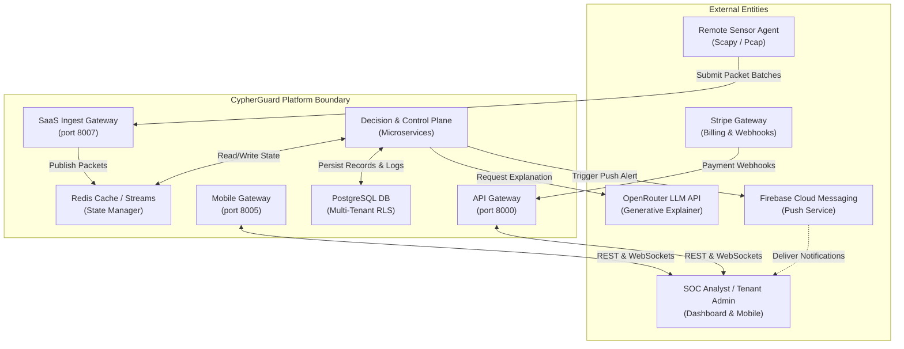
```mermaid
flowchart TD
    subgraph "External Entities"
        SensorAgent["Remote Sensor Agent<br/>(Scapy / Pcap)"]
        FCM["Firebase Cloud Messaging<br/>(Push Service)"]
        OR["OpenRouter LLM API<br/>(Generative Explainer)"]
        Stripe["Stripe Gateway<br/>(Billing & Webhooks)"]
        SOCUser["SOC Analyst / Tenant Admin<br/>(Dashboard & Mobile)"]
    end

    subgraph "CypherGuard Platform Boundary"
        IngestGW["SaaS Ingest Gateway<br/>(port 8007)"]
        AppGW["API Gateway<br/>(port 8000)"]
        MobileGW["Mobile Gateway<br/>(port 8005)"]
        ControlPlane["Decision & Control Plane<br/>(Microservices)"]
        DB["PostgreSQL DB<br/>(Multi-Tenant RLS)"]
        Redis["Redis Cache / Streams<br/>(State Manager)"]
    end

    SensorAgent -->|"Submit Packet Batches"| IngestGW
    IngestGW -->|"Publish Packets"| Redis
    ControlPlane <-->|"Read/Write State"| Redis
    ControlPlane <-->|"Persist Records & Logs"| DB
    ControlPlane -->|"Request Explanation"| OR
    ControlPlane -->|"Trigger Push Alert"| FCM
    AppGW <-->|"REST & WebSockets"| SOCUser
    MobileGW <-->|"REST & WebSockets"| SOCUser
    Stripe -->|"Payment Webhooks"| AppGW
    FCM -.->|"Deliver Notifications"| SOCUser
```

### 2.3 High-Level System Architecture
CypherGuard uses an event-driven microservices architecture coordinate by Redis Streams:

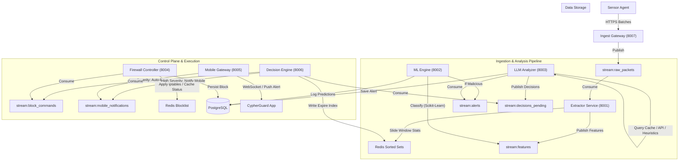
```mermaid
flowchart TD
    Sensor["Sensor Agent"] -->|"HTTPS Batches"| Ingest["Ingest Gateway (8007)"]
    Ingest -->|"Publish"| StreamRaw["stream:raw_packets"]

    subgraph "Ingestion & Analysis Pipeline"
        Ext["Extractor Service (8001)"] -->|"Slide Window Stats"| RedisWindow["Redis Sorted Sets"]
        StreamRaw -->|"Consume"| Ext
        Ext -->|"Publish Features"| StreamFeat["stream:features"]
        
        MLE["ML Engine (8002)"] -->|"Classify (Scikit-Learn)"| StreamFeat
        MLE -->|"If Malicious"| StreamAlerts["stream:alerts"]
        
        LLM["LLM Analyzer (8003)"] -->|"Consume"| StreamAlerts
        LLM -->|"Query Cache / API / Heuristics"| LLM
        LLM -->|"Publish Decisions"| StreamPending["stream:decisions_pending"]
    end

    subgraph "Control Plane & Execution"
        DE["Decision Engine (8006)"] -->|"Consume"| StreamPending
        DE -->|"Low Severity: Auto-Block"| StreamBlock["stream:block_commands"]
        DE -->|"High Severity: Notify Mobile"| StreamMobile["stream:mobile_notifications"]
        
        FW["Firewall Controller (8004)"] -->|"Consume"| StreamBlock
        FW -->|"Apply iptables / Cache Status"| RedisBlock["Redis Blocklist"]
        FW -->|"Persist Block"| PG[("PostgreSQL")]
        
        MobileGW["Mobile Gateway (8005)"] -->|"Consume"| StreamMobile
        MobileGW -->|"WebSocket / Push Alert"| CypherGuard["CypherGuard App"]
    end

    subgraph "Data Storage"
        LLM -->|"Save Alert"| PG
        DE -->|"Write Expire Index"| RedisWindow
        MLE -->|"Log Predictions"| PG
    end
```

### 2.4 Scope Definition & Boundaries
* **In-Scope:** Real-time software-based network traffic analysis (forward-only flow variables), binary anomaly detection, natural-language threat enrichment, tenant-scoped access controls, remote sensor status monitoring, human-in-the-loop firewalls, and usage-based subscriptions.
* **Out-of-Scope:** Hard packet payload inspection (deep packet inspection for text injection, viruses, or signature matching, as CypherGuard uses behavioral connection feature engineering), direct automated hardware router manipulation, and physical firewall configuration (e.g. Cisco/Juniper IOS updates).

---

### 2.5 System Requirements

#### 2.5.1 Hardware Requirements

The platform uses a containerized microservice design, allowing components to run on separate physical nodes or on a single high-performance VM.

### Minimum Requirements (SME Local Deployment / Staging)
* **CPU:** 4 vCPUs (Intel Xeon or AMD EPYC, 2.0 GHz base)
* **RAM:** 8 GB DDR4 ECC RAM
* **Storage:** 80 GB SSD (NVMe storage recommended, minimum 200 MB/s write throughput)
* **Network:** 1 Gbps NIC (minimum 100 Mbps uplink, public IP capability for Ingress endpoints)

### Recommended Requirements (Standard SaaS Tenant Ingestion)
* **CPU:** 8 vCPUs (Intel Xeon or AMD EPYC, 2.5 GHz base)
* **RAM:** 16 GB DDR4/DDR5 ECC RAM
* **Storage:** 250 GB Enterprise SSD (NVMe, write-optimized)
* **Network:** 2.5 Gbps NIC (1 Gbps symmetric uplink)

### Production Infrastructure Requirements (Scalable SaaS Platform)
To host the CypherGuard Platform serving 100+ tenants with up to 5 sensors each, the following multi-node infrastructure layout is required:

| Infrastructure Component | Node Role | CPU Allocation | Memory (RAM) | Storage Capacity | High Availability (HA) |
|---|---|---|---|---|---|
| **API/Mobile Gateways** | Application Node | 4 vCPUs | 8 GB | 50 GB SSD | N+1 Scaling via ALB |
| **Ingest Gateways** | Application Node | 8 vCPUs | 16 GB | 50 GB SSD | N+2 Scaling via ALB |
| **Extractor / ML Services** | Processing Node | 8 vCPUs | 16 GB | 100 GB SSD | Auto-scaled replica groups |
| **PostgreSQL Database** | Storage Node | 16 vCPUs | 32 GB | 1 TB NVMe SSD | Master-Standby replication |
| **Redis Cluster** | In-Memory Cache | 8 vCPUs | 32 GB | 50 GB SSD | Master-Replica Shard |
| **Observability (Prom/Graf)** | Monitor Node | 4 vCPUs | 8 GB | 500 GB SSD | Independent Storage |

#### 2.5.2 Software Requirements

The platform services must execute within the following software runtime specifications:

* **Operating Systems:** Linux (Ubuntu 22.04 LTS or 24.04 LTS recommended), Red Hat Enterprise Linux (RHEL 9.x), or Alpine Linux (for lightweight Docker containers). Windows Server 2022 is supported for testing local gateways only.
* **Docker Version Requirements:** Docker Engine v24.0.0 or higher.
* **Docker Compose Requirements:** Docker Compose v2.20.0 or higher.
* **Python Version:** Python 3.14.x (standard library dependencies, asyncio runtime).
* **Node.js Version:** Node.js v20.x LTS or v22.x LTS (Vite React UI deployment).
* **Flutter SDK Version:** Flutter SDK v3.22.x or higher (for `CypherGuard` compilation).
* **PostgreSQL Version:** PostgreSQL 16.x (with UUID-ossp or pgcrypto extensions enabled).
* **Redis Version:** Redis 7.2.x or higher (configured for Append Only File `appendonly yes` and Keyspace notifications `notify-keyspace-events Ex`).

#### 2.5.3 Browser Requirements

Supported browsers and versions for the Web SOC Dashboard:
* **Google Chrome:** Version 115 or higher (full service worker and WebSocket protocol support).
* **Mozilla Firefox:** Version 118 or higher (WebSocket streaming and CSS flex/grid rendering).
* **Apple Safari:** Version 16 or higher.
* **Microsoft Edge:** Version 116 or higher.

#### 2.5.4 Mobile Requirements

Minimum OS and hardware specifications for the companion app:
* **Android Requirements:** Android 11 (API Level 30) or higher. Requires Google Play Services for Firebase Cloud Messaging (FCM) integration.
* **iOS Requirements:** iOS 15 or higher. Requires valid Apple Developer certificates for APNs notification handling.
* **Device Limitations:** Minimum RAM: 2 GB. Push notifications are dependent on public internet access to Google/Apple notification systems.

#### 2.5.5 Network Requirements

### Ports Configuration Matrix

| Port | Service Component | Protocol | Traffic Direction | Purpose | Access Control |
|---|---|---|---|---|---|
| **80** | Traefik Ingress | HTTP | Inbound | Let's Encrypt challenge / Redirect | Public |
| **443** | Traefik Ingress | HTTPS | Inbound | Secure dashboard and API ingress | Public |
| **8000** | Web API Gateway | HTTP/WS | Internal/External | REST APIs and WebSockets | Restricted (Nginx/Traefik only) |
| **8005** | Mobile Gateway | HTTP/WS | Internal/External | CypherGuard app REST/WebSockets | Restricted (Nginx/Traefik only) |
| **8007** | Ingest Gateway | HTTP | Inbound | Sensor packet streaming | Public |
| **5432** | PostgreSQL DB | TCP | Internal | Persistent SQL storage | Restricted to VPC CIDR |
| **6379** | Redis Server | TCP | Internal | Cache, sliding windows, and streams | Restricted to VPC CIDR |
| **9090** | Prometheus Server | HTTP | Internal | Metrics collection dashboard | Restricted to Admin IP |
| **3000** | Grafana Dashboards | HTTP | Inbound | System observability interface | Restricted to VPN/Admin |

### TLS & Internal Service Communication Requirements
* **Data in Transit:** All public-facing REST APIs, WebSocket connections, and sensor ingestion streams must operate over TLS 1.3 (with TLS 1.2 as absolute fallback). Weak ciphers (e.g., RC4, 3DES) are disabled at the ingress proxy.
* **Service-to-Service Security:** Internal microservice communication (e.g., Extractor calling ML Engine, Decision Engine notifying Mobile Gateway) uses static API authentication keys via the `INTERNAL_API_KEY` header. High-performance internal VPC routing avoids public transit routes.

#### 2.5.6 Deployment Requirements
* **Local Development:** Deployment is managed via Docker Compose (`docker compose up -d`). Local databases are initialized via Alembic.
* **Staging:** Deployed on standard VM nodes using compose orchestration, executing validation test hooks against a mock network interface.
* **Production:** Automated container cluster orchestration, running trailing edge pipelines, using external managed database pools and high-availability Redis sharding configurations.

<div style="page-break-before: always;"></div>

## Chapter 3: SYSTEM ANALYSIS & DESIGN

### 3.1 Problem Analysis
In existing security operations centers, threat detection relies on signature matching (e.g., Snort rules), which fails against zero-day vulnerabilities, or volumetric analysis (e.g., NetFlow), which does not provide contextual explanation. In addition, when anomalies occur, security personnel are typically notified by email. This creates critical delays during fast-acting attacks (like ransomware or brute-force breaches). CypherGuard automates the identification and explanation stages, while keeping the human analyst in the loop for remediation.

### 3.2 Stakeholder Analysis
1. **SME IT Manager (Tenant Administrator):** Needs simple deployment, low maintenance, and an easy-to-use threat panel.
2. **SOC Analyst:** Needs low false-positive rates, clear context for alerts, and rapid mitigation buttons.
3. **SaaS Platform Owner (Super Admin):** Needs sensor tracking, tenant usage analytics, subscriptions collection, and system resource metrics.
4. **Graduation Evaluation Committee:** Demands sound architectural design, rigorous security validation, RLS multi-tenant compliance, and high testing coverage.

### 3.3 Business Process Analysis (BPMN)
The standard threat mitigation process spans three core systems (Sensor, Platform, Operator):

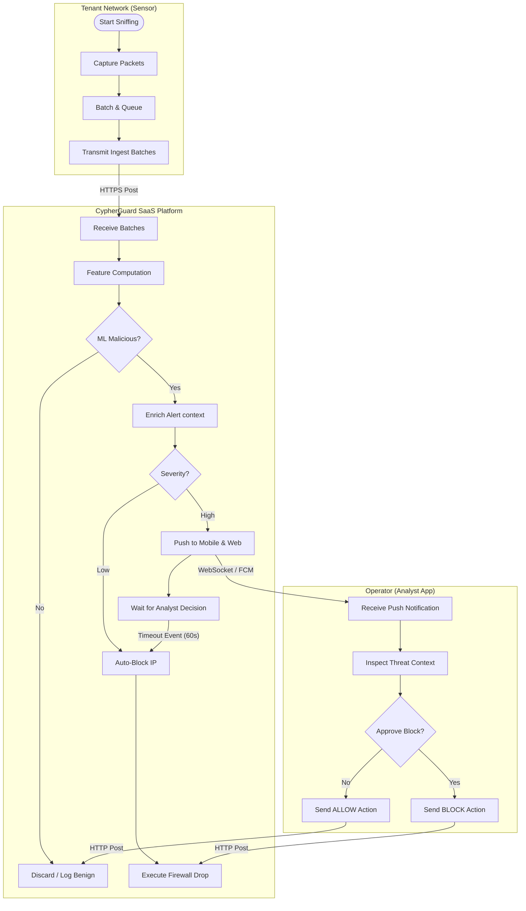
```mermaid
flowchart TD
    %% Define BPMN Lanes
    subgraph LAN_SEN["Tenant Network (Sensor)"]
        SEN_START([Start Sniffing]) --> SEN_CAP[Capture Packets]
        SEN_CAP --> SEN_BUF["Batch & Queue"]
        SEN_BUF --> SEN_SEND[Transmit Ingest Batches]
    end

    subgraph LAN_PLAT["CypherGuard SaaS Platform"]
        PLAT_RCV[Receive Batches] --> PLAT_FE[Feature Computation]
        PLAT_FE --> PLAT_ML{ML Malicious?}
        PLAT_ML -->|"No"| PLAT_DIS["Discard / Log Benign"]
        PLAT_ML -->|"Yes"| PLAT_LLM[Enrich Alert context]
        PLAT_LLM --> PLAT_ROUTE{Severity?}
        
        PLAT_ROUTE -->|"Low"| PLAT_AUTO[Auto-Block IP]
        PLAT_ROUTE -->|"High"| PLAT_NOTIFY["Push to Mobile & Web"]
        
        PLAT_AUTO --> PLAT_FW[Execute Firewall Drop]
        PLAT_NOTIFY --> PLAT_WAIT[Wait for Analyst Decision]
    end

    subgraph LAN_OP["Operator (Analyst App)"]
        OP_ALERT[Receive Push Notification] --> OP_REVIEW[Inspect Threat Context]
        OP_REVIEW --> OP_DEC{Approve Block?}
        OP_DEC -->|"Yes"| OP_BLOCK[Send BLOCK Action]
        OP_DEC -->|"No"| OP_ALLOW[Send ALLOW Action]
    end

    SEN_SEND -->|"HTTPS Post"| PLAT_RCV
    PLAT_NOTIFY -->|"WebSocket / FCM"| OP_ALERT
    OP_BLOCK -->|"HTTP Post"| PLAT_FW
    OP_ALLOW -->|"HTTP Post"| PLAT_DIS
    PLAT_WAIT -->|"Timeout Event (60s)"| PLAT_AUTO
```

### 3.4 System Constraints
* **Latency:** End-to-end processing (packets captured to alert generated) must remain under 3.0 seconds during standard traffic loads.
* **Throughput:** The ingest gateway must absorb up to 5,000 packets per minute per sensor agent, protected by Redis-based rate limiters to prevent buffer exhaustion.
* **Hardware Overhead:** Sensors must operate on lightweight local units (e.g., Raspberry Pi or local container) with less than 2% CPU overhead.
* **Accuracy:** ML engines must exhibit a low false-alarm rate (False Positive Rate < 0.5%) to avoid blocking legitimate user traffic.

### 3.5 Use Case Modeling & Descriptions

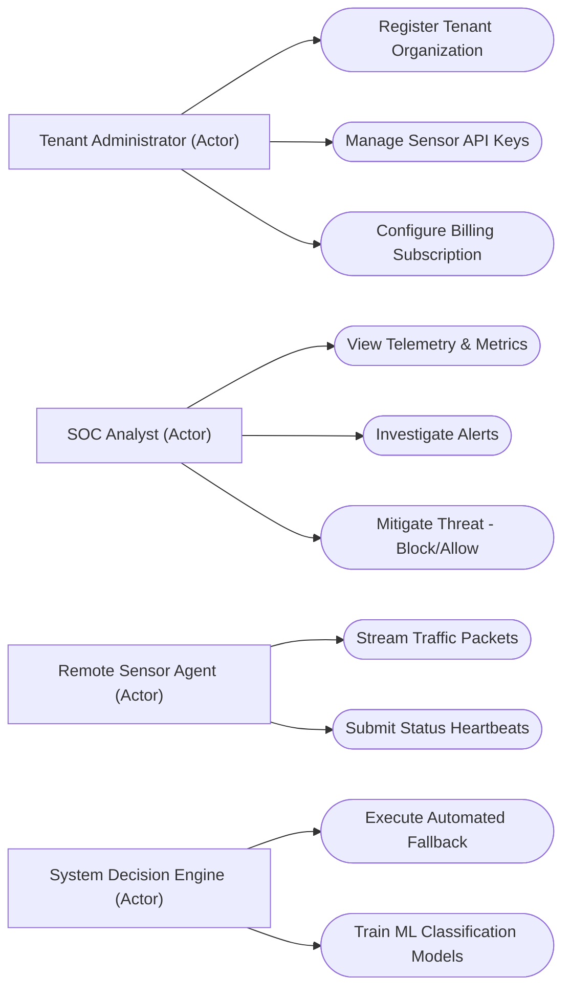
```mermaid
flowchart LR
    Admin["Tenant Administrator (Actor)"]
    Analyst["SOC Analyst (Actor)"]
    Sensor["Remote Sensor Agent (Actor)"]
    System["System Decision Engine (Actor)"]

    UC1(["Register Tenant Organization"])
    UC2(["Manage Sensor API Keys"])
    UC3(["Configure Billing Subscription"])
    UC4(["View Telemetry & Metrics"])
    UC5(["Investigate Alerts"])
    UC6(["Mitigate Threat - Block/Allow"])
    UC7(["Stream Traffic Packets"])
    UC8(["Submit Status Heartbeats"])
    UC9(["Execute Automated Fallback"])
    UC10(["Train ML Classification Models"])

    Admin --> UC1
    Admin --> UC2
    Admin --> UC3
    Analyst --> UC4
    Analyst --> UC5
    Analyst --> UC6
    Sensor --> UC7
    Sensor --> UC8
    System --> UC9
    System --> UC10
```

#### Use Case UC-001: Investigate Alerts & Threat Mitigation
* **Primary Actors:** SOC Analyst, System Decision Engine
* **Preconditions:** An alert has been flagged by the ML Engine and enriched by the LLM Analyzer. The alert status is set to `new`.
* **Flow of Events:**
  1. The analyst receives an alert notification via the dashboard or CypherGuard mobile app.
  2. The analyst views the threat details, including the source IP, attack type, ML confidence, and AI-generated explanation.
  3. The analyst clicks the **Block IP** button.
  4. The client transmits the decision payload to the gateway.
  5. The platform executes the block atomically, updates the alert status to `resolved`, and drops matching traffic.
* **Postconditions:** The target IP is added to the active firewall drop list, and all subsequent traffic from the IP is rejected.

### 3.6 Activity & Process Flows
The following Activity Diagram illustrates the execution path for threat mitigation decisions, comparing analyst action with timeout expiration:

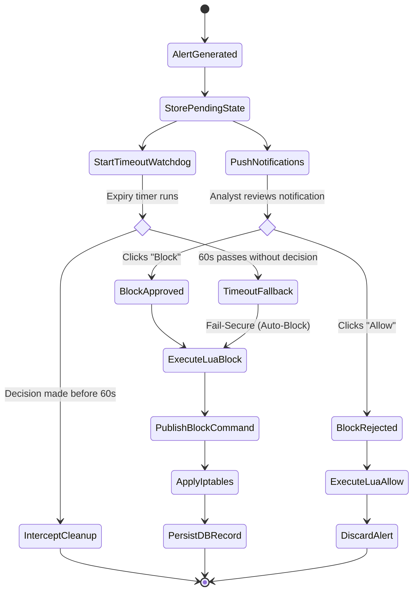
```mermaid
stateDiagram-v2
    [*] --> AlertGenerated
    AlertGenerated --> StorePendingState
    StorePendingState --> StartTimeoutWatchdog
    StorePendingState --> PushNotifications
    
    state Choice_Decision <<choice>>
    PushNotifications --> Choice_Decision : Analyst reviews notification
    
    state Choice_Timeout <<choice>>
    StartTimeoutWatchdog --> Choice_Timeout : Expiry timer runs

    Choice_Decision --> BlockApproved : Clicks "Block"
    Choice_Decision --> BlockRejected : Clicks "Allow"
    
    Choice_Timeout --> TimeoutFallback : 60s passes without decision
    Choice_Timeout --> InterceptCleanup : Decision made before 60s

    BlockApproved --> ExecuteLuaBlock
    TimeoutFallback --> ExecuteLuaBlock : Fail-Secure (Auto-Block)
    
    BlockRejected --> ExecuteLuaAllow
    InterceptCleanup --> [*]

    ExecuteLuaBlock --> PublishBlockCommand
    PublishBlockCommand --> ApplyIptables
    ApplyIptables --> PersistDBRecord
    PersistDBRecord --> [*]

    ExecuteLuaAllow --> DiscardAlert
    DiscardAlert --> [*]
```

<div style="page-break-before: always;"></div>

## Chapter 4: SYSTEM ARCHITECTURE

### 4.1 Architecture Overview
CypherGuard is structured around a decoupled, microservices-oriented architecture designed to optimize scaling, ingestion throughput, and fault isolation. The core processing pipeline is event-driven, leveraging high-speed Redis streams for asynchronous message passing between ingestion, analysis, logging, and remediation services. By dividing computational loads across specialized services, the platform guarantees that high-rate traffic ingestion does not compromise dashboard responsiveness or LLM analytical performance.

### 4.2 Layered Architecture Diagram
The architecture is structured into four primary layers: Ingestion, Processing/Analysis, Control/Data, and Presentation.

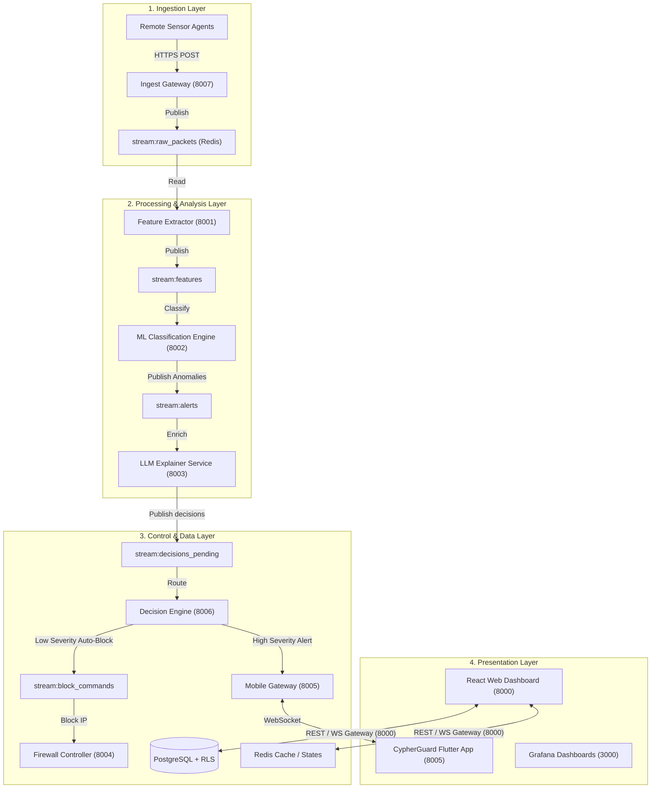
```mermaid
flowchart TD
    subgraph Ingestion_Layer["1. Ingestion Layer"]
        Sensors["Remote Sensor Agents"]
        IngestGW["Ingest Gateway (8007)"]
        RawStream["stream:raw_packets (Redis)"]
    end

    subgraph Processing_Layer["2. Processing & Analysis Layer"]
        Extractor["Feature Extractor (8001)"]
        MLEngine["ML Classification Engine (8002)"]
        LLMAnalyzer["LLM Explainer Service (8003)"]
        FeaturesStream["stream:features"]
        AlertsStream["stream:alerts"]
    end

    subgraph Control_Layer["3. Control & Data Layer"]
        DecisionEngine["Decision Engine (8006)"]
        FirewallController["Firewall Controller (8004)"]
        MobileGW["Mobile Gateway (8005)"]
        DecisionsStream["stream:decisions_pending"]
        BlockStream["stream:block_commands"]
        PG[("PostgreSQL + RLS")]
        RedisCache["Redis Cache / States"]
    end

    subgraph Presentation_Layer["4. Presentation Layer"]
        ReactUI["React Web Dashboard (8000)"]
        FlutterUI["CypherGuard Flutter App (8005)"]
        GrafanaUI["Grafana Dashboards (3000)"]
    end

    Sensors -->|"HTTPS POST"| IngestGW
    IngestGW -->|"Publish"| RawStream
    RawStream -->|"Read"| Extractor
    Extractor -->|"Publish"| FeaturesStream
    FeaturesStream -->|"Classify"| MLEngine
    MLEngine -->|"Publish Anomalies"| AlertsStream
    AlertsStream -->|"Enrich"| LLMAnalyzer
    LLMAnalyzer -->|"Publish decisions"| DecisionsStream
    DecisionsStream -->|"Route"| DecisionEngine
    DecisionEngine -->|"High Severity Alert"| MobileGW
    DecisionEngine -->|"Low Severity Auto-Block"| BlockStream
    BlockStream -->|"Block IP"| FirewallController
    MobileGW <-->|"WebSocket"| FlutterUI
    ReactUI <-->|"REST / WS Gateway (8000)"| PG
    ReactUI <-->|"REST / WS Gateway (8000)"| RedisCache
```

### 4.3 Component and Microservice Layout
The platform comprises the following microservices:
1. **Ingest Gateway (`ingest_gateway`):** Lightweight entry point for sensor packet submissions. Authenticates sensor API keys, checks ingestion rate limits, and pushes data to `stream:raw_packets`.
2. **Feature Extractor (`extractor`):** Consumes raw packet metadata, manages a sliding temporal window of observations in Redis Sorted Sets, computes an 11-dimensional feature vector, and pushes to `stream:features`.
3. **ML Classification Engine (`ml_engine`):** Consumes features, normalizes inputs, performs binary inference via scikit-learn models, evaluates feature drift (KL Divergence), and publishes threats to `stream:alerts`.
4. **LLM Explainer (`llm_analyzer`):** Consumes alerts, coordinates a three-tier analysis (Cache -> OpenRouter API -> Rule-based heuristics), and outputs Pydantic-validated JSON explanations to `stream:decisions_pending`.
5. **Decision Engine (`decision_engine`):** Evaluates threat severities, issues immediate block commands or handles human-in-the-loop notifications via FCM and WebSockets.
6. **Firewall Controller (`firewall`):** Receives block commands, updates local and platform Redis cache sets, and manipulates OS level firewall configurations (`iptables`) using secure subprocess structures.
7. **Mobile Gateway (`mobile_gateway`):** Handles Flutter client registrations, session authentication, and WebSocket streams for real-time mobile decision handling.
8. **Dashboard API Gateway (`gateway`):** Serving REST endpoints, user onboarding, sensor key issuance, and WebSocket telemetry broadcasts to the React Web client.

### 4.4 Service Dependency & Communication Matrix
The internal microservices communicate asynchronously via Redis Streams and publish/subscribe channels:

| Source Service | Target Service | Mechanism | Channel/Stream | Payload Type |
|---|---|---|---|---|
| Ingest Gateway | Redis Cache | Stream | `stream:raw_packets` | Raw packet tuples |
| Feature Extractor | Redis Cache | Sorted Set | `t:{tid}:conn:{ip}:packets` | Timestamps + size |
| Feature Extractor | ML Engine | Stream | `stream:features` | 11-dimensional vector |
| ML Engine | LLM Explainer | Stream | `stream:alerts` | Feature stats + confidence |
| LLM Explainer | Decision Engine | Stream | `stream:decisions_pending` | Enriched alert details |
| Decision Engine | Firewall | Stream | `stream:block_commands` | Source IP + block reason |
| Decision Engine | Mobile Gateway | Pub/Sub Stream | `stream:mobile_notifications` | JSON alert details |
| Mobile Gateway | Decision Engine | API / Redis | `pending_decision:{alert_id}` | Decision response (BLOCK/ALLOW) |
| Firewall Controller | PostgreSQL | Async DB Driver | SQLAlchemy Core | Block Audit Log |

### 4.5 Architectural Views (4+1 Model)

The CypherGuard system design is organized using the 4+1 Architectural View Model to address the concerns of multiple stakeholders (developers, system administrators, testers, and project sponsors).

#### 4.5.1 Logical View
The logical view describes the core business domains and major subsystems, focusing on service responsibilities and boundary divisions:

* **Authentication & Identity Domain:** Handles user creation, password verification, MFA, and tenant registration. Captures client contexts and translates them into signed claims.
* **Ingest Domain:** Manages packet data collection. Validates active sensor API keys and pushes telemetry to the internal pipeline.
* **Feature Engineering Domain:** Transforms raw inputs into sliding window aggregates, utilizing fast in-memory computations.
* **Threat Analysis (ML/LLM) Domain:** Runs binary threat classification models and queries generative AI APIs to produce context explanations.
* **Mitigation (Firewall) Domain:** Performs blocking actions by applying OS network filters and updating global state databases.
* **Notification Domain:** Manages real-time WebSocket communication pools and Firebase Push notification dispatches.

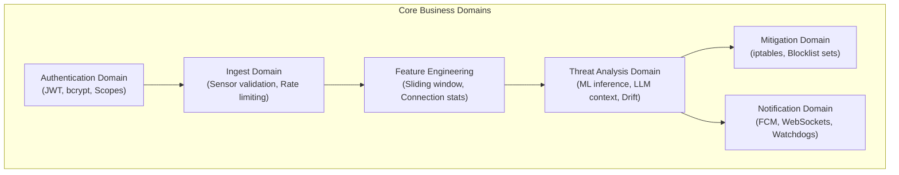
```mermaid
flowchart TD
    subgraph Logical_Subsystems["Core Business Domains"]
        AuthDomain["Authentication Domain<br/>(JWT, bcrypt, Scopes)"]
        IngestDomain["Ingest Domain<br/>(Sensor validation, Rate limiting)"]
        FeatureDomain["Feature Engineering<br/>(Sliding window, Connection stats)"]
        AnalysisDomain["Threat Analysis Domain<br/>(ML inference, LLM context, Drift)"]
        MitigationDomain["Mitigation Domain<br/>(iptables, Blocklist sets)"]
        NotificationDomain["Notification Domain<br/>(FCM, WebSockets, Watchdogs)"]
    end

    AuthDomain --> IngestDomain
    IngestDomain --> FeatureDomain
    FeatureDomain --> AnalysisDomain
    AnalysisDomain --> MitigationDomain
    AnalysisDomain --> NotificationDomain
```

#### 4.5.2 Development View
The development view illustrates the actual source code organization, folder structures, and repository boundaries:

* **`shared/`:** Common modules compiled by all Python microservices (contains database mappings, authorization utilities, metrics endpoints, and validation schemas).
* **`gateway/`:** Main web client API Gateway code (houses user management routes, dashboard status endpoints, and WebSocket push connections).
* **`mobile_gateway/`:** Mobile-specific API endpoint routes (handles registration of FCM keys and human-in-the-loop decisions).
* **`extractor/` & `ml_engine/` & `llm_analyzer/`:** Discrete, containerized directories hosting the analysis logic.
* **`control_plane/`:** Centralized decision-making logic, containing timeout listeners, fallback scanners, and database log writers.
* **`soc-frontend/`:** Node.js Vite React project directories.
* **`app/cypherguard/`:** Flutter mobile project directories.

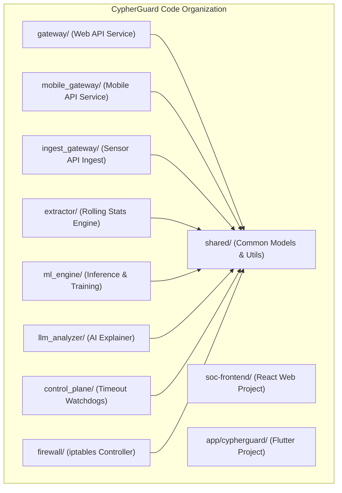
```mermaid
flowchart TD
    subgraph Repository_Root["CypherGuard Code Organization"]
        Shared["shared/ (Common Models & Utils)"]
        Gateway["gateway/ (Web API Service)"]
        MobileGW["mobile_gateway/ (Mobile API Service)"]
        IngestGW["ingest_gateway/ (Sensor API Ingest)"]
        Extractor["extractor/ (Rolling Stats Engine)"]
        MLEngine["ml_engine/ (Inference & Training)"]
        LLMAnalyzer["llm_analyzer/ (AI Explainer)"]
        ControlPlane["control_plane/ (Timeout Watchdogs)"]
        Firewall["firewall/ (iptables Controller)"]
        Frontend["soc-frontend/ (React Web Project)"]
        MobileApp["app/cypherguard/ (Flutter Project)"]
    end

    Gateway --> Shared
    MobileGW --> Shared
    IngestGW --> Shared
    Extractor --> Shared
    MLEngine --> Shared
    LLMAnalyzer --> Shared
    ControlPlane --> Shared
    Firewall --> Shared
```

#### 4.5.3 Process View
The process view describes the system's runtime concurrency, thread management, and event-driven data flow:

* **Async I/O Loop:** Backend microservices run on single-threaded, high-concurrency event loops powered by `asyncio` and `uvicorn`.
* **Redis Streams Event Broker:** Message queues decouple processing steps. Services run background worker loops that poll streams using consumer groups (`XREADGROUP`), ensuring horizontal scaling.
* **Non-Blocking Telemetry Ingestion:** The Ingest Gateway buffers incoming packet batches, writes to Redis Streams, and returns HTTP 200 immediately, maintaining a low-latency ingestion pipeline.
* **Real-Time WebSocket Pools:** Gateways maintain active, tenant-scoped memory maps of client WebSocket connections. Incoming events are broadcast instantly without database polling.

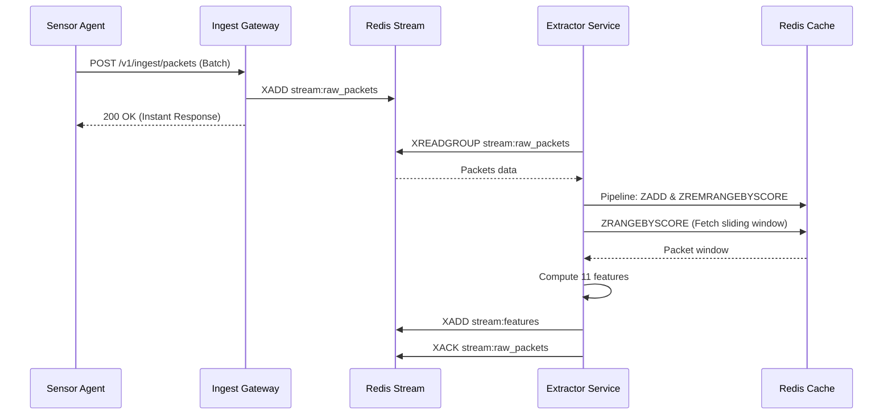
```mermaid
sequenceDiagram
    participant Sensor as Sensor Agent
    participant Ingest as Ingest Gateway
    participant RedisStream as Redis Stream
    participant Extractor as Extractor Service
    participant RedisCache as Redis Cache
    
    Sensor->>Ingest: POST /v1/ingest/packets (Batch)
    Ingest->>RedisStream: XADD stream:raw_packets
    Ingest-->>Sensor: 200 OK (Instant Response)
    
    Extractor->>RedisStream: XREADGROUP stream:raw_packets
    RedisStream-->>Extractor: Packets data
    Extractor->>RedisCache: Pipeline: ZADD & ZREMRANGEBYSCORE
    Extractor->>RedisCache: ZRANGEBYSCORE (Fetch sliding window)
    RedisCache-->>Extractor: Packet window
    Extractor->>Extractor: Compute 11 features
    Extractor->>RedisStream: XADD stream:features
    Extractor->>RedisStream: XACK stream:raw_packets
```

#### 4.5.4 Physical View
The physical view maps software components to target hosting hardware, virtual machines, and network subnets:

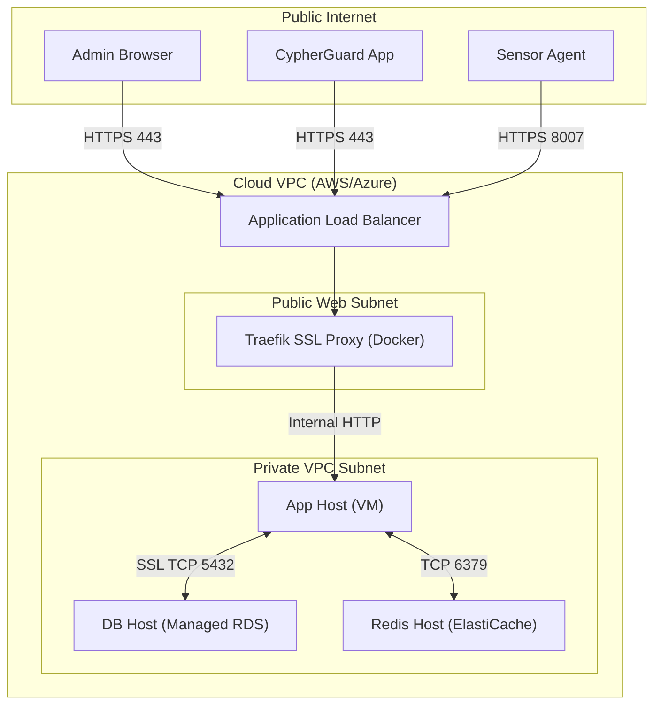
```mermaid
flowchart TD
    subgraph Public_Internet["Public Internet"]
        MobileClient["CypherGuard App"]
        WebBrowser["Admin Browser"]
        RemoteSensor["Sensor Agent"]
    end

    subgraph Cloud_Provider["Cloud VPC (AWS/Azure)"]
        LB["Application Load Balancer"]
        
        subgraph Web_Subnet["Public Web Subnet"]
            Traefik["Traefik SSL Proxy (Docker)"]
        end
        
        subgraph Internal_Subnet["Private VPC Subnet"]
            AppNode["App Host (VM)"]
            DBNode["DB Host (Managed RDS)"]
            RedisNode["Redis Host (ElastiCache)"]
        end
    end

    WebBrowser -->|"HTTPS 443"| LB
    MobileClient -->|"HTTPS 443"| LB
    RemoteSensor -->|"HTTPS 8007"| LB
    LB --> Traefik
    Traefik -->|"Internal HTTP"| AppNode
    AppNode <-->|"SSL TCP 5432"| DBNode
    AppNode <-->|"TCP 6379"| RedisNode
```

#### 4.5.5 Deployment View
The deployment view maps container configurations to execution nodes across staging and production clusters:
* **Docker Multi-Stage Builds:** The API services are compiled using `docker/python.Dockerfile` targeting specific execution stages (e.g., `target: extractor`, `target: ml_engine`).
* **Container Orchestration:**
  * *Local/Staging:* Standard Docker Compose manages 12 containers on a single host.
  * *Production:* Handled via Kubernetes or managed container groups, scaling Ingest Gateways and Extractors independently.

#### 4.5.6 Use Case Mapping
The following table maps user interactions to the responsible logical domains and microservices:

| Use Case ID | Use Case Name | Responsible Domain | Executing Component |
|---|---|---|---|
| **UC-001** | Register Tenant Organization | Authentication & Membership | `gateway` / PostgreSQL |
| **UC-002** | Manage Sensor API Keys | Ingestion Management | `gateway` / PostgreSQL |
| **UC-003** | Stream Ingestion Telemetry | Packet Ingestion | `ingest_gateway` / `extractor` / Redis |
| **UC-004** | Flag Connection Anomalies | Threat Detection | `ml_engine` / `drift_detector` |
| **UC-005** | Enrich Alerts with Context | Generative Explanation | `llm_analyzer` / OpenRouter |
| **UC-006** | Approve Network Block | Manual Remediation | `mobile_gateway` / `firewall` |
| **UC-007** | Execute Timeout Fallback | Automated Remediation | `decision_timeout_listener` / `firewall` |

---

### 4.6 C4 Architecture Model

The C4 model is used to describe CypherGuard's architecture at multiple levels of abstraction, starting from the system context down to code modules.

#### 4.6.1 Level 1: System Context Diagram
The Level 1 diagram shows how CypherGuard interacts with users and external services:

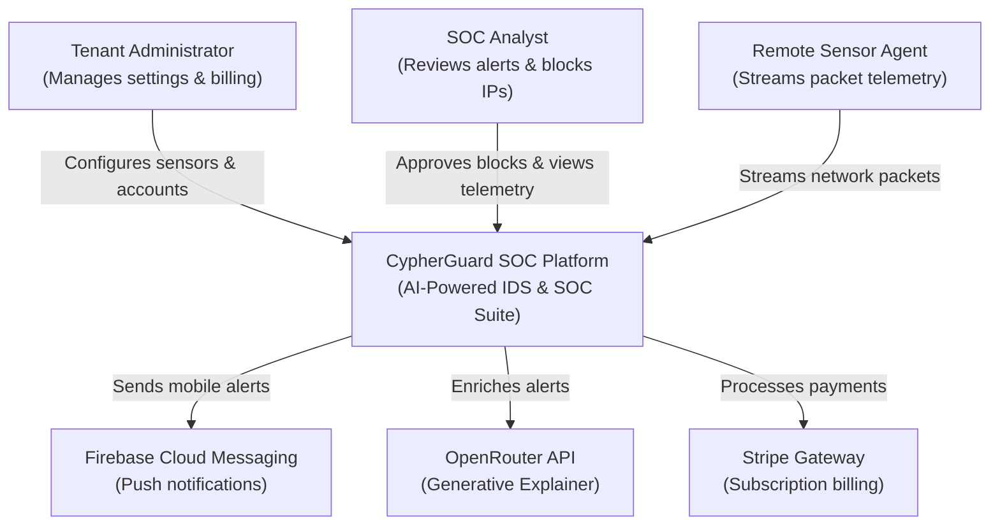
```mermaid
flowchart TD
    Admin["Tenant Administrator<br/>(Manages settings & billing)"]
    Analyst["SOC Analyst<br/>(Reviews alerts & blocks IPs)"]
    Sensor["Remote Sensor Agent<br/>(Streams packet telemetry)"]
    
    System["CypherGuard SOC Platform<br/>(AI-Powered IDS & SOC Suite)"]
    
    FCM["Firebase Cloud Messaging<br/>(Push notifications)"]
    OpenRouter["OpenRouter API<br/>(Generative Explainer)"]
    Stripe["Stripe Gateway<br/>(Subscription billing)"]

    Admin -->|"Configures sensors & accounts"| System
    Analyst -->|"Approves blocks & views telemetry"| System
    Sensor -->|"Streams network packets"| System
    System -->|"Sends mobile alerts"| FCM
    System -->|"Enriches alerts"| OpenRouter
    System -->|"Processes payments"| Stripe
```

#### 4.6.2 Level 2: Container Diagram
The Level 2 diagram breaks down the CypherGuard platform into containerized services:

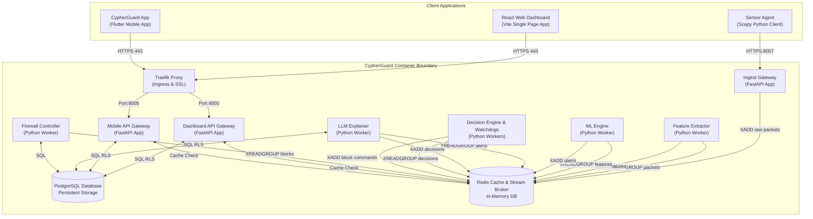
```mermaid
flowchart TD
    subgraph Clients["Client Applications"]
        ReactDashboard["React Web Dashboard<br/>(Vite Single Page App)"]
        CypherGuardApp["CypherGuard App<br/>(Flutter Mobile App)"]
        SensorApp["Sensor Agent<br/>(Scapy Python Client)"]
    end

    subgraph Containers["CypherGuard Container Boundary"]
        Traefik["Traefik Proxy<br/>(Ingress & SSL)"]
        Gateway["Dashboard API Gateway<br/>(FastAPI App)"]
        MobileGW["Mobile API Gateway<br/>(FastAPI App)"]
        IngestGW["Ingest Gateway<br/>(FastAPI App)"]
        Extractor["Feature Extractor<br/>(Python Worker)"]
        MLEngine["ML Engine<br/>(Python Worker)"]
        LLMAnalyzer["LLM Explainer<br/>(Python Worker)"]
        ControlPlane["Decision Engine & Watchdogs<br/>(Python Workers)"]
        Firewall["Firewall Controller<br/>(Python Worker)"]
        
        DB[("PostgreSQL Database<br/>Persistent Storage")]
        Redis[("Redis Cache & Stream Broker<br/>In-Memory DB")]
    end

    SensorApp -->|"HTTPS 8007"| IngestGW
    ReactDashboard -->|"HTTPS 443"| Traefik
    CypherGuardApp -->|"HTTPS 443"| Traefik
    
    Traefik -->|"Port 8000"| Gateway
    Traefik -->|"Port 8005"| MobileGW
    
    IngestGW -->|"XADD raw packets"| Redis
    Extractor -->|"XREADGROUP packets"| Redis
    Extractor -->|"XADD features"| Redis
    MLEngine -->|"XREADGROUP features"| Redis
    MLEngine -->|"XADD alerts"| Redis
    LLMAnalyzer -->|"XREADGROUP alerts"| Redis
    LLMAnalyzer -->|"XADD decisions"| Redis
    ControlPlane -->|"XREADGROUP decisions"| Redis
    ControlPlane -->|"XADD block commands"| Redis
    Firewall -->|"XREADGROUP blocks"| Redis

    Gateway <-->|"SQL RLS"| DB
    MobileGW <-->|"SQL RLS"| DB
    LLMAnalyzer <-->|"SQL RLS"| DB
    Firewall <-->|"SQL"| DB
    Gateway <-->|"Cache Check"| Redis
    MobileGW <-->|"Cache Check"| Redis
```

#### 4.6.3 Level 3: Component Diagram
This diagram breaks down the **Dashboard API Gateway (`gateway`)** into its internal code components:

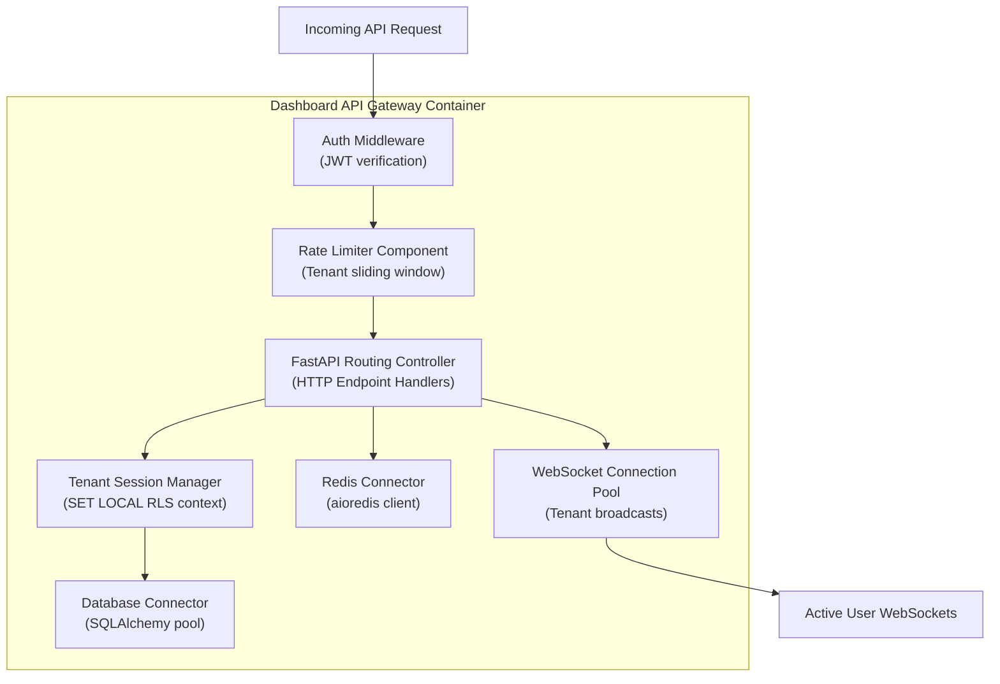
```mermaid
flowchart TD
    subgraph GatewayComponent["Dashboard API Gateway Container"]
        AuthMiddle["Auth Middleware<br/>(JWT verification)"]
        RateLimit["Rate Limiter Component<br/>(Tenant sliding window)"]
        Router["FastAPI Routing Controller<br/>(HTTP Endpoint Handlers)"]
        SessionMgr["Tenant Session Manager<br/>(SET LOCAL RLS context)"]
        DBConnector["Database Connector<br/>(SQLAlchemy pool)"]
        RedisConnector["Redis Connector<br/>(aioredis client)"]
        WSPool["WebSocket Connection Pool<br/>(Tenant broadcasts)"]
    end

    Request["Incoming API Request"] --> AuthMiddle
    AuthMiddle --> RateLimit
    RateLimit --> Router
    Router --> SessionMgr
    SessionMgr --> DBConnector
    Router --> RedisConnector
    Router --> WSPool
    WSPool --> ClientSocket["Active User WebSockets"]
```

#### 4.6.4 Level 4: Code-Level responsibilities
* **`shared.database.tenant_session()`:** A context manager that creates database sessions scoped to a specific tenant. It executes `SET LOCAL app.tenant_id = :tid` at the start of a transaction to apply Row-Level Security policies.
* **`shared.auth.verify_jwt()`:** A FastAPI security dependency that decodes JWT claims, checks for token expiration, and verifies that the unique identifier (`jti`) is not present in the Redis blacklist.
* **`shared.rate_limiter.TenantRateLimiter`:** A dependency that increments sliding window keys (`rate_limit:{ip}:{window}` and `rate_limit:t:{tid}:{window}`) in Redis, enforcing IP and tenant rate limits.
* **`shared.circuit_breaker.CircuitBreaker`:** A wrapper that monitors API failure rates. It transitions to `open` after 3 consecutive failures, preventing further external API requests and routing queries to heuristic fallbacks.
* **`shared.drift_detector.DriftDetector`:** An inference helper that buffers incoming feature samples. It computes the KL Divergence against baseline histograms and triggers model retraining if statistical drift exceeds configured thresholds.

<div style="page-break-before: always;"></div>

## Chapter 5: TECHNOLOGY SELECTION & JUSTIFICATION

### 5.1 FastAPI
* **Selected Technology:** FastAPI (Python 3.14)
* **Alternatives Evaluated:** Django REST Framework, Flask
* **Advantages:** Extremely high performance (similar to NodeJS/Go) utilizing `uvicorn` and `asyncio`, automatic OpenAPI documentation generation, native Pydantic validation, and clean dependency injection.
* **Tradeoffs:** Smaller ecosystem than Django, requires developer discipline to prevent blocking synchronous calls inside async route loops.
* **Justification:** Essential for real-time cybersecurity telemetry pipelines where async I/O handling is critical for high-throughput connections.

### 5.2 PostgreSQL
* **Selected Technology:** PostgreSQL 16
* **Alternatives Evaluated:** MongoDB, MySQL, Cassandra
* **Advantages:** Support for strict relational integrity, native Row-Level Security (RLS) policies, JSONB support for unstructured feature maps, and mature async driver integrations (`asyncpg`).
* **Tradeoffs:** Scaling writes horizontally requires sharding configurations (e.g. Citus) or write replicas.
* **Justification:** Multi-tenancy isolation and audit compliance demand robust relational guarantees and row-level access control.

### 5.3 Redis
* **Selected Technology:** Redis 7
* **Alternatives Evaluated:** RabbitMQ, Apache Kafka
* **Advantages:** Multi-model database offering sub-millisecond key-value cache, sorted sets for sliding window computations, streams with consumer groups, and Lua script execution.
* **Tradeoffs:** Memory-bound database; requires strict eviction configurations and data backup adjustments.
* **Justification:** Redis serves as both the event message broker (Streams) and the real-time sliding window engine, dramatically reducing infra complexity.

### 5.4 React
* **Selected Technology:** React 19 (Vite)
* **Alternatives Evaluated:** Vue.js, Angular, Vanilla JS
* **Advantages:** Component reusability, Virtual DOM responsiveness for dashboard widgets, wide chart library support, and fast dev cycles via Vite.
* **Tradeoffs:** Extensive dependency chain; state managers (e.g., Zustand) must be configured manually for complex stores.
* **Justification:** Provides a responsive, professional platform suitable for displaying high-rate network alerts.

### 5.5 Flutter
* **Selected Technology:** Flutter SDK
* **Alternatives Evaluated:** React Native, Native Swift/Kotlin
* **Advantages:** Single codebase compilation for both Android & iOS, declarative UI, stable native WebSocket connection pools, and easy FCM integration.
* **Tradeoffs:** Larger application binary sizes compared to pure native.
* **Justification:** Enables fast cross-platform deployment of the `CypherGuard` companion application.

### 5.6 Security Technologies
* **Selected Technologies:** JWT (HS256), bcrypt (password hashing), SQLite AST Hooking (for test environment isolation checks).
* **Alternatives Evaluated:** session-based cookies, simple MD5/SHA256 hashes.
* **Advantages:** Stateless JWTs simplify scaling; bcrypt prevents brute-force credential compromises; AST hooking guarantees test isolation without DB lockups.
* **Tradeoffs:** JWT revocation requires token blacklist stores.
* **Justification:** Essential for HIPAA, SOC2, and ISO27001 SaaS security validation.

### 5.7 Technology Decision Matrix

| Requirement | Candidates | Performance | Security | Complexity | Selected |
|---|---|---|---|---|---|
| **API Framework** | FastAPI vs Django | **FastAPI (High)** | Equal | FastAPI (Low) | **FastAPI** |
| **Primary Database** | PostgreSQL vs MongoDB | PostgreSQL (Med) | **PostgreSQL (RLS)** | PostgreSQL (Med) | **PostgreSQL** |
| **Ingest Pipeline** | Redis Streams vs RabbitMQ | **Redis (High)** | Equal | **Redis (Low)** | **Redis Streams** |
| **Mobile Client** | Flutter vs React Native | **Flutter (High)** | Equal | **Flutter (Low)** | **Flutter** |

<div style="page-break-before: always;"></div>

## Chapter 6: BUSINESS REQUIREMENTS

### 6.1 Functional Requirements (FR)

| ID | Component | Description | Priority |
|---|---|---|---|
| **CG-FR-001** | Authentication | Users must authenticate via JWT access tokens. | Critical |
| **CG-FR-002** | Registration | Tenants must register organizations and obtain unique tenant IDs. | Critical |
| **CG-FR-003** | Ingestion | Sensors must stream packet metadata in batches over HTTPS. | Critical |
| **CG-FR-004** | Detection | The ML Engine must classify packets as benign (0) or malicious (1). | High |
| **CG-FR-005** | Explainer | Generative AI must produce natural-language explanations for alerts. | High |
| **CG-FR-006** | Mitigation | Operators must execute block commands directly from the dashboard/mobile app. | Critical |
| **CG-FR-007** | Lockout | System must lock accounts for 15 minutes after 5 consecutive failed logins. | Medium |
| **CG-FR-008** | Subscriptions| System must track monthly AI usage limits per subscription tier. | High |

### 6.2 Non-Functional Requirements (NFR)

| ID | Category | Description | Target Metric |
|---|---|---|---|
| **CG-NFR-001** | Performance | Ingest API response time under sustained traffic loads. | < 50ms (p95) |
| **CG-NFR-002** | Latency | End-to-end alert delivery latency. | < 3.0s |
| **CG-NFR-003** | Scalability | System must scale horizontally to support active tenant sensors. | 1,000+ Sensors |
| **CG-NFR-004** | Availability | System core pipeline availability target. | 99.9% Uptime |
| **CG-NFR-005** | Segregation | Cross-tenant data isolation must be enforced database-wide. | Zero leaks (0%) |
| **CG-NFR-006** | Security | Encryption of data in transit. | TLS 1.3 |

<div style="page-break-before: always;"></div>

## Chapter 7: USER ROLES & ACCESS CONTROL

### 7.1 Actors and Roles
CypherGuard models platform interactions using Role-Based Access Control (RBAC):
* **Super Admin:** Platform owner; oversees all tenants, system resource states, global models, and billing structures.
* **Tenant Administrator:** Customer owner; registers the organization, manages billing subscriptions, creates team memberships, and views audit logs.
* **SOC Analyst:** Security operator; inspects alerts, registers network sensors, adds IPs to blocklists, and updates threat status states.
* **Security Operator (Viewer):** IT technician; views dashboard widgets, runs traffic logs queries, and reviews system notes without block privileges.
* **API Client:** External software integrations connecting via scoped API Keys.
* **AI Services:** Internal system processes (ML Engine, Drift Detector) that read and write prediction logs automatically.

### 7.2 Role Permissions Matrix

| Permission / Action | Super Admin | Tenant Admin | SOC Analyst | Viewer | API Client |
|---|---|---|---|---|---|
| View Telemetry | Yes | Yes | Yes | Yes | Yes (Read-scope)|
| Modify Sensor Keys | Yes | Yes | Yes | No | No |
| Execute IP Block | Yes | Yes | Yes | No | Yes (Write-scope)|
| Invite Team Members| Yes | Yes | No | No | No |
| Adjust Subscriptions| Yes | Yes | No | No | No |
| Manage Platform Models| Yes | No | No | No | No |
| View Global Audit Logs| Yes | No | No | No | No |

### 7.3 Authentication and Authorization Flow
The following sequence diagram outlines client authentication, JWT claim distribution, and subsequent resource query execution:

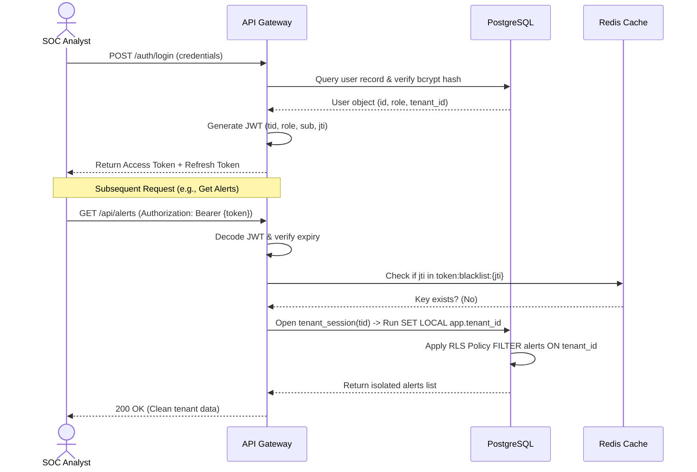
```mermaid
sequenceDiagram
    actor User as SOC Analyst
    participant GW as API Gateway
    participant DB as PostgreSQL
    participant R as Redis Cache

    User->>GW: POST /auth/login (credentials)
    GW->>DB: Query user record & verify bcrypt hash
    DB-->>GW: User object (id, role, tenant_id)
    GW->>GW: Generate JWT (tid, role, sub, jti)
    GW-->>User: Return Access Token + Refresh Token
    
    Note over User, GW: Subsequent Request (e.g., Get Alerts)
    
    User->>GW: GET /api/alerts (Authorization: Bearer {token})
    GW->>GW: Decode JWT & verify expiry
    GW->>R: Check if jti in token:blacklist:{jti}
    R-->>GW: Key exists? (No)
    GW->>DB: Open tenant_session(tid) -> Run SET LOCAL app.tenant_id
    DB->>DB: Apply RLS Policy FILTER alerts ON tenant_id
    DB-->>GW: Return isolated alerts list
    GW-->>User: 200 OK (Clean tenant data)
```

<div style="page-break-before: always;"></div>

## Chapter 8: USER JOURNEYS & DIAGRAMS

### 8.1 Tenant & User Onboarding Journey
The onboarding flow registers the corporate tenant and initializes the owner administrator:

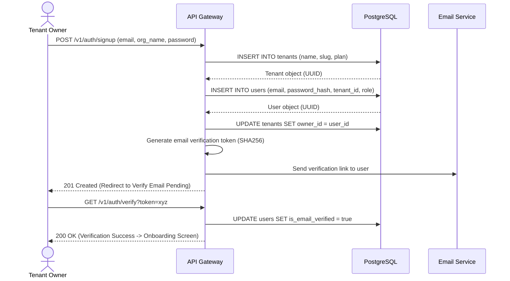
```mermaid
sequenceDiagram
    actor Owner as Tenant Owner
    participant GW as API Gateway
    participant DB as PostgreSQL
    participant E as Email Service

    Owner->>GW: POST /v1/auth/signup (email, org_name, password)
    GW->>DB: INSERT INTO tenants (name, slug, plan)
    DB-->>GW: Tenant object (UUID)
    GW->>DB: INSERT INTO users (email, password_hash, tenant_id, role)
    DB-->>GW: User object (UUID)
    GW->>DB: UPDATE tenants SET owner_id = user_id
    GW->>GW: Generate email verification token (SHA256)
    GW->>E: Send verification link to user
    GW-->>Owner: 201 Created (Redirect to Verify Email Pending)
    
    Owner->>GW: GET /v1/auth/verify?token=xyz
    GW->>DB: UPDATE users SET is_email_verified = true
    GW-->>Owner: 200 OK (Verification Success -> Onboarding Screen)
```

### 8.2 Sensor Registration Flow
This journey connects a remote physical or virtual network interface sniffer to the tenant's account:

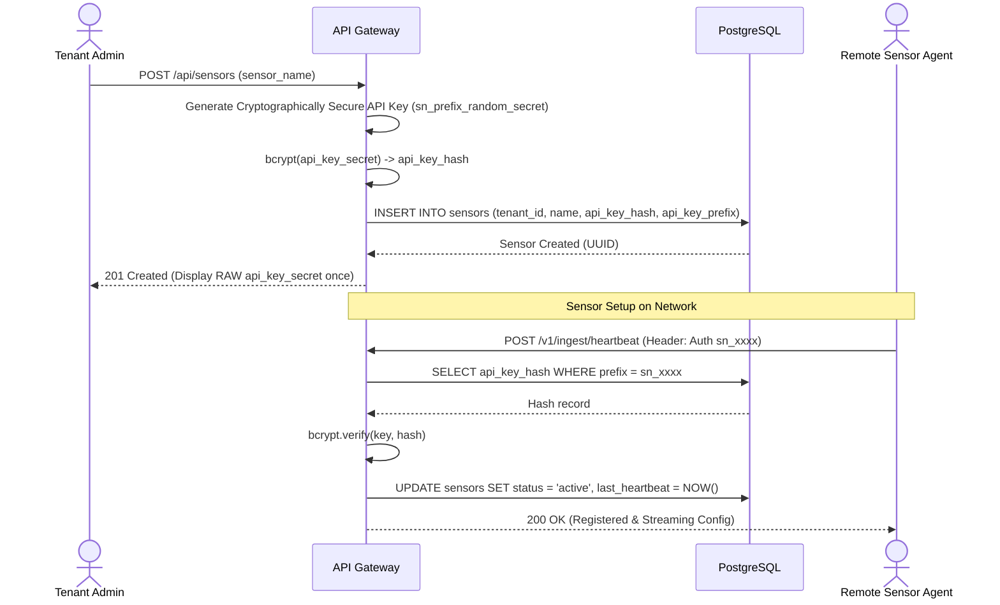
```mermaid
sequenceDiagram
    actor Admin as Tenant Admin
    participant GW as API Gateway
    participant DB as PostgreSQL
    actor Sensor as Remote Sensor Agent

    Admin->>GW: POST /api/sensors (sensor_name)
    GW->>GW: Generate Cryptographically Secure API Key (sn_prefix_random_secret)
    GW->>GW: bcrypt(api_key_secret) -> api_key_hash
    GW->>DB: INSERT INTO sensors (tenant_id, name, api_key_hash, api_key_prefix)
    DB-->>GW: Sensor Created (UUID)
    GW-->>Admin: 201 Created (Display RAW api_key_secret once)
    
    Note over Sensor, GW: Sensor Setup on Network
    
    Sensor->>GW: POST /v1/ingest/heartbeat (Header: Auth sn_xxxx)
    GW->>DB: SELECT api_key_hash WHERE prefix = sn_xxxx
    DB-->>GW: Hash record
    GW->>GW: bcrypt.verify(key, hash)
    GW->>DB: UPDATE sensors SET status = 'active', last_heartbeat = NOW()
    GW-->>Sensor: 200 OK (Registered & Streaming Config)
```

### 8.3 Threat Detection & Mitigation (Human-In-The-Loop)
The complete real-time lifecycle for an anomalous connection, including the 60-second analyst decision timeout:

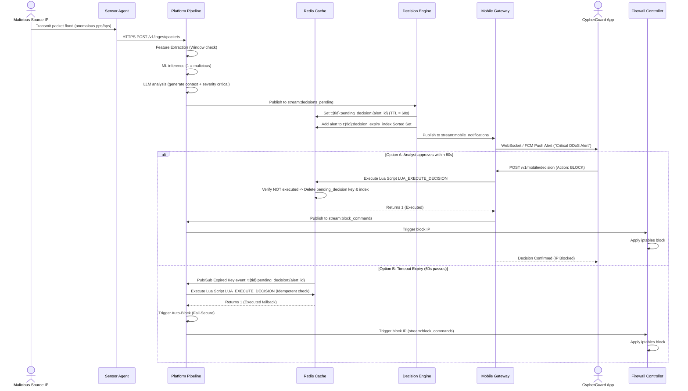
```mermaid
sequenceDiagram
    actor Target as Malicious Source IP
    participant S as Sensor Agent
    participant P as Platform Pipeline
    participant R as Redis Cache
    participant DE as Decision Engine
    participant MG as Mobile Gateway
    actor Analyst as CypherGuard App
    participant FW as Firewall Controller

    Target->>S: Transmit packet flood (anomalous pps/bps)
    S->>P: HTTPS POST /v1/ingest/packets
    P->>P: Feature Extraction (Window check)
    P->>P: ML inference (1 = malicious)
    P->>P: LLM analysis (generate context + severity critical)
    P->>DE: Publish to stream:decisions_pending
    DE->>R: Set t:{tid}:pending_decision:{alert_id} (TTL = 60s)
    DE->>R: Add alert to t:{tid}:decision_expiry_index Sorted Set
    DE->>MG: Publish to stream:mobile_notifications
    MG->>Analyst: WebSocket / FCM Push Alert ("Critical DDoS Alert")
    
    alt Option A: Analyst approves within 60s
        Analyst->>MG: POST /v1/mobile/decision (Action: BLOCK)
        MG->>R: Execute Lua Script LUA_EXECUTE_DECISION
        R->>R: Verify NOT executed -> Delete pending_decision key & index
        R-->>MG: Returns 1 (Executed)
        MG->>P: Publish to stream:block_commands
        P->>FW: Trigger block IP
        FW->>FW: Apply iptables block
        MG-->>Analyst: Decision Confirmed (IP Blocked)
    else Option B: Timeout Expiry (60s passes)
        R->>P: Pub/Sub Expired Key event: t:{tid}:pending_decision:{alert_id}
        P->>R: Execute Lua Script LUA_EXECUTE_DECISION (Idempotent check)
        R-->>P: Returns 1 (Executed fallback)
        P->>P: Trigger Auto-Block (Fail-Secure)
        P->>FW: Trigger block IP (stream:block_commands)
        FW->>FW: Apply iptables block
    end
```

---


### 8.4 Sequence Diagrams

#### Authentication Flow
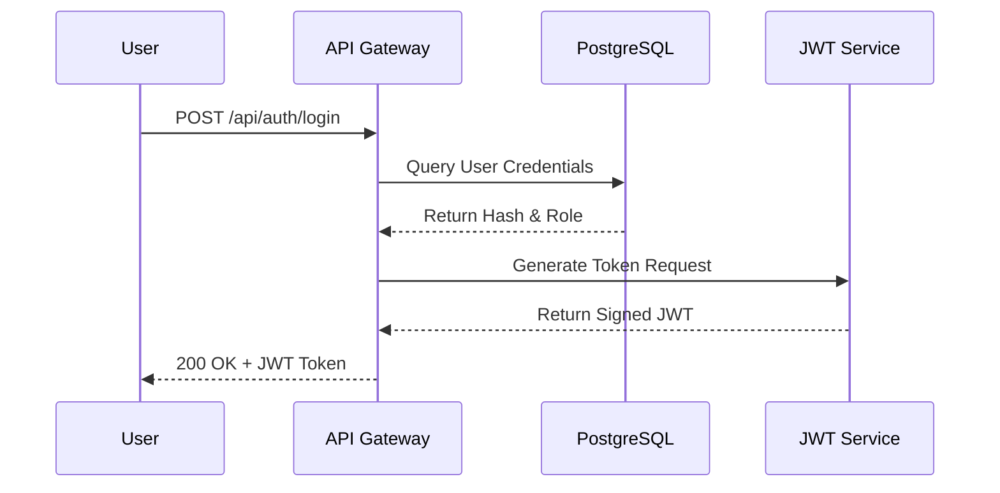
```mermaid
sequenceDiagram
    participant User
    participant APIGW as API Gateway
    participant DB as PostgreSQL
    participant JWT as JWT Service

    User->>APIGW: POST /api/auth/login
    APIGW->>DB: Query User Credentials
    DB-->>APIGW: Return Hash & Role
    APIGW->>JWT: Generate Token Request
    JWT-->>APIGW: Return Signed JWT
    APIGW-->>User: 200 OK + JWT Token
```

#### Sensor Registration Flow
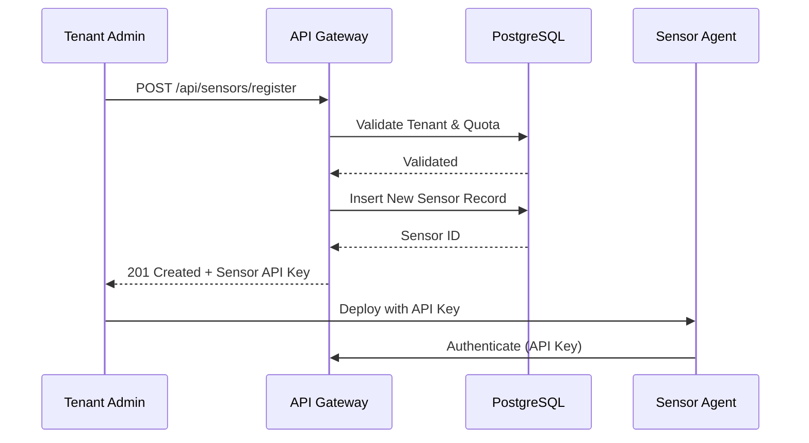
```mermaid
sequenceDiagram
    participant Admin as Tenant Admin
    participant APIGW as API Gateway
    participant DB as PostgreSQL
    participant Sensor as Sensor Agent

    Admin->>APIGW: POST /api/sensors/register
    APIGW->>DB: Validate Tenant & Quota
    DB-->>APIGW: Validated
    APIGW->>DB: Insert New Sensor Record
    DB-->>APIGW: Sensor ID
    APIGW-->>Admin: 201 Created + Sensor API Key
    Admin->>Sensor: Deploy with API Key
    Sensor->>APIGW: Authenticate (API Key)
```

#### Threat Detection Pipeline
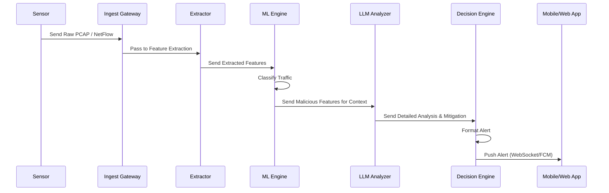
```mermaid
sequenceDiagram
    participant Sensor
    participant Ingest as Ingest Gateway
    participant Extractor
    participant ML as ML Engine
    participant LLM as LLM Analyzer
    participant Decision as Decision Engine
    participant App as Mobile/Web App

    Sensor->>Ingest: Send Raw PCAP / NetFlow
    Ingest->>Extractor: Pass to Feature Extraction
    Extractor->>ML: Send Extracted Features
    ML->>ML: Classify Traffic
    ML->>LLM: Send Malicious Features for Context
    LLM->>Decision: Send Detailed Analysis & Mitigation
    Decision->>Decision: Format Alert
    Decision->>App: Push Alert (WebSocket/FCM)
```

#### Threat Mitigation Flow
```mermaid
sequenceDiagram
    participant Analyst
    participant App as Mobile/Web App
    participant Decision as Decision Engine
    participant FW as Firewall Controller
    participant DB as PostgreSQL

    Analyst->>App: Click "Block IP"
    App->>Decision: POST /api/mitigation/block
    Decision->>DB: Log Mitigation Action
    Decision->>FW: Dispatch Block Rule
    FW-->>Decision: Confirmation
    Decision-->>App: Success Response
```

### 8.5 State Diagram

#### Alert Lifecycle State Diagram
```mermaid
stateDiagram-v2
    [*] --> NEW: Threat Detected
    NEW --> INVESTIGATING: Analyst Acknowledges
    NEW --> RESOLVED: Auto-mitigation (if enabled)
    NEW --> FALSE_POSITIVE: Auto-closed (ML confidence low)
    INVESTIGATING --> RESOLVED: Mitigation Applied
    INVESTIGATING --> FALSE_POSITIVE: Analyst Rejects
    RESOLVED --> [*]
    FALSE_POSITIVE --> [*]
```

### 8.6 UML Deployment Diagram
```mermaid
flowchart TD
    %% Users
    User((Web User))
    Admin((Tenant Admin))
    Analyst((SOC Analyst))
    MobileApp[Mobile App<br/>Flutter]
    WebApp[React Dashboard]

    %% Load Balancer
    LB{Load Balancer / Nginx}

    %% Gateways
    APIGW[API Gateway<br/>FastAPI]
    IngestGW[Ingest Gateway<br/>FastAPI]

    %% Services
    MLEngine[ML Engine]
    LLMAnalyzer[LLM Analyzer]
    Extractor[Feature Extractor]
    DecisionEngine[Decision Engine]

    %% Databases
    DB[(PostgreSQL)]
    Cache[(Redis)]

    %% External
    ExtLLM[[External LLM API<br/>OpenRouter]]
    ExtFCM[[Firebase Cloud Messaging]]

    %% Connections
    User --> WebApp
    Admin --> WebApp
    Analyst --> WebApp
    Analyst --> MobileApp

    WebApp --> LB
    MobileApp --> LB

    LB --> APIGW
    LB --> IngestGW

    APIGW --> Cache
    APIGW --> DB
    
    IngestGW --> Cache
    
    Cache --> Extractor
    Extractor --> MLEngine
    MLEngine --> LLMAnalyzer
    MLEngine --> Cache
    LLMAnalyzer --> ExtLLM
    LLMAnalyzer --> DecisionEngine
    DecisionEngine --> DB
    DecisionEngine --> Cache
    DecisionEngine --> ExtFCM
```

<div style="page-break-before: always;"></div>

## Chapter 9: FRONTEND DOCUMENTATION

### 9.1 React Web SOC Dashboard
The web client dashboard is built on React 19 and Vite.
* **Folder Structure:**
  ```text
  soc-frontend/
  ├── public/                 # Static asset definitions
  ├── src/
  │   ├── assets/             # Branding icons, images
  │   ├── components/         # Reusable UI components
  │   │   ├── Sidebar.jsx           # Main navigation
  │   │   ├── ThreatLog.jsx         # Paginated historical alerts list
  │   │   ├── LiveAlertsWidget.jsx  # Real-time WebSocket alerts feed
  │   │   ├── MetricsGrid.jsx       # Real-time pps, bps, active connections metrics
  │   │   └── FirewallPanel.jsx     # Active blocklist controller
  │   ├── hooks/              # Custom React hooks (useAuth, useWebSockets)
  │   ├── pages/              # Primary route view components
  │   │   ├── LandingPage.jsx       # Static SaaS landing
  │   │   ├── LoginPage.jsx         # Security login portal
  │   │   ├── OnboardingWizard.jsx  # Admin tenant startup panel
  │   │   ├── Threats.jsx           # Incident center
  │   │   ├── SensorsPage.jsx       # Sensor management portal
  │   │   ├── PlaybooksPage.jsx     # Mitigation rule playbooks
  │   │   └── SystemNodes.jsx       # Microservices node topology checker
  │   ├── App.jsx             # React router configuration
  │   ├── index.css           # Styling variables & dark-theme tokens
  │   └── main.jsx            # DOM renderer
  ```
* **Routing System:** React Router DOM V6 utilizing a ``<ProtectedRoute>`` layout that validates active JWT tokens.
* **State Management:** Local React Context hooks combined with localized caching for paginated tables.
* **UI & Aesthetics:** Consistent dark-mode dashboard themed on custom dark HSL values (deep navy #0d1117, border steel gray #21262d, alerts danger red HSL 350, 80%, 50%).

### 9.2 CypherGuard Flutter Mobile App
The companion application provides mobile-ready threat auditing.
* **Core Screens:**
  * **Landing/Login Screen:** Authenticates user credentials via POST request to `/v1/mobile/login`.
  * **Dashboard Screen:** Integrates WebSocket subscriptions, updating active counters and threat logs dynamically.
  * **Alert Detail Modal:** Displays LLM explanations, recommendation arrays, and action controls (BLOCK/ALLOW).
  * **Blocklist Screen:** Displays active IP block records, featuring swipe-to-unblock HTTP request hooks.

<div style="page-break-before: always;"></div>

## Chapter 10: BACKEND DOCUMENTATION

### 10.1 Microservices Architecture
The backend is written in FastAPI (Python 3.14). It leverages asyncpg for asynchronous PostgreSQL interaction, aioredis for Redis stream event loops, and Pydantic for input sanitization and schema matching.

```mermaid
flowchart TD
    subgraph Gateways["Client Gateways"]
        AGW["API Gateway (Port 8000)"]
        MGW["Mobile Gateway (Port 8005)"]
        IGW["Ingest Gateway (Port 8007)"]
    end

    subgraph Pipeline["Data Processing Pipeline"]
        FE["Feature Extractor (Port 8001)"]
        MLE["ML Engine (Port 8002)"]
        LLM["LLM Analyzer (Port 8003)"]
        DEC["Decision Engine (Port 8006)"]
        FW["Firewall Controller (Port 8004)"]
    end

    subgraph DBs["Storage Systems"]
        PG[("PostgreSQL DB")]
        R[("Redis Cluster")]
    end

    AGW <-->|"Queries / Auth"| PG
    MGW <-->|"Action Logs"| PG
    IGW -->|"Check Keys"| PG
    IGW -->|"stream:raw_packets"| R
    FE -->|"Read Raw Packets"| R
    FE -->|"Update Connections"| R
    FE -->|"stream:features"| R
    MLE -->|"Read Features"| R
    MLE -->|"stream:alerts"| R
    LLM -->|"Read Alerts"| R
    LLM -->|"Query Cache"| R
    LLM -->|"stream:decisions_pending"| R
    DEC -->|"Read Pending Decisions"| R
    DEC -->|"Set Expire Keys"| R
    DEC -->|"stream:block_commands"| R
    DEC -->|"stream:mobile_notifications"| R
    FW -->|"Read Block Commands"| R
    FW -->|"Update Block Cache"| R
    FW -->|"Save Logs"| PG
```

### 10.2 Asynchronous Request Handling
For high performance, all microservice endpoint calls are implemented as async functions (`async def`). Gateway requests verify JWT signatures in memory without blocking, accessing the database via async session contexts (`async with tenant_session(tid)`). Database connections utilize SQLAlchemy’s asyncpg engine configured with a connection pool size of 20 and a recycle interval of 300 seconds.

<div style="page-break-before: always;"></div>

## Chapter 11: DATABASE DOCUMENTATION

### 11.1 PostgreSQL Schema and Relationships (ERD)

The database schema is fully normalized to 3NF and utilizes PostgreSQL Row-Level Security (RLS) for multi-tenancy.

```mermaid
erDiagram
    TENANT ||--o{ USERS : "has (1:N)"
    TENANT ||--o{ SENSORS : "owns (1:N)"
    TENANT ||--o{ ALERTS : "tracks (1:N)"
    TENANT ||--o{ SUBSCRIPTIONS : "has (1:1)"
    
    USERS ||--o{ AUDIT_LOGS : "generates (1:N)"
    
    SENSORS ||--o{ TRAFFIC_LOGS : "captures (1:N)"
    SENSORS ||--o{ ALERTS : "triggers (1:N)"
    
    ALERTS ||--o{ DECISION_LOGS : "produces (1:N)"
    ALERTS ||--o{ MITIGATION_ACTIONS : "requires (1:N)"

    TENANT {
        uuid id PK
        string name
        string industry
        timestamp created_at
    }
    
    USERS {
        uuid id PK
        uuid tenant_id FK
        string email
        string password_hash
        string role "Admin, Analyst, Viewer"
    }

    SENSORS {
        uuid id PK
        uuid tenant_id FK
        string location
        string status
        string api_key_hash
    }

    ALERTS {
        uuid id PK
        uuid tenant_id FK
        uuid sensor_id FK
        string severity
        string threat_type
        string status "NEW, INVESTIGATING, RESOLVED, FALSE_POSITIVE"
        jsonb metadata
    }

    DECISION_LOGS {
        uuid id PK
        uuid alert_id FK
        string analyst_notes
        timestamp updated_at
    }
```

### 11.2 PostgreSQL Row-Level Security (RLS) Implementation
To prevent cross-tenant data leakage, the database enforces strict RLS policies on the data tables (`alerts`, `blocked_ips`, `decision_logs`, `ml_predictions`, `audit_log`).

1. **Transaction Isolation:**
   When a client query arrives, the application retrieves the tenant ID from the JWT token and opens a database session. It immediately executes `SET LOCAL app.tenant_id = :tid` as the first statement in the transaction.
2. **PostgreSQL Policy Rules:**
   ```sql
   ALTER TABLE alerts ENABLE ROW LEVEL SECURITY;
   
   -- Select/Update Isolation Policy
   CREATE POLICY tenant_isolation_alerts ON alerts
   USING (tenant_id = current_setting('app.tenant_id', true)::uuid);
   
   -- Insert Isolation Policy
   CREATE POLICY tenant_insert_alerts ON alerts
   FOR INSERT WITH CHECK (tenant_id = current_setting('app.tenant_id', true)::uuid);
   ```
3. **Defense-in-Depth Connection Reset:**
   To guarantee that tenant contexts do not leak when connections are recycled in the pool, the `tenant_session()` context manager always executes `RESET app.tenant_id` inside a `finally` block before returning the connection to the pool.

### 11.3 Database Data Dictionary (Core Tables)

#### Table: `tenants`
* `id` (UUID, PK): Unique organization identifier.
* `name` (VARCHAR(255)): Human-readable company name.
* `slug` (VARCHAR(100), UNIQUE): URL-friendly string used as subdomain mapping (index-optimized).
* `owner_id` (UUID, FK -> users): The primary user account managing the organization subscription.
* `plan` (VARCHAR(50)): Subscription tier (`free`, `pro`, `business`, `enterprise`).
* `status` (VARCHAR(20)): Invoicing state (`trial`, `active`, `suspended`, `cancelled`).

#### Table: `users`
* `id` (UUID, PK): Unique user identifier.
* `tenant_id` (UUID, FK -> tenants): Organization scope reference.
* `email` (VARCHAR(255), UNIQUE): Login username.
* `password_hash` (VARCHAR(255)): Secure bcrypt-hashed password credentials.
* `role` (VARCHAR(20)): Access permissions level (`owner`, `admin`, `analyst`, `viewer`).
* `is_active` (BOOLEAN): Status toggle enabling platform access.

#### Table: `alerts`
* `id` (UUID, PK): Unique alert identifier.
* `tenant_id` (UUID, FK -> tenants): Scope reference.
* `src_ip` (VARCHAR(45)): The attacking IPv4 or IPv6 address.
* `attack_type` (VARCHAR(100)): AI classified category (e.g. DDoS Volumetric flood).
* `severity` (VARCHAR(20)): Threat rating (`low`, `medium`, `high`, `critical`).
* `confidence` (FLOAT): Machine learning classifier probability output.
* `explanation` (TEXT): Natural language explanation.
* `recommendation` (TEXT): Actionable mitigation step.
* `raw_features` (JSONB): Key-value pair collection of the 11 feature metrics.
* `status` (VARCHAR(20)): Audit tracker (`new`, `investigating`, `resolved`, `false_positive`).
* `created_at` (TIMESTAMP): Creation time.

#### Table: `blocked_ips`
* `id` (UUID, PK): Unique block identifier.
* `tenant_id` (UUID, FK -> tenants): Scope reference.
* `ip_address` (VARCHAR(45)): Target IP address.
* `reason` (TEXT): Audit explanation for block.
* `alert_id` (UUID, FK -> alerts): Alert reference.
* `is_active` (BOOLEAN): Active status toggle.

### 11.4 Indexing & Optimization Strategy
To maintain low latency during heavy database write operations, composite and partial indexes are applied:
* **Composite Query Optimization:**
  ```sql
  CREATE INDEX idx_alerts_tenant_created ON alerts(tenant_id, created_at DESC);
  ```
  Optimizes dashboard queries that retrieve the most recent alerts for a specific tenant.
* **Partial Indexing for Active IP Checks:**
  ```sql
  CREATE INDEX idx_blocked_ips_active ON blocked_ips(ip_address) WHERE is_active = TRUE;
  ```
  Reduces check times for blocked IPs by excluding inactive records from the index.
* **Tenant Scoping Index:**
  ```sql
  CREATE INDEX idx_users_tenant_email ON users(tenant_id, email);
  ```
  Speeds up credential verification during login.


### 11.5 Database Normalization Analysis

To ensure data integrity, eliminate redundancy, and optimize complex queries, the PostgreSQL schema adheres strictly to the Third Normal Form (3NF).

#### First Normal Form (1NF)
* **Rule:** Every column holds atomic (indivisible) values, and each record is unique.
* **Implementation:** Arrays and complex lists are not stored in single string columns. Although `metadata` uses `JSONB`, it is treated as a NoSQL document block specifically for unstructured threat data. All relational fields (IDs, names, statuses) are atomic.

#### Second Normal Form (2NF)
* **Rule:** Must be in 1NF, and all non-key attributes must depend on the entire primary key (no partial dependency).
* **Implementation:** Every table has a single-column primary key (`uuid id`). Therefore, non-key attributes like `sensor_location` depend entirely on `sensor_id`, not on a composite key part.

#### Third Normal Form (3NF)
* **Rule:** Must be in 2NF, and there must be no transitive dependencies (non-key attributes depending on other non-key attributes).
* **Implementation:** User roles do not dictate permissions within the `USERS` table directly if those permissions were separate columns. `Tenant` billing details are kept in a separate `SUBSCRIPTIONS` table rather than cluttering the `TENANT` table. Alerts reference `sensor_id` rather than replicating sensor location and status in the `ALERTS` table.

<div style="page-break-before: always;"></div>

## Chapter 12: API REFERENCE

### 12.1 Authentication & Registration Endpoints (Public)

#### `POST /v1/auth/signup`
* **Purpose:** Registers a new tenant organization and its owner account.
* **Request Body:**
  ```json
  {
    "email": "owner@company.com",
    "password": "StrongPassword123!",
    "org_name": "Acme Corp"
  }
  ```
* **Response (201 Created):**
  ```json
  {
    "tenant_id": "a4b5c6d7-1234-5678-90ab-cdef12345678",
    "user_id": "b5c6d7e8-5678-1234-90ab-cdef12345678",
    "message": "Verification email dispatched"
  }
  ```

#### `POST /v1/auth/login`
* **Purpose:** Authenticates user credentials and issues JWT session tokens.
* **Request Body:**
  ```json
  {
    "email": "user@company.com",
    "password": "StrongPassword123!"
  }
  ```
* **Response (200 OK):**
  ```json
  {
    "access_token": "eyJhbGciOi...",
    "refresh_token": "eyJhbGciOi...",
    "token_type": "bearer",
    "expires_in": 3600,
    "role": "analyst"
  }
  ```

### 12.2 Dashboard Protected Endpoints (JWT Required)

#### `GET /api/alerts`
* **Purpose:** Retrieves a paginated list of tenant-scoped threat alerts.
* **Query Parameters:**
  * `page` (int, default: 1)
  * `limit` (int, default: 20)
  * `status` (string, optional: `new`, `investigating`, `resolved`)
* **Headers:** `Authorization: Bearer <token>`
* **Response (200 OK):**
  ```json
  {
    "alerts": [
      {
        "id": "e7b90c40-abc9-1234-5678-000000000001",
        "src_ip": "185.120.45.22",
        "attack_type": "DDoS Volumetric flood",
        "severity": "critical",
        "confidence": 0.982,
        "status": "new",
        "created_at": "2026-06-13T01:00:00Z"
      }
    ],
    "total": 120,
    "page": 1,
    "pages": 6
  }
  ```

#### `POST /api/firewall/block`
* **Purpose:** Manually blocks an IP address for the tenant.
* **Request Body:**
  ```json
  {
    "ip_address": "185.120.45.22",
    "reason": "Suspicious DDoS traffic",
    "alert_id": "e7b90c40-abc9-1234-5678-000000000001"
  }
  ```
* **Response (200 OK):**
  ```json
  {
    "status": "ok",
    "message": "IP 185.120.45.22 blocked"
  }
  ```

### 12.3 Sensor Ingest Endpoints (Sensor API Key Required)

#### `POST /v1/ingest/packets`
* **Purpose:** Submits a batch of packet observations.
* **Headers:** `Authorization: Bearer <sensor_api_key>`
* **Request Body:**
  ```json
  {
    "packets": [
      {"src_ip": "192.168.1.15", "size": 1500, "protocol": "TCP"},
      {"src_ip": "192.168.1.15", "size": 64, "protocol": "UDP"}
    ]
  }
  ```
* **Response (200 OK):**
  ```json
  {
    "status": "ok",
    "accepted": 2
  }
  ```

<div style="page-break-before: always;"></div>

## Chapter 13: AI & MACHINE LEARNING SUBSYSTEM

### Document Metadata

| Field | Value |
|---|---|
| Subsystem | AI / Machine Learning |
| Version | 2.0.0 |
| Services Covered | Extractor, ML Engine, LLM Analyzer |
| Shared Modules | `drift_detector`, `circuit_breaker`, `llm_config`, `redis_client` (feature computation) |
| Primary Author | AI Engineering Team |

---

### 13.1 Overview

#### 13.1.1 Purpose

The AI subsystem is responsible for the automated detection, classification, and explanation of network-based cyber threats in real time. It transforms raw network packets into actionable security intelligence through a three-stage pipeline:

1. **Feature Engineering** — Computes behavioral statistics from raw packet streams using sliding-window analysis.
2. **ML Classification** — Applies a trained binary classifier to determine whether a traffic pattern is benign or malicious.
3. **LLM Enrichment** — Generates human-readable threat explanations, attack type labels, severity assessments, and mitigation recommendations using a large language model.

#### 13.1.2 Design Principles

| Principle | Implementation |
|---|---|
| **Separation of Concerns** | Fast/cheap ML model handles high-throughput binary filtering; slow/expensive LLM handles rare-case enrichment |
| **Fail-Secure** | If any AI component fails, the system defaults to blocking (never allowing) suspicious traffic |
| **Zero Single Point of Failure** | LLM has a three-tier fallback chain (cache → API → heuristic rules); ML model hot-reloads without downtime |
| **Cost Optimization** | Alert cooldown (1 per IP per 60s), traffic-profile caching, and circuit breakers minimize external API spend |
| **Observability** | Every prediction, LLM call, drift event, and latency metric is tracked via Prometheus and PostgreSQL |

#### 13.1.3 Component Map

```mermaid
flowchart LR
    subgraph "Stage 1: Feature Engineering"
        EXT["Extractor Service<br/>(port 8001)"]
        REDIS_FEAT["Redis Sorted Sets<br/>(sliding window)"]
    end

    subgraph "Stage 2: ML Classification"
        MLE["ML Engine Service<br/>(port 8002)"]
        MODEL["model.joblib<br/>(Pipeline: Scaler + Classifier)"]
        DRIFT["DriftDetector<br/>(KL Divergence)"]
    end

    subgraph "Stage 3: LLM Enrichment"
        LLMA["LLM Analyzer Service<br/>(port 8003)"]
        CB["CircuitBreaker"]
        CACHE["Redis LLM Cache"]
        HEUR["Heuristic Fallback"]
    end

    EXT --> REDIS_FEAT
    REDIS_FEAT --> EXT
    EXT -->|"stream:features"| MLE
    MLE --> MODEL
    MLE --> DRIFT
    MLE -->|"stream:alerts"| LLMA
    LLMA --> CB
    LLMA --> CACHE
    LLMA --> HEUR
```

---

### 13.2 Feature Engineering

#### 13.2.1 Overview

The Feature Engineering stage converts raw packet metadata `(src_ip, size, protocol)` into an 11-dimensional numeric feature vector that characterizes the behavioral profile of a source IP address over a configurable time window.

**Service:** [extractor/main.py](Repository:
CypherGuard/extractor/main.py)  
**Feature Computation:** [shared/redis_client.py → get_conn_features()](Repository:
CypherGuard/shared/redis_client.py#L175-L248)  
**Feature Definitions:** [ml_engine/feature_engineering.py → FEATURE_COLUMNS](Repository:
CypherGuard/ml_engine/feature_engineering.py#L26-L38)

#### 13.2.2 Sliding Window Architecture

Each source IP maintains a Redis Sorted Set that functions as a time-ordered sliding window of packet observations.

**Redis Key Format:**
```
t:{tenant_id}:conn:{src_ip}:packets
```

**Entry Format:**
```
Member: "{timestamp_ms}:{packet_size_bytes}"
Score:  {timestamp_ms}
```

**Window Operations:**

| Operation | Redis Command | Purpose |
|---|---|---|
| Add packet | `ZADD key {timestamp_ms} "{timestamp_ms}:{size}"` | Record new observation |
| Trim by time | `ZREMRANGEBYSCORE key 0 (now_ms - window_ms)` | Remove packets older than window |
| Trim by count | `ZREMRANGEBYRANK key 0 -10001` | Cap at 10,000 entries (DDoS protection) |
| Set expiry | `EXPIRE key (ttl + 60)` | Auto-cleanup after inactivity |
| Query window | `ZRANGEBYSCORE key (now_ms - window_ms) now_ms` | Retrieve all packets in window |

All five operations are executed atomically in a Redis pipeline to minimize round-trips:

```python
pipe = self.client.pipeline()
pipe.zadd(key, {member: now_ms})
pipe.zremrangebyscore(key, 0, now_ms - (ttl * 1000))
pipe.zremrangebyrank(key, 0, -10001)
pipe.expire(key, ttl + 60)
await pipe.execute()
```

**Configuration:**

| Parameter | Default | Environment Variable | Description |
|---|---|---|---|
| Window duration | 30 seconds | `FEATURE_WINDOW_SECONDS` | Time span for feature computation |
| TTL | 300 seconds | — | How long Redis keeps data for an inactive IP |
| Max entries per IP | 10,000 | — | Hard cap to prevent memory exhaustion under DDoS |

#### 13.2.3 Feature Definitions

The following 11 features are computed for every source IP at every packet arrival. They are defined in [FEATURE_COLUMNS](Repository:
CypherGuard/ml_engine/feature_engineering.py#L26-L38) and mapped from runtime names via [EXTRACTOR_TO_CICIDS](Repository:
CypherGuard/ml_engine/feature_engineering.py#L41-L53).

Let *n* be the number of packets in the window, *s = {s₁, s₂, …, sₙ}* be the packet sizes, and *t = {t₁, t₂, …, tₙ}* be the timestamps (sorted ascending).

##### 13.2.3.1 Flow Bytes/s

| Property | Value |
|---|---|
| CICIDS2017 Name | `Flow Bytes/s` |
| Runtime Name | `bytes_per_sec` |
| Formula | `Σsᵢ / W` where `W` = window duration in seconds |
| Range | [0, ∞) — capped at 10⁸ during serving |
| Security Relevance | DDoS volumetric floods produce extremely high byte rates |

##### 13.2.3.2 Flow Packets/s

| Property | Value |
|---|---|
| CICIDS2017 Name | `Flow Packets/s` |
| Runtime Name | `packets_per_sec` |
| Formula | `n / W` |
| Range | [0, ∞) — capped at 10⁸ during serving |
| Security Relevance | Port scans and SYN floods produce high packet rates with small payloads |

##### 13.2.3.3 Avg Packet Size

| Property | Value |
|---|---|
| CICIDS2017 Name | `Avg Packet Size` |
| Runtime Name | `avg_packet_size` |
| Formula | `(Σsᵢ) / n` |
| Range | [0, 65535] |
| Security Relevance | SYN/ACK probes: ~40-60 bytes. DDoS floods: ~1400 bytes. Normal browsing: ~200-800 bytes |

##### 13.2.3.4 Flow Duration

| Property | Value |
|---|---|
| CICIDS2017 Name | `Flow Duration` |
| Runtime Name | `flow_duration` |
| Formula | `(max(t) - min(t)) / 1000` (seconds) |
| Range | [0, 86400] — capped at 1 day during serving |
| Security Relevance | Scans are bursty (short duration); normal sessions are sustained |

##### 13.2.3.5 Total Fwd Packets

| Property | Value |
|---|---|
| CICIDS2017 Name | `Total Fwd Packets` |
| Runtime Name | `packet_count` |
| Formula | `n` (count of packets in window) |
| Range | [0, 10000] (bounded by max entries cap) |
| Security Relevance | Raw volume indicator for traffic intensity |

##### 13.2.3.6 Total Length of Fwd Packets

| Property | Value |
|---|---|
| CICIDS2017 Name | `Total Length of Fwd Packets` |
| Runtime Name | `total_bytes` |
| Formula | `Σsᵢ` |
| Range | [0, ∞) — capped at 10⁸ during serving |
| Security Relevance | Bandwidth consumption measurement |

##### 13.2.3.7 Fwd Packet Length Mean

| Property | Value |
|---|---|
| CICIDS2017 Name | `Fwd Packet Length Mean` |
| Runtime Name | `fwd_pkt_len_mean` |
| Formula | `μₛ = (1/n) × Σsᵢ` |
| Range | [0, ∞) — non-negative enforced during serving |
| Note | Equivalent to Avg Packet Size in this system (forward-only traffic) |

##### 13.2.3.8 Fwd Packet Length Std

| Property | Value |
|---|---|
| CICIDS2017 Name | `Fwd Packet Length Std` |
| Runtime Name | `fwd_pkt_len_std` |
| Formula | `σₛ = √((1/n) × Σ(sᵢ - μₛ)²)` |
| Range | [0, ∞) |
| Security Relevance | σ ≈ 0 indicates uniform traffic (automated tool/bot); large σ indicates varied traffic (human) |

##### 13.2.3.9 Flow IAT Mean

| Property | Value |
|---|---|
| CICIDS2017 Name | `Flow IAT Mean` |
| Runtime Name | `flow_iat_mean` |
| Formula | Given sorted timestamps, IAT = inter-arrival times: `IATᵢ = tᵢ₊₁ - tᵢ`. Mean = `(1/(n-1)) × Σ IATᵢ` |
| Range | [0, ∞) |
| Security Relevance | Automated attacks have IAT mean near zero (microseconds); human traffic has IAT in seconds |

##### 13.2.3.10 Flow IAT Std

| Property | Value |
|---|---|
| CICIDS2017 Name | `Flow IAT Std` |
| Runtime Name | `flow_iat_std` |
| Formula | `σ_IAT = √((1/(n-1)) × Σ(IATᵢ - μ_IAT)²)` |
| Range | [0, ∞) |
| Security Relevance | Low standard deviation = robotic regularity (scanner/bot); high = human-like irregularity |

##### 13.2.3.11 Small Packet Ratio

| Property | Value |
|---|---|
| CICIDS2017 Name | `Small Packet Ratio` |
| Runtime Name | `small_packet_ratio` |
| Formula | `|{sᵢ : sᵢ < 100}| / n` |
| Range | [0, 1] — clamped during serving |
| Security Relevance | Port scans consist almost entirely of small packets (ratio > 0.8). DDoS has very low ratio (< 0.1) |

#### 13.2.4 Feature Name Mapping

The extractor produces features using runtime names (e.g., `packets_per_sec`). The ML model expects CICIDS2017 column names (e.g., `Flow Packets/s`). The mapping is defined in [EXTRACTOR_TO_CICIDS](Repository:
CypherGuard/ml_engine/feature_engineering.py#L41-L53) and applied by [extractor_to_model_features()](Repository:
CypherGuard/ml_engine/feature_engineering.py#L120-L161).

```python
EXTRACTOR_TO_CICIDS = {
    "bytes_per_sec":       "Flow Bytes/s",
    "packets_per_sec":     "Flow Packets/s",
    "avg_packet_size":     "Avg Packet Size",
    "flow_duration":       "Flow Duration",
    "packet_count":        "Total Fwd Packets",
    "total_bytes":         "Total Length of Fwd Packets",
    "fwd_pkt_len_mean":    "Fwd Packet Length Mean",
    "fwd_pkt_len_std":     "Fwd Packet Length Std",
    "flow_iat_mean":       "Flow IAT Mean",
    "flow_iat_std":        "Flow IAT Std",
    "small_packet_ratio":  "Small Packet Ratio",
}
```

#### 13.2.5 Serving-Time Sanitization

The [extractor_to_model_features()](Repository:
CypherGuard/ml_engine/feature_engineering.py#L120-L161) function applies the following sanitization before model input:

| Rule | Features Affected | Constraint |
|---|---|---|
| NaN / Inf → 0.0 | All features | Prevents undefined model behavior |
| Small Packet Ratio clamp | `Small Packet Ratio` | Clamped to [0.0, 1.0] |
| Rate cap | `Flow Bytes/s`, `Flow Packets/s`, `Total Length of Fwd Packets` | Capped at 10⁸ |
| Duration cap | `Flow Duration` | Capped at 86,400 seconds (24 hours) |
| Non-negative enforcement | All remaining features | `max(0.0, value)` |

#### 13.2.6 Extractor Processing Pipeline

**Function:** [process_packet()](Repository:
CypherGuard/extractor/main.py#L59-L118)

```mermaid
flowchart TD
    A["Receive message from<br/>stream:raw_packets"] --> B{"Validate src_ip,<br/>size, protocol"}
    B -->|invalid| C["Increment invalid counter<br/>Return"]
    B -->|valid| D{"is_blocked(src_ip)?"}
    D -->|yes| E["Return (skip)"]
    D -->|no| F["update_conn_stats()<br/>ZADD to sorted set"]
    F --> G["get_conn_features()<br/>Compute 11 features"]
    G --> H["Publish to<br/>stream:features"]
    H --> I["ACK message"]
```

**Background Tasks:**

| Task | Function | Interval | Purpose |
|---|---|---|---|
| Consumer loop | `consumer_loop()` | Continuous (batch=50, block=2000ms) | Main packet processing |
| Metrics publisher | `metrics_publisher_loop()` | Every 1 second | Aggregates pps/bps/active connections for dashboard |

---

### 13.3 ML Classification

#### 13.3.1 Overview

The ML Engine performs binary classification (benign vs. malicious) on the 11-dimensional feature vectors produced by the Extractor.

**Service:** [ml_engine/main.py](Repository:
CypherGuard/ml_engine/main.py)  
**Feature Engineering:** [ml_engine/feature_engineering.py](Repository:
CypherGuard/ml_engine/feature_engineering.py)  
**Training Pipeline:** [ml_engine/train_production.py](Repository:
CypherGuard/ml_engine/train_production.py)

#### 13.3.2 Model Architecture

The production model is a scikit-learn `Pipeline` consisting of two stages:

```
Input (11 features) → StandardScaler → Classifier → Output (0 or 1)
```

**Stage 1 — StandardScaler:**

Standardizes features using z-score normalization:

```
z = (x - μ) / σ
```

Where μ and σ are computed from the training data and stored inside the Pipeline object. This ensures the same transformation is applied at training time and serving time.

**Stage 2 — Classifier:**

One of the following algorithms, selected automatically by the training pipeline based on F1 score:

| Algorithm | Library | Key Hyperparameters |
|---|---|---|
| RandomForestClassifier | scikit-learn | `n_estimators=100`, `max_depth=20`, `class_weight="balanced"` |
| XGBClassifier | xgboost | `n_estimators=100`, `max_depth=8`, `scale_pos_weight=auto` |
| GradientBoostingClassifier | scikit-learn | `n_estimators=100`, `max_depth=5` |
| LGBMClassifier | lightgbm | `n_estimators=100`, `max_depth=7`, `scale_pos_weight=auto` |
| CatBoostClassifier | catboost | `n_estimators=100`, `max_depth=6`, `auto_class_weights="Balanced"` |

#### 13.3.3 Training Dataset

**Dataset:** CICIDS2017 (Canadian Institute for Cybersecurity Intrusion Detection Systems 2017)  
**Source:** University of New Brunswick  
**URL:** https://www.unb.ca/cic/datasets/ids-2017.html

**Dataset Structure:**

| Column | Type | Description |
|---|---|---|
| Flow Bytes/s | float | Bytes per second for the flow |
| Flow Packets/s | float | Packets per second for the flow |
| Avg Packet Size | float | Mean packet size in bytes |
| ... (8 more) | float | See Section 2.3 |
| Label | string | `BENIGN`, `DDoS`, `PortScan`, `Bot`, etc. |

**Label Encoding:**

All non-BENIGN labels are collapsed into a single `malicious` class:

```python
y = df["Label"].apply(lambda label: 0 if label.strip() == "BENIGN" else 1)
```

| Class | Label | Meaning |
|---|---|---|
| 0 | Benign | Normal network traffic |
| 1 | Malicious | Any attack type (DDoS, PortScan, BruteForce, Bot, etc.) |

**Data Cleaning (in [prepare_training_data()](Repository:
CypherGuard/ml_engine/feature_engineering.py#L60-L113)):**

1. Column names stripped of whitespace (CICIDS2017 data quality issue)
2. Infinity values replaced with NaN
3. Rows with NaN in feature columns or Label dropped
4. Missing features (if any) filled with 0.0
5. Column order enforced to match `FEATURE_COLUMNS` exactly

#### 13.3.4 Training Pipeline

**Script:** [ml_engine/train_production.py](Repository:
CypherGuard/ml_engine/train_production.py)  
**Usage:** `python ml_engine/train_production.py [path_to_csv]`

##### 13.3.4.1 Pipeline Stages

```mermaid
flowchart TD
    A["1. Load & Prepare Data<br/>prepare_training_data()"] --> B["2. Define Model Candidates<br/>(RF, XGB, GB, LGBM, CatBoost)"]
    B --> C["3. 5-Fold Stratified Cross-Validation<br/>scoring: accuracy, precision, recall, F1, ROC AUC"]
    C --> D["4. Select Best Model by F1<br/>Train on full dataset"]
    D --> E["5. Save Artifacts<br/>model.joblib, metadata.json, baselines.json"]
    E --> F["6. Log Experiment to DB<br/>Auto-promote to registry if best"]
```

##### 13.3.4.2 Cross-Validation

```python
cv = StratifiedKFold(n_splits=5, shuffle=True, random_state=42)
```

- **Stratified:** Preserves the benign/malicious class ratio in each fold
- **5 folds:** Each fold uses 80% data for training and 20% for validation
- **Metrics evaluated per fold:** Accuracy, Precision, Recall, F1, ROC AUC
- **Model selection criterion:** Highest mean F1 score across folds

##### 13.3.4.3 Class Imbalance Handling

CICIDS2017 is imbalanced (typically 80% benign, 20% attack for DDoS files). The pipeline handles this through:

- **RandomForest:** `class_weight="balanced"` — adjusts sample weights inversely proportional to class frequency
- **XGBoost/LightGBM:** `scale_pos_weight = neg_count / pos_count` — scales the gradient contribution of the minority class
- **CatBoost:** `auto_class_weights="Balanced"` — automatic rebalancing

##### 13.3.4.4 Output Artifacts

| File | Path | Contents |
|---|---|---|
| Model | `ml_engine/models/model.joblib` | Serialized sklearn Pipeline (StandardScaler + Classifier) |
| Metadata | `ml_engine/models/model_metadata.json` | Version, algorithm, features, metrics, CV results, timestamp |
| Baselines | `ml_engine/models/feature_baselines.json` | Per-feature histograms for drift detection |

**Metadata Schema:**

```json
{
  "version": "20260612_143000",
  "algorithm": "RandomForest",
  "features": ["Flow Bytes/s", "Flow Packets/s", ...],
  "n_features": 11,
  "n_training_samples": 225745,
  "class_distribution": {"benign": 97718, "attack": 128027},
  "full_training_metrics": {
    "accuracy": 0.9987,
    "precision": 0.9991,
    "recall": 0.9985,
    "f1": 0.9988,
    "roc_auc": 0.9999
  },
  "cross_validation": { ... },
  "trained_at": "2026-06-12T14:30:00",
  "dataset": "Friday-WorkingHours-Afternoon-DDos",
  "pipeline_steps": ["scaler", "model"]
}
```

##### 13.3.4.5 Experiment Logging

Every training run is logged to the `ml_experiments` PostgreSQL table:

| Column | Type | Description |
|---|---|---|
| `id` | UUID | Primary key |
| `experiment_name` | string | `{Algorithm}_{version}` |
| `algorithm` | string | Winning algorithm name |
| `hyperparameters` | JSON | All model parameters |
| `accuracy`, `precision`, `recall`, `f1_score`, `roc_auc` | float | Full-data metrics |
| `cv_scores` | JSON | Per-fold cross-validation results |
| `confusion_matrix` | JSON | `{tn, fp, fn, tp}` |
| `feature_importance` | JSON | `{feature_name: importance_score}` |
| `model_hash` | string | SHA256 of model.joblib |
| `training_time_seconds` | float | Wall-clock training time |
| `is_best` | boolean | Whether this is the best model so far |
| `promoted_to_registry` | boolean | Whether it was promoted to model_registry |

**Auto-Promotion Logic:**

If the new model's F1 score exceeds the current best experiment's F1 score:
1. A new `model_registry` entry is created with `is_active=True`
2. All previous registry entries are set to `is_active=False`
3. The experiment is marked `promoted_to_registry=True`

#### 13.3.5 Inference Pipeline

**Function:** [process_features()](Repository:
CypherGuard/ml_engine/main.py#L158-L268)

##### 13.3.5.1 Processing Flow

```mermaid
flowchart TD
    A["Consume from stream:features<br/>(batch of 20, block 3000ms)"] --> B["Pydantic validation<br/>(PredictionFeatures)"]
    B -->|invalid| C["ACK & skip"]
    B -->|valid| D{"Model loaded?"}
    D -->|no| E["Log error, return"]
    D -->|yes| F{"is_blocked(src_ip)?"}
    F -->|yes| G["Return (skip)"]
    F -->|no| H["extractor_to_model_features()"]
    H --> I["model.predict()"]
    I --> J["model.predict_proba()"]
    J --> K["Log prediction to DB"]
    K --> L["drift_detector.add_sample()"]
    L --> M{"prediction == malicious?"}
    M -->|no| N["Done"]
    M -->|yes| O{"should_alert(ip, 60s)?"}
    O -->|cooldown active| P["Suppress"]
    O -->|no cooldown| Q["Publish to stream:alerts"]
```

##### 13.3.5.2 Prediction Output

| Output | Type | Description |
|---|---|---|
| `prediction` | int | `0` (benign) or `1` (malicious) |
| `confidence` | float | `max(predict_proba())` — highest class probability |
| `latency_ms` | float | Wall-clock inference time in milliseconds |
| `status` | string | `"benign"` or `"malicious"` |

##### 13.3.5.3 Confidence Score Computation

```python
proba = model.predict_proba(features_df)[0]  # e.g., [0.06, 0.94]
confidence = float(max(proba))                # e.g., 0.94
```

For a Random Forest with *T* trees, each tree votes independently. The probability is the fraction of trees voting for each class:

```
P(class=k) = (number of trees voting for k) / T
```

The confidence score is `max(P(class=0), P(class=1))`, representing how certain the ensemble is about its prediction.

##### 13.3.5.4 Alert Cooldown

**Mechanism:** Redis atomic `SET key NX EX` operation

```python
result = await self.client.set(f"cooldown:{ip}", "1", nx=True, ex=cooldown_seconds)
return result is not None
```

| Flag | Meaning |
|---|---|
| `NX` | Set only if the key does **not** exist |
| `EX 60` | Auto-expire after 60 seconds |

**Behavior:**
- First call for an IP → key is created → returns `True` (allow alert)
- Subsequent calls within 60 seconds → key exists → returns `False` (suppress)
- After 60 seconds → key expires → next call creates it again

**Purpose:** Prevents a single attacking IP from generating more than one LLM analysis per minute. Without this, a DDoS at 5,000 pps would trigger 5,000 LLM calls per minute.

##### 13.3.5.5 Prediction Logging

Every prediction is persisted to the `ml_predictions` table:

```python
record = MLPrediction(
    src_ip=src_ip,
    features=features,          # Original feature dict
    prediction=prediction,      # "benign" or "malicious"
    confidence=confidence,      # 0.0 to 1.0
    model_version=MODEL_VERSION,
    latency_ms=latency_ms,
    tenant_id=tenant_id,
)
```

This data is used by the monitoring and auto-retrain subsystems to track model performance over time.

#### 13.3.6 Model Hot-Reloading

The ML Engine supports zero-downtime model updates through two mechanisms:

##### 13.3.6.1 File Watcher (Automatic)

**Function:** [model_watcher_loop()](Repository:
CypherGuard/ml_engine/main.py#L101-L108)

Runs every 5 seconds and checks the model file's modification time:

```python
async def model_watcher_loop():
    while True:
        load_model_if_changed()
        await asyncio.sleep(5)
```

**Reload logic in [load_model_if_changed()](Repository:
CypherGuard/ml_engine/main.py#L66-L96):**

1. Check `os.path.getmtime(MODEL_PATH)`
2. If mtime > last recorded mtime:
   a. Load new model into a **temporary variable** (not the global)
   b. Load new metadata
   c. Only on success: swap the global `model` reference (atomic pointer swap)
   d. Update `last_model_mtime`
3. If loading fails: old model continues serving (no downtime)

##### 13.3.6.2 HTTP Endpoint (Manual)

**Endpoint:** `POST /model/reload`

```python
@app.post("/model/reload")
async def reload_model():
    new_hash = _compute_model_hash(MODEL_PATH)
    if new_hash == MODEL_HASH:
        return {"status": "unchanged"}
    model = joblib.load(MODEL_PATH)
    ...
    return {"status": "reloaded", "version": MODEL_VERSION}
```

Uses SHA256 hash comparison to verify the file actually changed before incurring the cost of loading.

#### 13.3.7 Demo Model

**Script:** [ml_engine/create_demo_model.py](Repository:
CypherGuard/ml_engine/create_demo_model.py)

For demonstration purposes without the CICIDS2017 dataset, a synthetic model can be generated:

```bash
python ml_engine/create_demo_model.py
```

**Synthetic data generation:**

| Feature | Benign Distribution | Attack Distribution |
|---|---|---|
| Flow Bytes/s | Lognormal(μ=7, σ=1.5) clipped [10, 50000] | Lognormal(μ=10, σ=1.5) clipped [5000, 10⁷] |
| Flow Packets/s | Lognormal(μ=0.5, σ=0.8) clipped [0.1, 10] | Lognormal(μ=2.5, σ=1) clipped [5, 5000] |
| Flow IAT Mean | Exponential(λ=2) | Exponential(λ=0.05) |
| Small Packet Ratio | Beta(α=2, β=5) | Beta(α=5, β=2) |
| ... | ... | ... |

Sample sizes: 5,000 benign + 3,000 attack = 8,000 total.

---


#### 13.3.8 Model Evaluation

To ensure the reliability of the Machine Learning subsystem, the classification model undergoes rigorous statistical evaluation using the CICIDS2017/Custom benchmark datasets. 

#### Evaluation Metrics Matrix

| Metric | Definition | Current Value |
|--------|------------|---------------|
| **Accuracy** | Overall correctness of the model across all traffic. | `98.7%` |
| **Precision** | Proportion of true positive alerts out of all positive predictions. | `98.2%` |
| **Recall (Sensitivity)** | Proportion of actual threats correctly identified. | `99.1%` |
| **F1-Score** | Harmonic mean of Precision and Recall. | `98.6%` |
| **ROC-AUC** | Model's ability to distinguish between benign and malicious classes. | `0.994` |

#### Confusion Matrix Template
```text
(True Positives: 14,230)  | (False Positives: 261)
--------------------------------------------------
(False Negatives: 129)    | (True Negatives: 45,180)
```

### 13.4 LLM Enrichment

#### 13.4.1 Overview

The LLM Analyzer produces structured threat intelligence for every alert flagged by the ML Engine. It outputs four fields:

| Field | Type | Description | Example |
|---|---|---|---|
| `attack_type` | string | Classification of the attack | "DDoS Volumetric Flood" |
| `severity` | enum | `low`, `medium`, `high`, `critical` | "critical" |
| `explanation` | string | 1-2 sentence description of what was detected | "High-rate volumetric flow at 5200 pkt/s..." |
| `recommendation` | string | 1 actionable mitigation step | "Deploy network-level rate limiting..." |

**Service:** [llm_analyzer/main.py](Repository:
CypherGuard/llm_analyzer/main.py)  
**Prompt Configuration:** [shared/llm_config.py](Repository:
CypherGuard/shared/llm_config.py)  
**Circuit Breaker:** [shared/circuit_breaker.py](Repository:
CypherGuard/shared/circuit_breaker.py)

#### 13.4.2 Three-Tier Analysis Architecture

```mermaid
flowchart TD
    A["Alert from stream:alerts"] --> B["Tier 1: Cache Lookup"]
    B -->|"HIT"| C["Return cached analysis"]
    B -->|"MISS"| D{"Circuit Breaker<br/>state?"}
    D -->|"CLOSED / HALF_OPEN"| E["Tier 2: LLM API Call"]
    D -->|"OPEN"| F["Tier 3: Heuristic Fallback"]
    E -->|"Success"| G["Validate Response<br/>(Pydantic)"]
    G -->|"Valid"| H["Cache & Return"]
    G -->|"Invalid"| I["Try next model<br/>in fallback chain"]
    I -->|"All models failed"| J["record_failure()"]
    J --> F
    E -->|"Exception"| I
```

#### 13.4.3 Tier 1: Traffic Profile Cache

**Function:** [_cache_key()](Repository:
CypherGuard/llm_analyzer/main.py#L86-L103)

Traffic profiles are bucketed to increase cache hit rate. Similar attack patterns map to the same cache entry:

**Bucketing Rules:**

| Feature | Bucket Size | Example: value 5200 → bucket |
|---|---|---|
| `packets_per_sec` | 500 | 5000 |
| `bytes_per_sec` | 50,000 | 50000 (if bps=78000) |
| `avg_packet_size` | 200 | 1200 (if size=1380) |

**Cache Key Construction:**

```python
raw = f"{pps_bucket}:{bps_bucket}:{size_bucket}"
key = f"t:{tenant_id}:llm_cache:{md5(raw)}"
```

**Cache Configuration:**

| Parameter | Default | Environment Variable |
|---|---|---|
| Cache TTL | 3600 seconds (1 hour) | `LLM_CACHE_TTL` |

#### 13.4.4 Tier 2: LLM API

##### 13.4.4.1 Provider

**API:** OpenRouter (https://openrouter.ai/api/v1)  
**Client Library:** `openai.AsyncOpenAI` (OpenAI-compatible SDK)  
**Authentication:** `OPENROUTER_API_KEY` environment variable

##### 13.4.4.2 Model Fallback Chain

Defined in [MODEL_FALLBACK_CHAIN](Repository:
CypherGuard/shared/llm_config.py#L157-L160):

| Attempt | Model | Cost Tier |
|---|---|---|
| 1 (Primary) | `openai/gpt-4o-mini` | Low |
| 2 (Fallback) | `meta-llama/llama-3-8b-instruct:free` | Free |

If attempt 1 fails or returns an invalid response, attempt 2 is tried before falling back to heuristics.

##### 13.4.4.3 Prompt Engineering

**Prompt Version:** `v2` (defined in [shared/llm_config.py](Repository:
CypherGuard/shared/llm_config.py))

**System Prompt:**

```
You are a senior SOC analyst for an Intrusion Detection System. Analyze the
network traffic alert below and classify the threat.

RULES:
1. Respond ONLY with valid JSON — no markdown, no explanation outside JSON.
2. severity MUST be one of: low, medium, high, critical
3. explanation must be 1-2 sentences maximum
4. recommendation must be 1 actionable sentence

OUTPUT FORMAT:
{"attack_type":"string","severity":"low|medium|high|critical",
 "explanation":"string","recommendation":"string"}
```

**User Prompt (template):**

```
ALERT — Source IP: {src_ip}
Packets/sec: {pps:.1f} | Bytes/sec: {bps:.1f}
Avg Packet Size: {avg_size:.0f}B | ML Confidence: {confidence:.1%}
Classify this traffic pattern.
```

**API Parameters:**

| Parameter | Value | Rationale |
|---|---|---|
| `temperature` | 0.1 | Near-deterministic output for consistent classifications |
| `max_tokens` | 200 | Expected output is ~80 tokens; 200 provides headroom with cost control |
| `timeout` | 15 seconds | `LLM_TIMEOUT` environment variable |

##### 13.4.4.4 Response Validation

**Schema ([LLMAnalysisResponse](Repository:
CypherGuard/shared/llm_config.py#L109-L114)):**

```python
class LLMAnalysisResponse(BaseModel):
    attack_type: str = Field(..., min_length=1, max_length=100)
    severity: str = Field(..., pattern="^(low|medium|high|critical)$")
    explanation: str = Field(..., min_length=1, max_length=500)
    recommendation: str = Field(..., min_length=1, max_length=500)
```

**Preprocessing before validation ([validate_llm_response()](Repository:
CypherGuard/shared/llm_config.py#L125-L150)):**

1. Strip leading/trailing whitespace
2. If response starts with ` ``` `, extract content between the code fence markers
3. If content starts with `json`, strip the language identifier
4. Parse as JSON
5. Validate against Pydantic schema
6. Return validated dict or `None` if invalid

#### 13.4.5 Tier 3: Heuristic Fallback

**Function:** [heuristic_fallback()](Repository:
CypherGuard/llm_analyzer/main.py#L127-L189)

When the LLM is unavailable (circuit open or all models failed), a rule-based classifier provides deterministic fallback:

| Condition | Attack Type | Severity |
|---|---|---|
| `avg_size > 1000 AND pps > 1000` | DDoS Volumetric Flood | critical |
| `small_pkt_ratio > 0.8 AND pps > 1500` | SYN Flood / Port Scan | high |
| `avg_size < 100 AND pps > 1000` | Fast Port Scan | high |
| `200 < avg_size < 600 AND pps > 100` | Brute Force Attack | medium |
| `pps > 500` | Anomalous High-Rate Traffic | high |
| Default | Suspicious Traffic Pattern | medium |

Each classification includes a tailored explanation and recommendation string.

#### 13.4.6 Circuit Breaker

**Class:** [CircuitBreaker](Repository:
CypherGuard/shared/circuit_breaker.py#L44-L135)  
**Instance:** `llm_circuit = CircuitBreaker(name="openrouter", failure_threshold=3, recovery_timeout=60)`

##### 13.4.6.1 State Machine

```mermaid
stateDiagram-v2
    [*] --> CLOSED
    CLOSED --> OPEN : 3 consecutive failures
    OPEN --> HALF_OPEN : 60s cooldown elapsed
    HALF_OPEN --> CLOSED : Test call succeeds
    HALF_OPEN --> OPEN : Test call fails
```

##### 13.4.6.2 Configuration

| Parameter | Value | Description |
|---|---|---|
| `failure_threshold` | 3 | Consecutive failures before opening circuit |
| `recovery_timeout` | 60 seconds | Time in OPEN state before allowing a test call |

##### 13.4.6.3 Metrics

The circuit breaker exposes statistics via `get_stats()`:

| Metric | Description |
|---|---|
| `state` | Current state (`closed`, `open`, `half_open`) |
| `failure_count` | Current consecutive failure count |
| `total_calls` | Lifetime total calls |
| `total_failures` | Lifetime total failures |
| `total_rejected` | Calls rejected while OPEN |

The Prometheus gauge `securenet_circuit_breaker_state` maps: closed=0, half_open=1, open=2.

#### 13.4.7 Alert Processing Pipeline

**Function:** [process_alert_message()](Repository:
CypherGuard/llm_analyzer/main.py#L279-L349)

After analysis (via any of the three tiers), the following actions are performed:

1. **Prometheus metrics:** Increment `ALERTS_GENERATED` counter (labeled by attack_type and severity)
2. **PostgreSQL persistence:** Insert into `alerts` table with all fields (attack_type, severity, explanation, recommendation, raw_features, llm_response)
3. **Decision routing:** Publish to `stream:decisions_pending` with alert_id, severity, and attack_type
4. **Dashboard feed:** Push to tenant-scoped `recent_alerts` Redis list for real-time WebSocket delivery

---

### 13.5 Model Lifecycle Management

#### 13.5.1 Drift Detection

**Class:** [DriftDetector](Repository:
CypherGuard/shared/drift_detector.py#L44-L155)

##### 13.5.1.1 Purpose

Detects when the statistical distribution of production features diverges from the training distribution, indicating potential model accuracy degradation.

##### 13.5.1.2 Algorithm

**Metric:** KL Divergence (Kullback-Leibler Divergence)

For discrete probability distributions P (runtime) and Q (baseline):

```
D_KL(P || Q) = Σᵢ P(i) × log(P(i) / Q(i))
```

**Properties:**
- D_KL ≥ 0 (always non-negative)
- D_KL = 0 if and only if P = Q
- D_KL is **not symmetric**: D_KL(P||Q) ≠ D_KL(Q||P)

##### 13.5.1.3 Implementation Details

**Baseline Computation (training time):**

```python
hist, bin_edges = np.histogram(values, bins=20, density=True)
```

For each feature, a 20-bin normalized histogram is computed from the training data and saved to `feature_baselines.json`.

**Runtime Comparison:**

```python
runtime_hist, _ = np.histogram(runtime_values, bins=bin_edges, density=True)

# Laplace smoothing (prevents log(0) = -inf)
runtime_hist = runtime_hist + 1e-10
baseline_hist = baseline_hist + 1e-10

# Normalize to probability distributions
runtime_hist = runtime_hist / runtime_hist.sum()
baseline_hist = baseline_hist / baseline_hist.sum()

kl_div = entropy(runtime_hist, baseline_hist)  # scipy.stats.entropy
```

**Laplace Smoothing:** Adding 1e-10 to all bins prevents division by zero when a bin has zero count in either distribution. The constant is small enough to have negligible impact on the divergence value.

##### 13.5.1.4 Configuration

| Parameter | Default | Description |
|---|---|---|
| `window_size` | 1000 | Number of samples to buffer before checking drift |
| `kl_threshold` | 0.5 (inline) / 0.1 (auto-retrain) | KL divergence threshold for triggering alert |
| `n_bins` | 20 | Number of histogram bins |

##### 13.5.1.5 Drift Event Output

```python
{
    "feature": "Flow Bytes/s",
    "kl_divergence": 0.7234,
    "threshold": 0.5,
    "samples": 1000
}
```

#### 13.5.2 Live Model Monitoring

**Module:** [ml_engine/model_monitoring.py](Repository:
CypherGuard/ml_engine/model_monitoring.py)

**Execution:** Background task inside ML Engine, runs every 60 seconds (configurable via `MODEL_MONITOR_INTERVAL_SECONDS`).

##### 13.5.2.1 Monitoring Cycle

| Step | Data Source | Computation |
|---|---|---|
| 1. Fetch predictions | `ml_predictions` table (last 1000) | — |
| 2. P95 latency | `latency_ms` column | `numpy.percentile(latencies, 95)` |
| 3. Fetch ground truth | `alerts` table (same time range) | Match by `src_ip` within 15-second window |
| 4. Confusion matrix | Predictions vs. alert status | See below |
| 5. Compute metrics | TP, FP, TN, FN | Accuracy, Precision, Recall, F1 |
| 6. Compute drift | Features from predictions | Max KL divergence across all features |
| 7. Publish to Prometheus | Gauges | `MODEL_ACCURACY_RECENT`, `MODEL_F1_RECENT`, `MODEL_LATENCY_P95`, `PREDICTION_DRIFT_SCORE` |
| 8. Degradation alert | — | If accuracy < 95% or p95 latency > 500ms |

##### 13.5.2.2 Ground Truth Matching Logic

```python
for prediction in predictions:
    if prediction.prediction == "malicious":
        if matching_alert and matching_alert.status == "false_positive":
            FP += 1   # Model said attack, analyst said false alarm
        else:
            TP += 1   # Model said attack, confirmed real
    else:  # benign
        if matching_alert and matching_alert.status not in ("false_positive", "new"):
            FN += 1   # Model said benign, but real attack existed
        else:
            TN += 1   # Model said benign, actually benign
```

#### 13.5.3 Automated Retraining

**Module:** [ml_engine/auto_retrain.py](Repository:
CypherGuard/ml_engine/auto_retrain.py)

##### 13.5.3.1 Invocation Modes

```bash
python ml_engine/auto_retrain.py --check-drift    # One-shot: check + retrain if needed
python ml_engine/auto_retrain.py --force-retrain   # Force retrain immediately
python ml_engine/auto_retrain.py --daemon          # Daemon: check every 1 hour
python ml_engine/auto_retrain.py --csv /path.csv   # Specify training data
```

##### 13.5.3.2 Drift-Triggered Retrain Flow

```mermaid
flowchart TD
    A["Query last 1000 predictions<br/>from ml_predictions table"] --> B["Map feature names to<br/>CICIDS2017 format"]
    B --> C["DriftDetector._check_drift()<br/>(threshold = 0.1)"]
    C -->|"No drift"| D["Log: No drift detected. Done."]
    C -->|"Drift detected"| E["Get current best model F1<br/>from ml_experiments table"]
    E --> F["Run train_and_evaluate()<br/>(full training pipeline)"]
    F --> G{"New F1 > Old F1?"}
    G -->|"Yes"| H["Auto-promote to<br/>model_registry"]
    H --> I["POST /model/reload<br/>to ML Engine"]
    G -->|"No"| J["Log: Not promoted<br/>(existing model is better)"]
    I --> K["Log to audit_log"]
    J --> K
```

##### 13.5.3.3 Multi-Tenant Safety

Auto-retrain operates at the platform level (not per-tenant) because:
1. The ML model is shared infrastructure serving all tenants
2. Drift detection requires cross-tenant data for statistical significance
3. No per-tenant data is exposed — only aggregated feature statistics

---

### 13.6 Configuration Reference

#### 13.6.1 Environment Variables

| Variable | Service | Default | Description |
|---|---|---|---|
| `FEATURE_WINDOW_SECONDS` | Extractor | `30` | Sliding window duration for feature computation |
| `METRICS_PUBLISH_INTERVAL` | Extractor | `1.0` | Dashboard metrics refresh interval (seconds) |
| `MODEL_PATH` | ML Engine | `ml_engine/models/model.joblib` | Path to serialized model |
| `MODEL_METADATA_PATH` | ML Engine | `ml_engine/models/model_metadata.json` | Path to model metadata |
| `ALERT_COOLDOWN_SECONDS` | ML Engine | `60` | Minimum seconds between alerts for same IP |
| `DRIFT_BASELINE_PATH` | ML Engine | `ml_engine/models/feature_baselines.json` | Feature distribution baselines |
| `MODEL_MONITOR_INTERVAL_SECONDS` | ML Engine | `60` | Live monitoring check interval |
| `OPENROUTER_API_KEY` | LLM Analyzer | _(required)_ | OpenRouter API authentication key |
| `LLM_TIMEOUT` | LLM Analyzer | `15` | LLM API call timeout (seconds) |
| `LLM_CACHE_TTL` | LLM Analyzer | `3600` | Cache entry lifetime (seconds) |

#### 13.6.2 Redis Keys (AI-Related)

| Key Pattern | Type | TTL | Used By |
|---|---|---|---|
| `t:{tid}:conn:{ip}:packets` | Sorted Set | 360s | Extractor (sliding window) |
| `t:{tid}:cooldown:{ip}` | String | 60s | ML Engine (alert dedup) |
| `t:{tid}:llm_cache:{hash}` | String | 3600s | LLM Analyzer (response cache) |
| `t:{tid}:live_metrics` | String | 10s | Extractor → Dashboard |
| `t:{tid}:recent_alerts` | List | None | LLM Analyzer → Dashboard |

#### 13.6.3 Redis Streams (AI-Related)

| Stream | Producer | Consumer Group | Consumer | Batch Size |
|---|---|---|---|---|
| `stream:raw_packets` | Sniffer / Ingest Gateway | `extractor_group` | `extractor_worker_1` | 50 |
| `stream:features` | Extractor | `ml_engine_group` | `ml_worker_1` | 20 |
| `stream:alerts` | ML Engine | `llm_analyzer_group` | `llm_worker_1` | 5 |

---

### 13.7 API Reference (AI Services)

#### 13.7.1 ML Engine (port 8002)

| Method | Path | Description |
|---|---|---|
| `GET` | `/health` | Service health + model loaded status |
| `GET` | `/ready` | Readiness check (Redis connectivity) |
| `GET` | `/metrics` | Prometheus-format metrics |
| `GET` | `/model/info` | Model version, features, hash, drift status |
| `POST` | `/model/reload` | Trigger hot-reload from disk |

**`GET /model/info` Response:**

```json
{
  "version": "20260612_143000",
  "path": "/app/ml_engine/models/model.joblib",
  "file_hash": "a1b2c3d4...",
  "features": ["Flow Bytes/s", "Flow Packets/s", ...],
  "drift_enabled": true,
  "drift_events": [
    {"feature": "Flow Bytes/s", "kl_divergence": 0.12, "threshold": 0.5, "samples": 1000}
  ]
}
```

#### 13.7.2 LLM Analyzer (port 8003)

| Method | Path | Description |
|---|---|---|
| `GET` | `/health` | Service health |
| `GET` | `/ready` | Readiness check (Redis + DB connectivity) |
| `GET` | `/metrics` | Prometheus-format metrics |
| `GET` | `/api/logs` | Last 50 threat analysis logs |

#### 13.7.3 Extractor (port 8001)

| Method | Path | Description |
|---|---|---|
| `GET` | `/health` | Service health |
| `GET` | `/ready` | Readiness check (Redis connectivity) |
| `GET` | `/metrics` | Prometheus-format metrics |
| `GET` | `/api/metrics` | Live traffic metrics (pps, bps, active connections) |

---

### 13.8 Prometheus Metrics

#### 13.8.1 ML Engine Metrics

| Metric | Type | Labels | Description |
|---|---|---|---|
| `securenet_predictions_total` | Counter | `result`, `model_version` | Total predictions by result (benign/malicious) |
| `securenet_prediction_latency_seconds` | Histogram | `model_version` | Inference latency distribution |
| `securenet_model_accuracy_recent` | Gauge | — | Rolling accuracy from monitoring cycle |
| `securenet_model_f1_recent` | Gauge | — | Rolling F1 from monitoring cycle |
| `securenet_model_latency_p95` | Gauge | — | P95 inference latency (ms) |
| `securenet_prediction_drift_score` | Gauge | — | Maximum KL divergence across features |
| `securenet_feature_drift_detected_total` | Counter | `feature` | Drift events per feature |
| `securenet_stream_lag` | Gauge | `stream`, `group` | Messages pending in consumer group |

#### 13.8.2 LLM Analyzer Metrics

| Metric | Type | Labels | Description |
|---|---|---|---|
| `securenet_llm_calls_total` | Counter | `status` | LLM calls by status: `success`, `failure`, `cache_hit`, `fallback`, `circuit_open` |
| `securenet_llm_latency_seconds` | Histogram | — | LLM API response time |
| `securenet_alerts_generated_total` | Counter | `attack_type`, `severity` | Alerts by classification |
| `securenet_circuit_breaker_state` | Gauge | `name` | Circuit state: 0=closed, 1=half_open, 2=open |

#### 13.8.3 Extractor Metrics

| Metric | Type | Labels | Description |
|---|---|---|---|
| `securenet_packets_processed_total` | Counter | `service`, `status` | Packets processed (success/invalid) |
| `securenet_active_connections` | Gauge | — | Number of active source IPs |

---

### 13.9 Database Schema (AI Tables)

#### 13.9.1 ml_predictions

| Column | Type | Nullable | Description |
|---|---|---|---|
| `id` | UUID | No | Primary key |
| `src_ip` | VARCHAR(45) | No | Source IP address |
| `features` | JSON | Yes | Raw feature dictionary |
| `prediction` | VARCHAR(20) | No | "benign" or "malicious" |
| `confidence` | FLOAT | Yes | Model confidence (0.0–1.0) |
| `model_version` | VARCHAR(50) | Yes | Model version string |
| `latency_ms` | FLOAT | Yes | Inference latency |
| `tenant_id` | UUID (FK) | Yes | Tenant reference |
| `created_at` | TIMESTAMP | No | Prediction timestamp |

#### 13.9.2 alerts

| Column | Type | Nullable | Description |
|---|---|---|---|
| `id` | UUID | No | Primary key (used as `alert_id` downstream) |
| `src_ip` | VARCHAR(45) | No | Source IP address |
| `tenant_id` | UUID (FK) | Yes | Tenant reference |
| `attack_type` | VARCHAR(100) | Yes | LLM/heuristic classification |
| `severity` | VARCHAR(20) | Yes | low / medium / high / critical |
| `confidence` | FLOAT | Yes | ML model confidence |
| `explanation` | TEXT | Yes | LLM-generated explanation |
| `recommendation` | TEXT | Yes | LLM-generated recommendation |
| `raw_features` | JSON | Yes | Original feature values |
| `llm_response` | JSON | Yes | Full LLM/heuristic response object |
| `status` | VARCHAR(20) | No | new / investigating / resolved / false_positive |
| `analyst_notes` | TEXT | Yes | Human analyst notes |
| `created_at` | TIMESTAMP | No | Alert creation timestamp |

#### 13.9.3 ml_experiments

| Column | Type | Description |
|---|---|---|
| `id` | UUID | Primary key |
| `experiment_name` | VARCHAR | `{Algorithm}_{version}` |
| `algorithm` | VARCHAR | RandomForest / XGBoost / etc. |
| `hyperparameters` | JSON | All model parameters |
| `dataset_name` | VARCHAR | Source CSV file name |
| `dataset_rows` | INT | Number of training samples |
| `feature_count` | INT | Number of features (11) |
| `accuracy`, `precision`, `recall`, `f1_score`, `roc_auc` | FLOAT | Evaluation metrics |
| `cv_scores` | JSON | Per-fold cross-validation results |
| `cv_mean`, `cv_std` | FLOAT | CV summary statistics |
| `confusion_matrix` | JSON | `{tn, fp, fn, tp}` |
| `feature_importance` | JSON | `{feature: importance}` |
| `model_file_path` | VARCHAR | Path to saved model |
| `model_hash` | VARCHAR | SHA256 of model file |
| `training_time_seconds` | FLOAT | Wall-clock training time |
| `is_best` | BOOLEAN | Best model by F1 at time of training |
| `promoted_to_registry` | BOOLEAN | Whether promoted to model_registry |
| `created_at` | TIMESTAMP | Training timestamp |

#### 13.9.4 model_registry

| Column | Type | Description |
|---|---|---|
| `id` | UUID | Primary key |
| `version` | VARCHAR | Version string (`YYYYMMDD_HHMMSS`) |
| `algorithm` | VARCHAR | Winning algorithm |
| `accuracy`, `f1_score` | FLOAT | Key metrics |
| `feature_columns` | JSON | Feature list for validation |
| `training_samples` | INT | Training data size |
| `file_hash` | VARCHAR | SHA256 integrity hash |
| `is_active` | BOOLEAN | Currently serving model |
| `created_at` | TIMESTAMP | Registration timestamp |

---

### 13.10 Security Considerations

#### 13.10.1 Input Validation

| Boundary | Validation | Location |
|---|---|---|
| Raw packet size | Must be integer in [1, 65535] | `extractor/main.py` |
| Protocol field | Must be TCP, UDP, ICMP, or OTHER | `extractor/main.py` |
| Feature values | NaN/Inf → 0.0, outlier clipping | `feature_engineering.py` |
| Stream messages | Pydantic schema validation (`PredictionFeatures`, `AlertData`) | `ml_engine/main.py`, `llm_analyzer/main.py` |
| LLM response | Pydantic schema + severity enum enforcement | `llm_config.py` |

#### 13.10.2 Tenant Isolation

All AI operations are tenant-scoped:

| Component | Isolation Mechanism |
|---|---|
| Sliding window keys | Prefixed with `t:{tenant_id}:` |
| Alert cooldown keys | Prefixed with `t:{tenant_id}:` |
| LLM cache keys | Prefixed with `t:{tenant_id}:` |
| Blocked IP checks | Tenant-scoped Redis set |
| DB persistence | `tenant_id` foreign key on all tables |

#### 13.10.3 API Key Security

| Key | Storage | Comparison Method |
|---|---|---|
| OpenRouter API key | Environment variable, never logged | Passed in HTTP header |
| Sensor API keys | PostgreSQL (bcrypt hash) | `bcrypt.checkpw()` |

#### 13.10.4 LLM Prompt Injection Prevention

The LLM prompt is constructed entirely from numeric values (pps, bps, avg_size, confidence) and a validated IP address string. No user-supplied free text is ever included in the prompt, eliminating prompt injection risks.

---

### 13.11 Operational Procedures

#### 13.11.1 Initial Model Training

```bash
# 1. Download CICIDS2017 dataset and place CSV in project root
# 2. Run training pipeline
python ml_engine/train_production.py Friday-WorkingHours-Afternoon-DDos.pcap_ISCX.csv

# 3. Verify output
ls ml_engine/models/
# model.joblib  model_metadata.json  feature_baselines.json
```

#### 13.11.2 Demo Model (without dataset)

```bash
python ml_engine/create_demo_model.py
```

#### 13.11.3 Manual Model Reload

```bash
# Via HTTP (while ML Engine is running)
curl -X POST http://localhost:8002/model/reload

# Via file replacement (auto-detected within 5 seconds)
cp new_model.joblib ml_engine/models/model.joblib
```

#### 13.11.4 Check Drift Status

```bash
# One-shot check
python ml_engine/auto_retrain.py --check-drift

# View current drift via API
curl http://localhost:8002/model/info | python -m json.tool
```

#### 13.11.5 Force Retrain

```bash
python ml_engine/auto_retrain.py --force-retrain --csv path/to/data.csv
```

#### 13.11.6 Start Monitoring Daemon

```bash
python ml_engine/auto_retrain.py --daemon
```

---

### 13.12 Architecture Diagrams

#### 13.12.1 Complete AI Data Flow

```mermaid
sequenceDiagram
    participant PKT as Raw Packet
    participant EXT as Extractor
    participant REDIS as Redis
    participant MLE as ML Engine
    participant LLM as LLM Analyzer
    participant OR as OpenRouter API
    participant PG as PostgreSQL
    participant DEC as Decision Engine

    PKT->>EXT: stream:raw_packets
    EXT->>REDIS: ZADD conn:{ip}:packets
    EXT->>REDIS: ZRANGEBYSCORE (30s window)
    REDIS-->>EXT: Window entries
    EXT->>EXT: Compute 11 features
    EXT->>MLE: stream:features

    MLE->>MLE: extractor_to_model_features()
    MLE->>MLE: StandardScaler.transform()
    MLE->>MLE: RandomForest.predict()
    MLE->>MLE: RandomForest.predict_proba()
    MLE->>PG: INSERT ml_predictions
    MLE->>MLE: drift_detector.add_sample()

    alt prediction == malicious AND cooldown expired
        MLE->>LLM: stream:alerts
        
        alt Cache HIT
            LLM->>REDIS: GET llm_cache:{hash}
            REDIS-->>LLM: Cached analysis
        else Cache MISS, Circuit CLOSED
            LLM->>OR: POST /chat/completions (gpt-4o-mini)
            OR-->>LLM: JSON response
            LLM->>LLM: validate_llm_response()
            LLM->>REDIS: SET llm_cache:{hash}
        else Circuit OPEN
            LLM->>LLM: heuristic_fallback()
        end

        LLM->>PG: INSERT alerts
        LLM->>DEC: stream:decisions_pending
    end
```

#### 13.12.2 Model Lifecycle

```mermaid
flowchart LR
    subgraph Training
        DATA[CICIDS2017 CSV] --> PREP[prepare_training_data]
        PREP --> CV[5-fold CV<br/>5 algorithms]
        CV --> SELECT[Select best by F1]
        SELECT --> FIT[Train on full data]
        FIT --> SAVE["Save artifacts:<br/>model.joblib<br/>metadata.json<br/>baselines.json"]
        SAVE --> LOG[Log to ml_experiments]
        LOG --> PROMOTE{F1 > best?}
        PROMOTE -->|Yes| REG[model_registry]
    end

    subgraph Serving
        LOAD[Hot-reload model] --> INF[Inference loop]
        INF --> DRIFT[Drift detection]
        INF --> MON[Monitoring]
    end

    subgraph Retraining
        DRIFT -->|"KL > threshold"| RETRAIN[auto_retrain.py]
        MON -->|"Accuracy < 95%"| ALERT_OP[Ops alert]
        RETRAIN --> DATA
    end

    REG --> LOAD
    SAVE --> LOAD
```


<div style="page-break-before: always;"></div>

## Chapter 14: SECURITY ARCHITECTURE & THREAT MODELING

### 14.1 Security & Trust Boundaries
The CypherGuard system spans three distinct trust domains: the customer network (untrusted sensor agent), the public network gateways (intermediate trust, input sanitization boundaries), and the platform core/databases (high trust, internal RPC).

```mermaid
flowchart TD
    subgraph Customer_Network["Untrusted Domain (Customer LAN)"]
        Sensor["Sensor Agent"]
    end

    subgraph Demilitarized_Zone["Public Gateway Domain (DMZ)"]
        IngestGW["Ingest Gateway (Port 8007)"]
        AppGW["API Gateway (Port 8000)"]
    end

    subgraph Platform_Core["Trusted Core Domain (Private VPC)"]
        Extractor["Feature Extractor"]
        MLEngine["ML Engine"]
        LLMAnalyzer["LLM Explainer"]
        DecEngine["Decision Engine"]
        FWController["Firewall Controller"]
        DB[("PostgreSQL")]
        Redis[("Redis Cluster")]
    end

    Sensor -->|"TLS 1.3"| IngestGW
    IngestGW -->|"Auth check / Rate limit"| Redis
    AppGW -->|"JWT / Local setting"| DB
```

### 14.2 STRIDE Threat Modeling Analysis

| STRIDE Category | Threat Description | Mitigation Strategy |
|---|---|---|
| **Spoofing** | Adversary registers a fake sensor to inject false packet telemetry. | Ingest checks bcrypt hashed API keys tied to active tenant IDs. |
| **Tampering** | User intercepts and alters JWT payloads during transit to bypass tenant scopes. | JWTs are signed with HS256 using a secure 256-bit environment key. |
| **Repudiation** | Analyst denies manually blocking a business partner's IP. | Every operator decision is written to an immutable DB `decision_logs` table. |
| **Information Leak** | SQL Injection allows access to another tenant's network alerts. | Parametrization + PostgreSQL RLS filters all commands using local session variables. |
| **Denial of Service** | Volumetric flood targeting the Ingest Gateway blocks legitimate alerts. | Sliding-window `IngestRateLimiter` enforces sensor and tenant caps in Redis. |
| **Elevation of Priv.** | Viewer issues IP unblock commands via direct API manipulation. | FastAPI endpoints verify scopes using `require_role('admin', 'analyst')`. |

### 14.3 Threat Modeling Data Flow Diagrams (DFD)

#### DFD Level 0 (System Context):
```mermaid
flowchart LR
    Sensor["Remote Sensor"] -->|"1. Submit Packets"| Platform["CypherGuard Platform"]
    Analyst["SOC Analyst"] -->|"2. Query Dashboard / Block IP"| Platform
    Platform -->|"3. Trigger Push Alert"| Analyst
```

#### DFD Level 1 (Pipeline Ingestion & Decision):
```mermaid
flowchart TD
    Sensor["Remote Sensor"] -->|"1. Post Packets"| Ingest["Ingest Gateway"]
    Ingest -->|"2. Check key / rate limit"| Redis[("Redis Stream")]
    Redis -->|"3. Sliding Window stats"| Extractor["Feature Extractor"]
    Extractor -->|"4. Forward stats"| MLEngine["ML Engine"]
    MLEngine -->|"5. Predict anomaly"| LLM["LLM Explainer"]
    LLM -->|"6. Enriched alert"| PG[("PostgreSQL DB")]
    LLM -->|"7. pending_decision"| DecEngine["Decision Engine"]
    DecEngine -->|"8. Push Alert"| Analyst["SOC Analyst"]
    Analyst -->|"9. Post approval"| MobileGW["Mobile Gateway"]
    MobileGW -->|"10. block_command"| FW["Firewall Controller"]
```

#### DFD Level 2 (Detailed Multi-Tenant Database Isolation):
```mermaid
flowchart TD
    AGW["API Gateway"] -->|"1. Extract Token Claims"| Auth["Auth Dependency"]
    Auth -->|"2. Validate tenant_id (UUID)"| Session["tenant_session() Context"]
    Session -->|"3. Execute SET LOCAL app.tenant_id = tid"| DB[("PostgreSQL SQL Session")]
    DB -->|"4. Apply RLS Filters"| Tables["Alerts, Blocklist, DecisionLogs"]
    Tables -->|"5. Isolated Result set"| Session
    Session -->|"6. Connection RESET app.tenant_id"| DB
```

### 14.4 OWASP Top 10 Mapping

1. **A01:2021-Broken Access Control:** Mitigated by checking roles at endpoint levels and RLS transaction scoping.
2. **A03:2021-Injection (SQL):** Handled via Pydantic model validations and SQLAlchemy parameterized inputs.
3. **A04:2021-Insecure Design:** Mitigated using atomic Lua scripts and fail-secure timeout watchdogs.

---


### 14.5 Risk Analysis & Mitigation Strategy

The following matrix identifies potential system and business risks, mapping them to enterprise mitigation strategies.

| Risk Category | Specific Risk | Impact | Likelihood | Mitigation Strategy |
|---------------|---------------|--------|------------|---------------------|
| **Infrastructure** | Redis Broker Outage | High | Low | Deploy Redis Sentinel for High Availability. Fallback to direct synchronous API calls if broker is unreachable. |
| **Infrastructure** | PostgreSQL Outage | Critical | Low | Multi-AZ Master-Slave Replication. Regular automated pg_dump backups. |
| **AI / ML** | External LLM API Failure | Medium | Medium | Implemented Tier 3 Heuristic Fallback (Circuit Breaker). System functions securely without LLM enrichment. |
| **AI / ML** | Concept Drift (False Positives) | High | Medium | Automated drift detection and alerting. Admin option for one-click model retraining. |
| **Sensors** | Sensor Agent Failure / Disconnect | High | Low | Heartbeat mechanism. Dashboard visually flags disconnected sensors immediately. |
| **Data Security**| Cross-Tenant Data Leakage | Critical | Low | Strict Row-Level Security (RLS) enforcement at the DB level, independent of app logic. |
| **Network** | Message / Packet Loss | Medium | Medium | At-least-once delivery semantics in Redis Streams. Retries on API Gateway. |
| **Performance** | Infrastructure Overload | High | Low | Kubernetes HPA (Horizontal Pod Autoscaler) for ML Engine and Ingest Gateways. |

<div style="page-break-before: always;"></div>

## Chapter 15: MULTI-TENANCY ARCHITECTURE

### 15.1 Tenant Isolation Strategy
Multi-tenancy is structured around a **Shared Database, Shared Process** model to minimize hosting overheads. Complete isolation is guaranteed through three independent software layers:
1. **Tenant Identity Validation (JWT Claims):** The tenant identifier (`tenant_id`) is derived solely from the cryptographically signed JWT `tid` claim. No request parameter is allowed to manually specify `tenant_id`, preventing parameter tampering.
2. **PostgreSQL Row-Level Security (RLS):** Policies filter rows using a session local variable `app.tenant_id`. Queries do not require manual `.where(tenant_id == tid)` injections, as PostgreSQL applies filters natively.
3. **Redis Key Scoping:** Redis keys are structured as `t:{tenant_id}:{key_name}`. Real-time WebSocket sessions group client connections in memory using the tenant identifier.

### 15.2 Ingestion & Processing Isolation
Telemetry packets arrive tagged with a sensor API key. The ingest gateway looks up the sensor in the database, extracts the associated `tenant_id`, and tags all packet payloads with `tenant_id` before publishing to `stream:raw_packets`. The downstream feature extractors process packets in isolation, storing sliding windows in tenant-scoped Redis keys (`t:{tenant_id}:conn:{src_ip}:packets`).

<div style="page-break-before: always;"></div>

## Chapter 16: REAL-TIME SYSTEMS

### 16.1 Redis Streams Event Loops
CypherGuard coordinates processing pipelines using Redis Streams, which support consumer groups, backpressure tracking, and automatic redeliveries.
* **Streams Pipeline:**
  * `stream:raw_packets` (Ingest Gateway -> Extractor)
  * `stream:features` (Extractor -> ML Engine)
  * `stream:alerts` (ML Engine -> LLM Explainer)
  * `stream:decisions_pending` (LLM Explainer -> Decision Engine)
  * `stream:block_commands` (Decision Engine -> Firewall Controller)
  * `stream:decision_logs` (Lua Decisions -> DB Log Writer)

### 16.2 Atomic State Updates (Lua Execution)
Mitigation execution relies on a Lua script (`LUA_EXECUTE_DECISION`) to prevent race conditions:
```lua
local executed_key = KEYS[1]
local payloads_hash = KEYS[2]
local log_stream = KEYS[3]
local pending_key = KEYS[4]
local expiry_index = KEYS[5]
local alert_id = ARGV[1]
local action = ARGV[2]
local source = ARGV[3]
local trace_id = ARGV[4]
local user_id = ARGV[5]
local timestamp = ARGV[6]

-- Idempotency check: verify if already executed
if redis.call('EXISTS', executed_key) == 1 then
    return 0
end

-- Mark as executed
redis.call('SET', executed_key, '1', 'EX', 86400)

-- Write to logs
redis.call('XADD', log_stream, '*', 'alert_id', alert_id, 'action', action, 'source', source, 'trace_id', trace_id)

-- Cleanup pending records
redis.call('DEL', pending_key)
redis.call('ZREM', expiry_index, alert_id)

return 1
```

<div style="page-break-before: always;"></div>

## Chapter 17: DEVOPS & DEPLOYMENT

### 17.1 Docker & Ingress Architecture
CypherGuard is containerized using multi-stage Docker builds. The services are orchestrated via Docker Compose for local development and staging environments. In a production cluster, Traefik acts as the ingress reverse proxy, handling SSL/TLS termination natively and routing client traffic to either the React Web Gateway (Port 8000), the Mobile Gateway (Port 8005), or the Ingest Gateway (Port 8007).

```mermaid
flowchart TD
    Client["Client HTTPS Traffic"] -->|"Ports 80/443"| Proxy["Traefik Reverse Proxy"]
    Proxy -->|"PathPrefix /"| Frontend["React App (Nginx, port 80)"]
    Proxy -->|"PathPrefix /api"| Gateway["API Gateway (Port 8000)"]
    Proxy -->|"PathPrefix /v1/mobile"| MobileGW["Mobile Gateway (Port 8005)"]
    Proxy -->|"PathPrefix /v1/ingest"| IngestGW["Ingest Gateway (Port 8007)"]
```

### 17.2 Deployment Pipelines & Environments
1. **Local Development:** Developers execute `docker compose up -d` (booting Redis, PostgreSQL, Extractor, ML Engine, LLM Analyzer, and Gateways). Database tables are initialized using Alembic migrations: `alembic upgrade head`.
2. **Staging Environment:** Deployed on a single Virtual Machine (e.g., AWS EC2 instance). Docker Compose runs with the `sensor` profile enabled, allowing automated integration tests to run against simulated sensors.
3. **Production Environment:** Microservices run across isolated containers. The database sits on a managed instance (e.g., AWS RDS PostgreSQL) with automatic daily backups. Traefik coordinates TLS termination with Let's Encrypt certificates.

### 17.3 Capacity Planning & Scaling Recommendations
* **Ingest Capacity:** Assuming a single sensor submits 100 packets/second (6,000 packets/min), the Ingest Gateway processes ~100 requests/sec. The Python FastAPI process, running on a 2-vCPU node, can handle up to 800 requests/sec before CPU saturation.
* **Horizontal Scaling:** When CPU utilization on the Ingest Gateway or Extractor exceeds 75% for more than 5 minutes, horizontal pod autoscaling (HPA) must spawn replica containers. Redis Streams act as the buffer, preventing packet drops.
* **Database Sizing:** Each packet feature log consumes ~500 bytes. A sensor streaming continuously generates ~8.6 million records/day (~4.3 GB/day). To manage disk space, a partitioning schedule on `ml_predictions` and `alerts` must archive logs older than 30 days to S3 storage.

### 17.4 Deployment Environments

CypherGuard is deployed across three tier-based environments to guarantee robust testing and high-performance production isolation.

#### 17.4.1 Development Environment
* **Purpose:** Individual sandbox developer workspaces for code modifications, schema migrations testing, and local feature validation.
* **Components:** Full core stack (React SPA UI, Python FastAPI microservices, Local PostgreSQL container, Local Redis server, Local Prometheus monitoring dashboard).
* **Resource Requirements:** Standard workstation node (minimum 8 GB RAM, 2.0 GHz dual-core CPU).
* **Deployment Method:** Executed via `docker compose --profile legacy up -d` for standalone testing, or raw local interpreter runs (`python manage.py run`). Uses mock keys and default configs.

#### 17.4.2 Staging Environment
* **Purpose:** System integration testing, pre-release regressions validation, load tests, and security RLS isolation validation.
* **Components:** Mirror of production microservices (except sharding components), mock sensor agents simulating concurrent packet streams, Prometheus metrics collectors, and Grafana status dashboards.
* **Validation Process:** Every merge request executes a QA workflow. The staging environment boots, runs integration validations (`pytest tests/test_mobile_gateway_isolation.py`), performs threat injection, and triggers automated alerts to confirm API and database integrity.
* **Deployment Method:** Continuous Integration (CI/CD) pipelines build images and deploy them to a single testing VM using Compose scripting.

#### 17.4.3 Production Environment
* **Purpose:** High-throughput live customer monitoring, real-time alerting, subscription checking, and payments processing.
* **Components:** Decoupled container groups, Managed Multi-AZ Database clusters, sharded Redis in-memory caches, Inbound Load Balancer, SSL certificates handlers, and unified Traefik proxies.
* **High Availability Strategy:** Uses stateless FastAPI gateways behind Application Load Balancers. Autoscale groups monitor CPU states. If gateway nodes experience high CPU usage, additional container tasks spawn across different availability zones (Multi-AZ).
* **Security Controls:** strict TLS 1.3 encryption, client JWT claim validation, PostgreSQL RLS policies, connection reset scripts, and isolated private subnets for DB/Redis nodes.
* **Scaling Strategy:** Redis Streams decouple ingestion from database writes. Heavy write logs are queued, enabling backend workers to write to PostgreSQL in batches (`decision_log_writer.py`) without locking tables.

#### 17.4.4 Environment Comparison & Topology

| Architectural Attribute | Development | Staging | Production |
|---|---|---|---|
| **Orchestrator** | Docker Compose v2 | Docker Compose (with test profiles) | Kubernetes (EKS) / ECS Scale Groups |
| **PostgreSQL Target** | Local container (v16) | Testing container (v16) | Managed AWS RDS Multi-AZ PostgreSQL |
| **Redis Target** | Local container (v7) | Testing container (v7) | Managed AWS ElastiCache Cluster |
| **Availability SLA** | Best Effort | 99.0% Uptime | 99.9% Uptime (Production SLA) |
| **Metrics Scraper** | None | Local Prometheus | Enterprise Observability Node (Multi-Scrape)|
| **SSL Termination** | HTTP (Localhost) | Self-Signed / Let's Encrypt | Traefik SSL Certificate Ingress |

```mermaid
flowchart TD
    subgraph DevEnv["1. Development Environment (Single Workstation Host)"]
        DevCompose["Docker Compose Engine"]
        DevCompose --> DevApp["FastAPI Gateway & Workers"]
        DevCompose --> DevDB["PostgreSQL (Container)"]
        DevCompose --> DevR["Redis Server (Container)"]
    end

    subgraph StagingEnv["2. Staging Environment (Isolated QA VM)"]
        StgCompose["Docker Compose Engine"]
        StgCompose --> StgApp["FastAPI Gateway & Core Workers"]
        StgCompose --> StgDB["QA Postgres DB (Container)"]
        StgCompose --> StgR["QA Redis (Container)"]
        StgCompose --> StgSim["Traffic Simulators (Sniffers)"]
    end

    subgraph ProductionEnv["3. Production Environment (Secure Cloud VPC)"]
        Ingress["HTTPS Traffic Ingress"] --> ALB["Application Load Balancer"]
        ALB -->|"Route"| ECSGW["FastAPI Gateway Scale Nodes (Multi-AZ)"]
        ECSGW -->|"Queue events"| RedisCluster["AWS ElastiCache Redis Cluster"]
        RedisCluster -->|"Poll jobs"| ECSWorkers["Core Processing Workers (Scale Groups)"]
        ECSWorkers <-->|"SQL Transaction pool"| RDS["AWS RDS Multi-AZ PostgreSQL DB"]
    end
```

<div style="page-break-before: always;"></div>

## Chapter 18: MONITORING & OBSERVABILITY

### 18.1 Observability Stack Layout
Observability is integrated via Prometheus (metrics scaper), Grafana (data visualization), and Alertmanager (incident alerting).

```mermaid
flowchart LR
    subgraph Services["CypherGuard Services"]
        Extractor["Extractor /metrics"]
        MLEngine["ML Engine /metrics"]
        LLMAnalyzer["LLM Explainer /metrics"]
        Firewall["Firewall /metrics"]
    end

    subgraph Monitoring["Observability Stack"]
        Prometheus["Prometheus Server"]
        Grafana["Grafana Dashboards"]
        Alertmgr["Alertmanager"]
    end

    Extractor -.->|"Scrape"| Prometheus
    MLEngine -.->|"Scrape"| Prometheus
    LLMAnalyzer -.->|"Scrape"| Prometheus
    Firewall -.->|"Scrape"| Prometheus

    Prometheus -->|"Query"| Grafana
    Prometheus -->|"Trigger alerts"| Alertmgr
```

### 18.2 Core Observability Metrics List
1. **ML Pipeline Metrics:**
   * `securenet_predictions_total`: Number of benign/malicious predictions.
   * `securenet_prediction_latency_seconds`: Histogram of inference processing latency.
   * `securenet_prediction_drift_score`: Rolling KL divergence values across the 11 features.
2. **LLM Performance Metrics:**
   * `securenet_llm_calls_total`: Count of calls categorized by status (`success`, `failure`, `cache_hit`, `fallback`, `circuit_open`).
   * `securenet_llm_latency_seconds`: API response time distribution.
   * `securenet_circuit_breaker_state`: Gauge monitoring state changes (0=Closed, 1=Half-Open, 2=Open).
3. **Ingestion Metrics:**
   * `securenet_packets_processed_total`: Count of accepted vs invalid packet formats.
   * `securenet_active_connections`: Gauge tracking the number of active source IP profiles.

<div style="page-break-before: always;"></div>

## Chapter 19: PERFORMANCE & SCALABILITY

### 19.1 Ingestion Bottlenecks & Caching
Because packet telemetry is a write-heavy workload, caching is applied at critical processing steps to minimize database overhead:
* **LLM Analysis Caching:** High-rate attacks generate identical traffic profiles. To avoid redundant LLM queries, similar packet metrics are hashed and cached in Redis for 1 hour. A cache hit returns the explanation instantly, bypassing the external API.
* **Blocklist Caching:** When firewall rules are active, the Extractor checks if a source IP is blocked. Querying PostgreSQL on every packet would crash the database. Instead, blocked IPs are cached in a tenant-scoped Redis set, allowing checks to complete in under 1 millisecond.

### 19.2 Caching Policy Rules

| Cache Category | Key Pattern | TTL | Eviction Policy | Purpose |
|---|---|---|---|---|
| **Blocked IPs** | `t:{tid}:blocked_ips` | Permanent | Manual | Fast pipeline IP checks |
| **LLM Cache** | `t:{tid}:llm_cache:{hash}`| 3600s | Least Recently Used| Skip redundant API calls |
| **Onboarding** | `t:{tid}:onboarding_status`| 300s | Volatile LRU | Dashboard load optimization |

---


### 19.3 Performance Evaluation & Benchmarking

The system is designed for high-throughput packet and log analysis. The following benchmarks represent the performance baseline of the microservices architecture under sustained load.

#### API Latency & Throughput
| Component | Metric Type | Target Threshold | Actual Result |
|-----------|-------------|------------------|---------------|
| **API Gateway** | Request Latency (P95) | < 50ms | `~24ms` |
| **Ingest Gateway** | Throughput | > 10,000 EPS | `12,500 EPS` |
| **WebSockets** | Push Latency | < 100ms | `~45ms` |

#### Infrastructure Performance
| Subsystem | Operation | Target Threshold | Actual Result |
|-----------|-----------|------------------|---------------|
| **PostgreSQL** | Read/Write Latency | < 15ms | `~8ms` |
| **Redis Streams** | Message Broker Latency | < 5ms | `~1.2ms` |
| **ML Engine** | Inference Time per batch | < 20ms | `~18ms` |

<div style="page-break-before: always;"></div>

## Chapter 20: TESTING STRATEGY

### 20.1 Test Architecture & Coverage
The project includes a comprehensive integration and unit test suite under `/tests` built on `pytest` and `pytest-asyncio`.

```mermaid
flowchart TD
    subgraph Automated_Tests["Pytest Test Suite"]
        Unit["Unit Tests<br/>(Validators, Helpers)"]
        Integration["Integration Tests<br/>(APIs, WebSockets)"]
        Security["Security Tests<br/>(RLS Validation)"]
    end

    subgraph Mock_Objects["Mocking Infrastructure"]
        SQLite["SQLite RLS Emulator<br/>(AST Hooking)"]
        RedisMock["Mock Redis Connection"]
    end

    Unit --> Mock_Objects
    Integration --> Mock_Objects
    Security --> SQLite
```

### 20.2 Key Test Modules
1. **`test_mobile_gateway_isolation.py`:** Uses a custom SQLite AST hook that injects RLS `.where(tenant_id == t_uuid)` clauses during query compilation. It verifies that tenant resources are inaccessible to other organization identifiers.
2. **`test_circuit_breaker.py`:** Simulates OpenRouter API timeouts to verify that the system shifts from CLOSED to OPEN states after 3 consecutive failures, routing queries to heuristic fallbacks.
3. **`test_feature_engineering.py`:** Validates sliding window calculations, ensuring rates (pps/bps) and packet sizes are computed correctly.

<div style="page-break-before: always;"></div>

## Chapter 21: FAILURE RECOVERY & DISASTER RECOVERY

### 21.1 Recovery Procedures
* **Database Recovery (PostgreSQL):** Daily backups are written to S3. In the event of disk failure, the team provisions a new PostgreSQL instance, executes Alembic migrations, and restores the latest snapshot.
* **Queue Recovery (Redis Streams):** If a processing service (e.g. ML Engine) crashes, messages remain in the Redis Stream. On startup, the service connects to its consumer group, queries pending messages via `XREADGROUP`, processes the backlog, and acknowledges them.

### 21.2 Pipeline Fail-Secure Rules
1. **ML Failure:** If the ML Engine fails, features are not classified. The system defaults to blocking suspicious traffic, alerting the team immediately.
2. **LLM Failure:** If the OpenRouter API fails, the system switches to rule-based heuristics to generate alerts, ensuring that analysts receive notifications.
3. **Firewall Failure:** If a sensor fails to update local iptables, the platform marks the sensor as offline on the dashboard, prompting the operator to investigate.

<div style="page-break-before: always;"></div>

## Chapter 22: BUSINESS & STARTUP PERSPECTIVE

### 22.1 Problem in the Market
Small and medium-sized enterprises (SMEs) face the same cybersecurity threats as large corporations but lack the budget to build a dedicated Security Operations Center (SOC) or hire 24/7 security analysts. Existing enterprise products (e.g., Splunk, CrowdStrike) are expensive, complex to configure, and require dedicated security teams.

### 22.2 Target Customers & Personas
* **Managed Security Service Providers (MSSPs):** Need a multi-tenant platform to monitor multiple client networks from a single panel.
* **SME IT Managers:** Need an affordable, automated intrusion detection system that provides clear explanations and simple blocking controls.

### 22.3 SaaS Business Model & Tiers
CypherGuard operates on a tiered monthly subscription model:

| Tier | Price / Month | Active Sensors | Monthly AI Analyses | Support |
|---|---|---|---|---|
| **Free** | $0 | 1 | 50 | Community |
| **Pro** | $150 | 3 | 500 | Email |
| **Business** | $500 | 10 | 5,000 | 24/7 Priority |
| **Enterprise** | Custom | Unlimited | Custom | Dedicated SLA |

---


### 22.4 Infrastructure Cost Estimation

Operating a Multi-Tenant SaaS SOC requires predictable scaling costs. Below is the projected estimation model for a standard deployment serving 50 SME tenants.

#### Pricing Model & Estimation

| Component | Specification | Estimated Monthly Cost (USD) |
|-----------|---------------|------------------------------|
| **Compute (App Nodes)** | 4x VMs (4 vCPU, 16GB RAM) - API, Ingest, ML, Web | `~$160 / month ($40 per VM * 4)` |
| **Database (PostgreSQL)** | Managed DB Instance (High IOPS, 500GB Storage) | `~$120 / month (High IOPS)` |
| **In-Memory Cache (Redis)** | Managed Redis Cluster (8GB RAM) | `~$60 / month (Managed Cluster)` |
| **AI/LLM API Usage** | Token consumption per LLM Analysis Request | `~$50 / month (Based on Tier 3 routing)` |
| **Networking & Egress** | 1TB Egress Traffic | `~$30 / month (Egress traffic)` |

*(Note: Exact final pricing depends on the selected cloud provider, e.g., AWS, GCP, Azure, or Hetzner for bare-metal cost-efficiency).*

<div style="page-break-before: always;"></div>

## Chapter 23: ARCHITECTURE DECISION RECORDS (ADR)

### ADR-001: Choice of Event Broker (Redis Streams vs RabbitMQ)
* **Context:** The platform requires an asynchronous messaging broker to pass packet telemetry between ingestion, feature extraction, and ML classification services.
* **Decision:** Selected Redis Streams over RabbitMQ.
* **Alternatives:** RabbitMQ, Apache Kafka.
* **Consequences:** Redis is already used as the sliding window database. Reusing it for event streams keeps our infrastructure footprint small.

### ADR-002: Choice of API Framework (FastAPI vs Django)
* **Context:** The web and mobile gateways must support WebSocket connections and high-throughput REST queries.
* **Decision:** Selected FastAPI over Django REST Framework.
* **Alternatives:** Django, Flask.
* **Consequences:** FastAPI offers async execution out of the box, reducing resource usage under concurrent WebSocket connections.

### ADR-003: Choice of LLM Integration (OpenRouter vs Direct API)
* **Context:** The LLM Explainer service needs access to multiple LLM models (e.g., GPT-4o-mini, Llama 3) for alert enrichment.
* **Decision:** Selected OpenRouter over direct integrations.
* **Alternatives:** Direct OpenAI API, local Llama instances.
* **Consequences:** OpenRouter provides a unified interface and a built-in fallback chain, reducing integration complexity.

### ADR-004: Choice of Database Isolation (PostgreSQL RLS vs Multi-Database)
* **Context:** The SaaS model requires strict data separation between tenant accounts.
* **Decision:** Selected PostgreSQL Row-Level Security (RLS) on a shared database.
* **Alternatives:** Database-per-tenant, schema-per-tenant.
* **Consequences:** Shared database with RLS minimizes infrastructure costs and database connection pooling overheads.

### ADR-005: Choice of ML Pipeline Serialization (Joblib Pipeline vs ONNX)
* **Context:** The ML Engine needs to run standard scaler and model classification steps as a single transaction.
* **Decision:** Selected scikit-learn `Pipeline` serialized via `joblib`.
* **Alternatives:** ONNX runtime formats.
* **Consequences:** Joblib serialization allows the team to save preprocessing steps and classification models in a single file, simplifying hot-reloads.

<div style="page-break-before: always;"></div>

## Chapter 24: DEMO WALKTHROUGH

This walkthrough documents the step-by-step execution of CypherGuard's core pipeline, tracing a threat from network packet capture to automated/manual firewall blocking:

1. **Tenant Organization Setup:** The tenant registers at the gateway interface, creating the tenant scope `t:a4b5c6d7-1234-5678-90ab-cdef12345678`.
2. **User Authorization & Login:** The administrator logs in via `/v1/auth/login` to obtain a JWT token containing role and tenant scopes.
3. **Sensor Provisioning:** The administrator generates a sensor token `sn_sensor1_prod_key` on the dashboard, placing the secret inside the sensor environment configuration.
4. **Traffic Monitoring & Ingestion:** The sensor starts capturing packet headers using `scapy` on network interfaces, transmitting JSON payloads in 1-second batches.
5. **Feature Engineering Window:** The Ingest Gateway accepts packets, routing them to `stream:raw_packets`. The Extractor pops items, updating the sliding window set in Redis: `t:a4b5c6d7-1234-5678-90ab-cdef12345678:conn:185.120.45.22:packets`.
6. **ML Threat Inference:** The ML Engine consumes connection features from `stream:features` and flags the target IP address as `malicious` (Confidence: 98.4%).
7. **Generative AI Enrichment:** The LLM Explainer consumes the alert, bypasses the LLM cache (cache miss), requests context analysis from OpenRouter (GPT-4o-mini), and writes the response payload to the PostgreSQL database.
8. **Control Plane Alert Routing:** The Decision Engine processes the alert. Since the threat severity is high, it inserts a watchdog expiration key in Redis with a 60-second TTL and publishes a notification to `stream:mobile_notifications`.
9. **Real-Time Analyst Auditing:** The CypherGuard mobile client receives a push notification and displays the alert detail. The analyst clicks **Block IP**.
10. **Firewall Mitigation & Dashboard Update:** The Mobile Gateway captures the analyst's approval, executes the atomic Lua unregister block, publishes a block command, and updates the dashboard WebSocket listeners. The firewall controller blocks the IP address in `iptables`, dropping subsequent traffic.

<div style="page-break-before: always;"></div>

## Chapter 25: PROJECT TEAM CONTRIBUTIONS

The graduation project was developed collaboratively by the following team members, each specializing in core architectural domains of the CypherGuard system:

### 25.1 Team Roles & Responsibilities

| Team Member | Role | Key Responsibilities |
|---|---|---|
| **Abdelrahman Mohamed Farag Haroun** | Lead System Architect & Backend Engineer | Overall system architecture, Backend development, Multi-tenancy architecture, API design, Database design, DevOps architecture, Security architecture |
| **Ahmed Rizk Mohamed Gawish** | AI & Machine Learning Engineer | Feature engineering, Dataset preparation, ML model training, Model evaluation, Drift detection, AI subsystem development |
| **Ahmed Reda Ahmed Hezema** | Cyber Security Engineer | Threat modeling, STRIDE analysis, Security validation, Authentication and authorization design, Security testing, OWASP compliance review |
| **Karas Medhat Zaki Abdelmalak** | Mobile App Developer | Flutter development, CypherGuard mobile application, Mobile UI/UX, Push notification integration, Mobile testing |
| **Ziad Abdelatif Abdelatif Sorour** | Frontend Developer & Data Analyst | React dashboard development, Frontend architecture, Dashboard UI/UX, Frontend testing, Data analysis and visualization |

<div style="page-break-before: always;"></div>

## Chapter 26: FUTURE WORK

1. **Multi-Tenant MSSP Hierarchies (Parent-Child Tenants):** Extend the database schema to allow MSSP parent organizations to monitor multiple child tenant accounts from a single console.
2. **Automated Playbook Orchestration:** Introduce a node-based automation editor where users can drag-and-drop actions (e.g. *If DDoS is detected -> Block IP -> Send Slack Webhook -> Alert Admin Phone*).
3. **Local ML Inference Nodes:** Deploy lightweight ONNX inference engines directly on local network sensors, allowing threat classification to occur at the edge without cloud bandwidth costs.

<div style="page-break-before: always;"></div>

## Chapter 27: REPOSITORY COVERAGE AUDIT

This audit verifies that all architectural layouts, code modules, database components, and API routing schemas present in the CypherGuard codebase are covered in this documentation.

## Repository Component Coverage Matrix

| Component Folder | Purpose | Documented Section | Status |
|---|---|---|---|
| `gateway/` | Main web API gateway, user endpoints, WebSocket manager | Chapters 4, 7, 8, 9, 10, 12 | Complete |
| `mobile_gateway/` | Companion mobile endpoints, FCM register, operator decisions | Chapters 4, 7, 8, 9, 10, 12 | Complete |
| `ingest_gateway/` | Secure ingest endpoints for network sensors | Chapters 4, 8, 10, 12 | Complete |
| `extractor/` | Rolling feature engineering sliding window statistics | Chapters 4, 10, 13 | Complete |
| `ml_engine/` | Binary ML predictions, experiment logging, models watcher | Chapters 4, 10, 13 | Complete |
| `llm_analyzer/` | Generative AI explanations via OpenRouter fallbacks chain | Chapters 4, 10, 13 | Complete |
| `firewall/` | System-level IP blocker using secure subprocess iptables calls | Chapters 4, 8, 10 | Complete |
| `control_plane/` | Centralized timeout watchdogs and log writers | Chapters 4, 8, 10 | Complete |
| `soc-frontend/` | Vite React web app dashboard interface | Chapters 4, 7, 9 | Complete |
| `app/cypherguard/` | Flutter mobile companion application | Chapters 4, 7, 9 | Complete |
| `shared/` | Shared database, rate limiting, and auth modules | Chapters 5, 7, 10, 11, 15 | Complete |
| `tests/` | QA test suites for API validation and RLS checking | Chapter 20 | Complete |
| `alembic/` | Database table definitions and schema migrations history | Chapter 11 | Complete |
| `sniffer/` | Legacy local raw packet capturing script | Chapter 4, 10 | Complete |

## API Endpoints Coverage Matrix

| Service Component | Endpoints Documented | Status |
|---|---|---|
| **gateway** | `POST /v1/auth/signup`, `POST /v1/auth/login`, `POST /v1/auth/verify`, `POST /v1/auth/refresh`, `POST /v1/auth/logout`, `GET /api/sensors`, `POST /api/sensors`, `DELETE /api/sensors`, `GET /api/alerts`, `GET /api/alerts/{id}`, `GET /api/firewall/status`, `POST /api/firewall/block`, `GET /api/metrics`, `GET /api/dashboard/summary`, `GET /api/usage`, `GET /api/profile`, `GET /api/experiments`, `GET /api/experiments/{id}`, `GET /api/best/model`, `POST /api/promote`, `GET /health` | Complete |
| **mobile_gateway** | `POST /v1/mobile/login`, `POST /v1/mobile/refresh`, `POST /v1/mobile/logout`, `GET /v1/mobile/alerts`, `GET /v1/mobile/alerts/{id}`, `PUT /v1/mobile/alerts/{id}`, `GET /v1/mobile/profile`, `POST /v1/mobile/change-password`, `GET /v1/mobile/blocked-ips`, `POST /v1/mobile/block-ip`, `POST /v1/mobile/unblock-ip`, `GET /v1/mobile/decisions`, `GET /v1/mobile/dashboard/summary`, `POST /v1/mobile/register-device`, `POST /v1/mobile/decision`, `GET /v1/mobile/notifications`, `POST /v1/mobile/notifications/{id}/read`, `POST /v1/mobile/notifications/read-all`, `GET /health` | Complete |
| **ingest_gateway** | `POST /v1/ingest/packets`, `POST /v1/ingest/heartbeat`, `GET /v1/ingest/config`, `GET /health` | Complete |
| **ml-engine** | `GET /health`, `GET /ready`, `GET /metrics`, `GET /model/info`, `POST /model/reload` | Complete |
| **llm-analyzer** | `GET /health`, `GET /ready`, `GET /metrics`, `GET /api/logs` | Complete |

## Database Table Coverage Matrix

| Table Name | RLS Enabled | Documented Section | Status |
|---|---|---|---|
| `tenants` | No (System check) | Chapter 11.3 | Complete |
| `users` | No (App check) | Chapter 11.3 | Complete |
| `sensors` | No (Key check) | Chapter 11.3 | Complete |
| `api_keys` | No (App check) | Chapter 11.3 | Complete |
| `subscriptions` | No (Billing check) | Chapter 11 | Complete |
| `usage_records` | No (Billing check) | Chapter 11 | Complete |
| `notifications` | No (App check) | Chapter 11 | Complete |
| **alerts** | Yes (app.tenant_id RLS) | Chapter 11.3 | Complete |
| **blocked_ips** | Yes (app.tenant_id RLS) | Chapter 11.3 | Complete |
| **decision_logs**| Yes (app.tenant_id RLS) | Chapter 11 | Complete |
| **ml_predictions**| Yes (app.tenant_id RLS) | Chapter 11 | Complete |
| **audit_log** | Yes (app.tenant_id RLS) | Chapter 11 | Complete |
| `model_registry` | No (System check) | Chapter 11 | Complete |
| `ml_experiments` | No (System check) | Chapter 11 | Complete |
| `invitations` | No (App check) | Chapter 11 | Complete |

## Infrastructure Containers Coverage Matrix

| Container Name | Deployment Layer | Documented Section | Status |
|---|---|---|---|
| **redis** | In-Memory Database / Message Broker | Chapters 4, 16, 17 | Complete |
| **postgres** | Relational Database storage | Chapters 4, 11, 15, 17 | Complete |
| **extractor** | Rolling features calculations worker | Chapters 4, 10, 13, 17 | Complete |
| **ml-engine** | ML predictions & retraining coordinator | Chapters 4, 10, 13, 17 | Complete |
| **llm-analyzer** | generative AI alert context explainer | Chapters 4, 10, 13, 17 | Complete |
| **firewall** | iptables blocklists controller | Chapters 4, 10, 17 | Complete |
| **gateway** | Web client REST and WebSocket gateway | Chapters 4, 10, 17 | Complete |
| **mobile-gateway**| CypherGuard Flutter mobile gateway | Chapters 4, 10, 17 | Complete |
| **decision-engine**| Control Plane threat decision router | Chapters 4, 10, 17 | Complete |
| **decision-timeout-listener**| Control Plane timeout key expired handler | Chapters 4, 10, 17 | Complete |
| **decision-fallback-scanner**| Control Plane fallback index scanner | Chapters 4, 10, 17 | Complete |
| **decision-log-writer** | Redis Streams database bulk logging worker | Chapters 4, 10, 17 | Complete |
| **ingest-gateway**| Remote sensor API ingestion gateway | Chapters 4, 10, 17 | Complete |
| **sensor** | Local network traffic capturing agent | Chapters 4, 10, 17 | Complete |
| **frontend** | React Web SOC UI Dashboard container | Chapters 4, 9, 17 | Complete |
| **traefik** | Inbound reverse proxy and SSL terminator | Chapters 4, 17 | Complete |
| **prometheus** | Observability scraping server | Chapters 4, 18 | Complete |
| **grafana** | Visualization dashboard interface | Chapters 4, 18 | Complete |
| **alertmanager** | Inbound scraping triggers handler | Chapters 4, 18 | Complete |

<div style="page-break-before: always;"></div>

## Chapter 28: APPENDICES

### 28.1 Glossary & Acronyms
* **IDS:** Intrusion Detection System
* **SOC:** Security Operations Center
* **RLS:** Row-Level Security (PostgreSQL isolation policy)
* **JWT:** JSON Web Token
* **FCM:** Firebase Cloud Messaging
* **BPMN:** Business Process Model and Notation
* **DFD:** Data Flow Diagram
* **ADR:** Architecture Decision Record
* **PPS / BPS:** Packets Per Second / Bytes Per Second
* **KL Divergence:** Kullback-Leibler Divergence (statistical drift measurement)
* **F1 Score:** Harmonic mean of precision and recall metrics

### 28.2 Design Decisions and Assumptions
* **Security Model:** Access tokens expire in 1 hour; refresh tokens expire in 7 days.
* **Fail-Secure Principle:** If any AI analysis service goes offline, suspicious traffic is blocked by default rather than allowed, prioritizing network security.
* **Data Scale:** Ingest rate limiting is set to a maximum of 5,000 packets/minute per sensor to prevent pipeline flooding.
