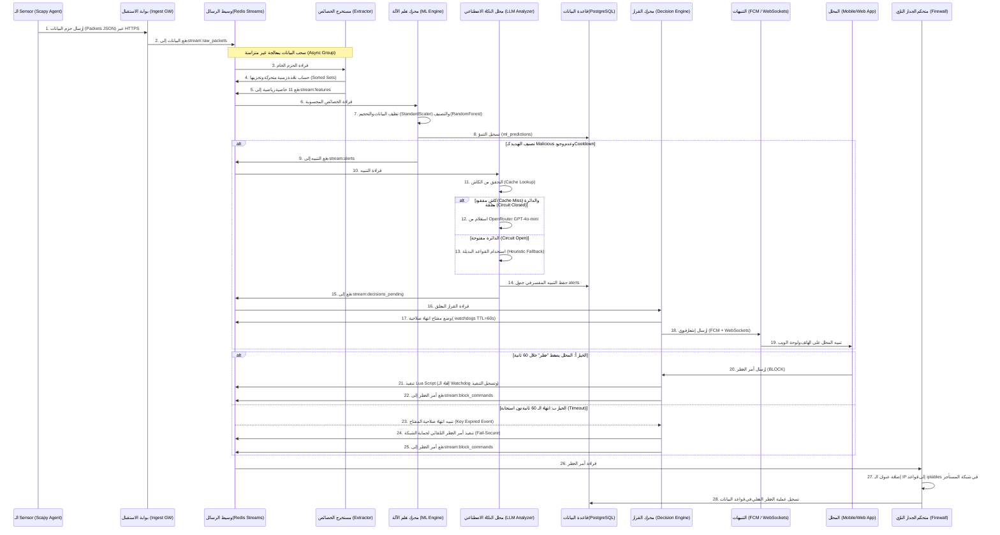

# دليل المذاكرة والاستعداد للمناقشة - مشروع تخرج CypherGuard

مرحباً بفريق مشروع تخرج **CypherGuard**! هذا الدليل تم إعداده خصيصاً لكم كمرجع مكثف ومبسط لدراسة وفهم بنية النظام البرمجية والأمنية، لكي تكونوا جاهزين بنسبة 100% لمناقشة مشروع التخرج أمام لجنة التحكيم. 

تم تقسيم هذا الدليل إلى أقسام تجيب على الأسئلة الجوهرية: **ما هو المكون؟**، **أين يُستخدم في الكود؟**، و**لماذا تم اختياره واستخدامه؟**، بالإضافة إلى **دليل مذاكرة مخصص لكل عضو** بحسب دوره، و**أهم الأسئلة المتوقعة وإجاباتها النموذجية**.

---

## فهرس الدليل
1. [نظرة عامة على النظام (System Abstract)](#1-نظرة-عامة-على-النظام-system-abstract)
2. [دورة حياة البيانات وتدفقها (End-to-End Data Flow)](#2-دورة-حياة-البيانات-وتدفقها-end-to-end-data-flow)
3. [المكونات البرمجية والتقنيات المستخدمة (Tech Stack & Rationale)](#3-المكونات-البرمجية-والتقنيات-المستخدمة-tech-stack--rationale)
4. [عزل البيانات والحوسبة متعددة المستأجرين (Multi-Tenancy & RLS)](#4-عزل-البيانات-والحوسبة-متعددة-المستأجرين-multi-tenancy--rls)
5. [نظام الذكاء الاصطناعي وتعلم الآلة (AI & ML Subsystem)](#5-نظام-الذكاء-الاصطناعي-وتعلم-الآلة-ai--ml-subsystem)
6. [حلقة اتخاذ القرار وإدارة التهديدات (Decision Engine & Watchdogs)](#6-حلقة-اتخاذ-القرار-وإدارة-التهديدات-decision-engine--watchdogs)
7. [أمان النظام ونمذجة التهديدات (Security & STRIDE Modeling)](#7-أمان-النظام-ونمذجة-التهديدات-security--stride-modeling)
8. [أقوى أسئلة المناقشة المتوقعة وإجاباتها النموذجية (Defense Q&A)](#8-أقوى-أسئلة-المناقشة-المتوقعة-وإجاباتها-النموذجية-defense-qa)
9. [بطاقة مراجعة مخصصة لكل عضو في الفريق (Role-Based Prep Cards)](#9-بطاقة-مراجعة-مخصصة-لكل-عضو-في-الفريق-role-based-prep-cards)

---

## 1. نظرة عامة على النظام (System Abstract)

**CypherGuard** هو نظام متكامل وموزع لإدارة العمليات الأمنية (SOC) وكشف التسلل (IDS)، يعمل كخدمة سحابية متعددة المستأجرين (Multi-tenant SaaS). يقوم النظام بحماية الشبكات الخاصة بالمؤسسات عن طريق تحليل حركة مرور البيانات (Network Traffic) في الوقت الفعلي، وتصنيفها باستخدام الذكاء الاصطناعي لتمييز الهجمات السيبرانية (مثل هجمات حجب الخدمة DDoS والمسح الشبكي Port Scans)، ثم تقديم تفسير دقيق لهذه التهديدات بلغة طبيعية باستخدام نماذج اللغة الكبيرة (LLMs)، مع توفير واجهة ويب وتطبيق هاتف لاتخاذ إجراءات الحظر الفوري (Active Blocking) بشكل يدوي أو تلقائي.

---

## 2. دورة حياة البيانات وتدفقها (End-to-End Data Flow)

عند مناقشة تدفق البيانات، يجب شرح كيف تتحول حزمة البيانات (Packet) من الشبكة الخاصة بالمستأجر إلى قرار حظر على الجدار الناري. تتبع البيانات المسار التالي:



---

## 3. المكونات البرمجية والتقنيات المستخدمة (Tech Stack & Rationale)

تتكون البنية التحتية لـ CypherGuard من مجموعة من الخدمات المصغرة (Microservices) المبنية باستخدام تقنيات متوافقة ومبررة هندسياً:

### أ. FastAPI (بوابة الخدمات الخلفية - Backend API)
* **أين يُستخدم:** في بوابات الدخول الثلاثة: [Dashboard Gateway](file:///d:/CypherGuard-some-adjustments/gateway) (بوابة لوحة الويب)، [Mobile Gateway](file:///d:/CypherGuard-some-adjustments/mobile_gateway) (بوابة تطبيق الهاتف)، و[Ingest Gateway](file:///d:/CypherGuard-some-adjustments/ingest_gateway) (بوابة استقبال حزم البيانات).
* **لماذا تم استخدامه؟** 
  * سرعة أداء استثنائية (تضاهي Node.js و Go) بفضل دعم الـ Async I/O (البرمجة غير المتزامنة) ومحرك `uvicorn`.
  * التوثيق التلقائي للمسارات (OpenAPI/Swagger docs).
  * نظام التحقق من المدخلات الصارم باستخدام مكتبة `Pydantic`.
  * نظام حقن الاعتماديات (Dependency Injection) المناسب للتحقق من الصلاحيات وربط قواعد البيانات.

### ب. PostgreSQL 16 (قاعدة البيانات الأساسية)
* **أين يُستخدم:** تخزين البيانات الهيكلية والعلائقية للمشروع في مسار [shared/database.py](file:///d:/CypherGuard-some-adjustments/shared/database.py) وتتم إدارته عبر الـ ORM (SQLAlchemy) وجداول المهاجرة [alembic](file:///d:/CypherGuard-some-adjustments/alembic).
* **لماذا تم استخدامه؟**
  * دعم ميزة **Row-Level Security (RLS)** المدمجة، وهي حجر الأساس لعزل بيانات المستأجرين (Tenant Isolation).
  * توافقية عالية مع المحركات غير المتزامنة عبر مكتبة `asyncpg`.
  * دعم نوع البيانات `JSONB` لتخزين الخصائص الخام بشكل مرن وسريع الاستعلام.
  * ضمانات ACID الصارمة لحماية العمليات المالية واللوجات الأمنية.

### ج. Redis 7 (قاعدة البيانات المؤقتة وناقل الرسائل - Cache & Event Broker)
* **أين يُستخدم:** 
  1. **Event Broker:** تمرير الرسائل بين الخدمات عبر **Redis Streams** بمجموعات استهلاك (Consumer Groups) في [shared/redis_client.py](file:///d:/CypherGuard-some-adjustments/shared/redis_client.py).
  2. **Sliding Window:** حساب خصائص حركة المرور لكل IP باستخدام مجموعات مرتبة **Redis Sorted Sets (ZSET)**.
  3. **Caching:** تخزين مؤقت لعناوين الـ IP المحظورة وتخزين مخرجات الـ LLMs لتقليل التكلفة.
  4. **Watchdog Timer:** مراقبة مهلة الـ 60 ثانية عبر آليات انتهاء صلاحية المفاتيح (TTL Expiry Events).
* **لماذا تم استخدامه؟** 
  * يدمج مهام ناقل الرسائل، الكاش، والحسابات الزمنية في تقنية واحدة، مما يقلل من تعقيد البنية التحتية للمشروع.
  * سرعة خارقة (Sub-millisecond latency) لكونه يعمل بالكامل في الذاكرة العشوائية (In-memory).
  * يدعم كتابة نصوص **Lua Scripts** لتنفيذ عمليات ذرية غير قابلة للتجزئة (Atomic Operations) لمنع سباق البيانات (Race Conditions).

### د. React 19 + Vite (لوحة التحكم - SOC Dashboard)
* **أين يُستخدم:** المجلد [soc-frontend](file:///d:/CypherGuard-some-adjustments/soc-frontend).
* **لماذا تم استخدامه؟**
  * سرعة البناء والتشغيل باستخدام Vite كبديل لـ Webpack التقليدي.
  * استخدام مكونات تفاعلية لتحديث لوحة التنبيهات في الوقت الفعلي عبر اتصال الـ WebSockets.
  * كفاءة عالية في التعامل مع كميات البيانات الكبيرة والتنبيهات المباشرة.

### هـ. Flutter SDK (تطبيق الهاتف المحمول)
* **أين يُستخدم:** المجلد [app/cypherguard](file:///d:/CypherGuard-some-adjustments/app) (الذي يمثل تطبيق الهاتف).
* **لماذا تم استخدامه؟**
  * لغة برمجية واحدة لإنتاج نسختين (Android & iOS).
  * أداء ممتاز للتعامل مع الـ WebSockets وحفظ جلسات تسجيل الدخول والتعامل مع إشعارات Firebase Cloud Messaging (FCM).

---

## 4. عزل البيانات والحوسبة متعددة المستأجرين (Multi-Tenancy & RLS)

أحد أقوى نقاط القوة في مشروع **CypherGuard** هو نموذج العزل متعدد المستأجرين (Multi-Tenancy) القائم على **Shared Database, Shared Process**، وهو نموذج يوفر في التكلفة ولكنه يتطلب أماناً فائقاً لمنع تسريب بيانات مستأجر لآخر (Data Leaks).

### كيف يعمل العزل في الطبقات المختلفة؟

1. **الطبقة الأولى: التحقق من الهوية (JWT Claims):**
   عند تسجيل الدخول، يحصل المستخدم على رمز JWT يحتوي على المعرف الفريد للمنظمة التابع لها (`tenant_id`). لا يُسمح للمستخدم بإرسال `tenant_id` كمتغير في الرابط أو جسم الطلب (Request Body)، بل يتم استخلاصه حصراً من الرمز المشفر رقمياً لمنع التلاعب (Parameter Tampering).
   
2. **الطبقة الثانية: أمان قواعد البيانات (PostgreSQL RLS):**
   * يتم تفعيل الـ RLS على الجداول الحساسة مثل (التنبيهات `alerts` ، عناوين الـ IP المحظورة `blocked_ips` ، سجلات التنبؤات `ml_predictions` ...).
   * عند استقبال الطلب، يقوم الـ Context Manager المسمى `tenant_session()` بفتح اتصال مع قاعدة البيانات، ويقوم فوراً بتنفيذ الأمر:
     ```sql
     SET LOCAL app.tenant_id = 'user-tenant-uuid';
     ```
   * تقوم قاعدة البيانات بمطابقة هذا المتغير تلقائياً مع السياسة المحددة مسبقاً لكل جدول، على سبيل المثال:
     ```sql
     CREATE POLICY tenant_isolation_alerts ON alerts
     USING (tenant_id = current_setting('app.tenant_id', true)::uuid);
     ```
     هذا يعني أن قاعدة البيانات لن تعيد أي سطر لا يتطابق فيه الـ `tenant_id` مع المتغير المحلي للجلسة، دون الحاجة لكتابة `.where(tenant_id == ...)` يدوياً في كود الباك إند.
   * **حماية إضافية (Defense-in-depth):** عند انتهاء الاستعلام وقبل إرجاع الاتصال إلى مجمع الاتصالات (Connection Pool)، يتم تنفيذ أمر `RESET app.tenant_id` لمنع تسرب الجلسة للمستعلم التالي.

3. **الطبقة الثالثة: عزل كود الـ Redis:**
   تتم تسمية جميع مفاتيح الـ Redis للمستأجرين بصيغة محددة: `t:{tenant_id}:{key_name}` لضمان عدم تداخل البيانات، ويتم تقسيم غرف الـ WebSockets بحسب الـ `tenant_id`.

---

## 5. نظام الذكاء الاصطناعي وتعلم الآلة (AI & ML Subsystem)

يعمل الذكاء الاصطناعي في CypherGuard من خلال نظام هجين ذو كفاءة عالية: نموذج كلاسيكي سريع لتصنيف التنبيهات، ونموذج توليدي (LLM) لتوضيح التهديد وتقديم التوصيات.

```
حزم البيانات الخام ──> Extractor (حساب 11 ميزة) ──> ML Engine (تصنيف ثنائي 0 أو 1) ──> LLM Analyzer (تفسير بلغة طبيعية)
```

### أ. مستخرج الخصائص (Feature Extractor)
يستقبل الحزم الخام `(src_ip, size, protocol)` ويقوم بحساب **11 ميزة رياضية** تلخص سلوك عنوان الـ IP خلال نافذة زمنية متحركة قدرها **30 ثانية** (Sliding Window):

| الميزة (Feature) | الرمز البرمجي | المعنى الأمني وفائدة استخدامها |
|---|---|---|
| **Flow Packets/s** | `packets_per_sec` | عدد الحزم في الثانية. يرتفع جداً في هجمات SYN Floods والـ Port Scans. |
| **Flow Bytes/s** | `bytes_per_sec` | حجم البيانات بالبايت في الثانية. يرتفع في هجمات حجب الخدمة الحجمية (Volumetric DDoS). |
| **Avg Packet Size** | `avg_packet_size` | متوسط حجم الحزمة. حزم صغيرة جداً تشير لمسح شبكي، حزم كبيرة جداً تشير لفيض من الهجمات الحجمية. |
| **Flow Duration** | `flow_duration` | المدة الزمنية للتدفق الحالي بالثواني. |
| **Total Fwd Packets** | `packet_count` | إجمالي عدد الحزم المرسلة خلال النافذة الحالية. |
| **Total Length of Fwd Packets** | `total_bytes` | إجمالي البايتات المرسلة خلال النافذة الحالية. |
| **Fwd Packet Length Mean** | `fwd_pkt_len_mean` | متوسط أطوال الحزم في الاتجاه الأمامي. |
| **Fwd Packet Length Std** | `fwd_pkt_len_std` | الانحراف المعياري لأطوال الحزم. الانحراف القريب من 0 يدل على انتظام آلي (بوت/مهاجم)، والانحراف الكبير يدل على سلوك بشري متنوع. |
| **Flow IAT Mean** | `flow_iat_mean` | متوسط الوقت بين وصول الحزم (Inter-Arrival Time). في الهجمات يكون قريباً من الصفر (أجزاء من الملي ثانية). |
| **Flow IAT Std** | `flow_iat_std` | الانحراف المعياري للوقت بين الحزم. الانحراف الصغير جداً يدل على سلوك دوري منتظم للروبوتات والمهاجمين. |
| **Small Packet Ratio** | `small_packet_ratio` | نسبة الحزم التي يقل حجمها عن 100 بايت. النسبة المرتفعة جداً (> 0.8) تدل على محاولات مسح شبكي وسرقة معلومات. |

* **كود الحساب الفعلي:** [shared/redis_client.py#L175-L248](file:///d:/CypherGuard-some-adjustments/shared/redis_client.py#L175-L248)

### ب. محرك التصنيف (ML Engine)
* **المسار:** [ml_engine/main.py](file:///d:/CypherGuard-some-adjustments/ml_engine/main.py).
* **نموذج البيانات الأساسي:** مجموعة بيانات **CICIDS2017** الشهيرة المجهزة من جامعة نيو برونزويك الكندية.
* **البنية البرمجية:** كود المعالجة والتحجيم مبني كـ Scikit-learn Pipeline يحتوي على:
  1. `StandardScaler`: لتحجيم الخصائص (Z-score Normalization) بحيث يكون لها متوسط يساوي 0 وانحراف معياري يساوي 1، لضمان عدم طغيان الخصائص ذات الأرقام الكبيرة (مثل Flow Bytes/s) على الأرقام الصغيرة (مثل Small Packet Ratio).
  2. `RandomForestClassifier`: (أو غيره من النماذج المدعومة مثل XGBoost/LightGBM) المصنف الذي يقدم توازناً ممتازاً بين الدقة وزمن التنبؤ الفوري.
* **التقييم:** يحقق النموذج دقة عالية جداً **F1-Score تفوق 98.6%** مع زمن استجابة (Inference Latency) يقل عن **20 مللي ثانية**.
* **مكافحة خلل توازن الفئات (Class Imbalance):** نظراً لأن بيانات الهجمات السيبرانية نادرة مقارنة بالبيانات الطبيعية، يتم استخدام خاصية `class_weight="balanced"` لتعديل أوزان الفئات عكسياً مع معدلات ظهورها.
* **تحديث النموذج دون توقف (Hot-Reloading):** يقوم محرك تعلم الآلة بمراقبة ملف النموذج `model.joblib` كل 5 ثوانٍ، وإذا تغير، يقوم بتحميله في متغير مؤقت ثم إجراء تبديل ذري للمؤشر (Atomic Pointer Swap) ليخدم الطلبات الجديدة فوراً دون انقطاع الخدمة.

### ج. كشف انحراف البيانات (Drift Detection)
* **المسار:** [shared/drift_detector.py](file:///d:/CypherGuard-some-adjustments/shared/drift_detector.py).
* **المفهوم:** في بيئة التشغيل، قد يتغير سلوك شبكة المستأجر تدريجياً، مما يجعل النموذج يفقد دقته.
* **الخوارزمية المستخدمة:** **مقياس تباعد كولباك - ليبلر (Kullback-Leibler Divergence - KL Divergence)**.
* **آلية العمل:** يقوم الكود بحفظ توزيع تكراري (Histogram) لكل خاصية أثناء تدريب النموذج. في بيئة التشغيل، يستقبل الـ `DriftDetector` عينات الخصائص الحية (بمجموعات من 1000 عينة)، ويقوم بحساب توزيعها التكراري مع تطبيق **Laplace Smoothing** (إضافة قيمة متناهية الصغر `1e-10` لمنع القسمة على صفر أو حساب لوغاريتم الصفر) ثم حساب الـ `KL Divergence`. إذا تخطى الانحراف القيمة المحددة (مثلاً 0.1)، يتم إطلاق تنبيهdrift وتفعيل إعادة التدريب التلقائي (Auto-Retraining).

### د. محلل التنبيهات باستخدام الذكاء الاصطناعي التوليدي (LLM Analyzer)
* **المسار:** [llm_analyzer/main.py](file:///d:/CypherGuard-some-adjustments/llm_analyzer/main.py).
* **البنية ثلاثية الطبقات (Three-Tier Architecture):** لضمان استمرارية النظام وتخفيض تكلفة الاستدعاءات:
  1. **الطبقة الأولى (Redis Cache):** يتم تقريب (Bucketize) قيم الخصائص لزيادة احتمالية تكرار الأنماط، ثم حساب مفتاح MD5 فريد للنمط. إذا تم تحليل نمط مشابه خلال الساعة الماضية، يتم استرجاع النتيجة من كاش الـ Redis فوراً دون الاتصال بالـ API الخارجي.
  2. **الطبقة الثانية (OpenRouter LLM API):** يتم إرسال الخصائص الرقمية لنموذج `gpt-4o-mini` (أو النموذج البديل `llama-3-8b-instruct` إذا فشل الأول) عبر OpenRouter للحصول على تفسير وتوصية بصيغة JSON صارمة يتم التحقق منها عبر `Pydantic`.
  3. **الطبقة الثالثة (Heuristic Fallback):** إذا تعطلت خدمات نماذج اللغة بالكامل وانفتحت دائرة الحماية (Circuit Breaker)، يتم استخدام قواعد مشروطة مبرمجة مسبقاً (If-Else Rules) لتوليد تقارير وتوصيات مبدئية لضمان عمل النظام.
* **مكافحة هجمات حقن الأوامر (Prompt Injection):** يتم إنشاء نص موجه الذكاء الاصطناعي (Prompt) بالكامل من قيم رقمية وعناوين IP مستخلصة ومعقمة برمجياً، ولا يتم إدراج أي نصوص حرة يدخلها المستخدمون، مما يلغي هذه الثغرة تماماً.
* **قاطع الدورة (Circuit Breaker):** آلية تحمي كود النظام من التعليق وتمنع الخسائر المالية. إذا فشلت الاتصالات الخارجية بـ OpenRouter لـ 3 مرات متتالية، تفتح الدائرة وتتحول جميع الطلبات فوراً للطبقة الثالثة (Heuristic) لمدة 60 ثانية قبل تجربة الاتصال الخارجي مجدداً.
* **آلية الحد من التنبيهات المتكررة (Alert Cooldown):** عند اكتشاف هجوم من IP معين، يُخزن مفتاح مؤقت في الـ Redis لـ 60 ثانية باستخدام خاصية `SET key NX EX`. يمنع هذا المفتاح تكرار استدعاء محلل الـ LLM لنفس عنوان الـ IP أكثر من مرة في الدقيقة، مما يحمي الفاتورة السحابية من النفاد السريع خلال ثوانٍ من هجمات حجب الخدمة الحجمية.

---

## 6. حلقة اتخاذ القرار وإدارة التهديدات (Decision Engine & Watchdogs)

يتبع مشروع CypherGuard مبدأ **"الإشراف البشري في الحلقة" (Human-In-The-Loop)** مع وجود آلية الحماية التلقائية عند الطوارئ (Fail-Secure):

1. عند كشف تهديد من عنوان IP، يتم إرسال تنبيه فوري للمحلل عبر تطبيق الهاتف الذكي (FCM) أو لوحة التحكم.
2. يتم تخزين حالة التنبيه في الـ Redis مع مؤقت تنازلي مدته **60 ثانية**.
3. **الخيار الأول (الحظر اليدوي):** يقوم المحلل بمراجعة التحليل المدعوم بالذكاء الاصطناعي ويضغط على "حظر IP" (Block IP). يتم إرسال الطلب وتنفيذ نص **Lua Script** ذري على الـ Redis يتحقق مما إذا كان القرار قد نُفذ بالفعل، وإذا لم يكن، يمسح المؤقت ويرسل أمر الحظر إلى الجدار الناري.
4. **الخيار الثاني (الحظر التلقائي بالـ Timeout):** إذا انقضت الـ 60 ثانية دون استجابة المحلل (بسبب انقطاع الاتصال أو النوم)، يستقبل خادم الباك إند حدث انتهاء صلاحية المفتاح (Expired Key Event) من Redis، ويقوم بتنفيذ قرار الحظر التلقائي (Fail-Secure) حماية للشبكة، مع تدوين أن الحظر تم تلقائياً بسبب انتهاء المهلة.

---

## 7. أمان النظام ونمذجة التهديدات (Security & STRIDE Modeling)

أمن البنية التحتية للنظام تمت دراسته وتصميمه بعناية متناهية:

### أ. حدود الثقة والأمان (Trust Boundaries)
* **منطقة العميل (Customer LAN):** منطقة غير موثوقة بالكامل، حيث يعمل برنامج الـ Sensor الذي يقوم بالتقاط حركة المرور.
* **منطقة بوابة الاستقبال (Ingest GW):** تقع في الـ DMZ (المنطقة منزوعة السلاح). تقوم بالتحقق من مفتاح الـ API للـ Sensor المشفر باستخدام `bcrypt` قبل استقبال أي بيانات.
* **المنطقة الخاصة الموثوقة (Private VPC):** تضم محركات التحليل (ML Engine, Extractor, LLM Analyzer) وقاعدة البيانات PostgreSQL وسيرفر Redis. لا يمكن الوصول إليها مباشرة من الإنترنت الخارجي.

### ب. تحليل التهديدات بنموذج STRIDE

| تصنيف STRIDE | التهديد المحتمل | الحل المطبق في مشروع CypherGuard |
|---|---|---|
| **Spoofing (انتحال الشخصية)** | مهاجم ينتحل شخصية Sensor ليغرق النظام ببيانات مغلوطة. | يتم تزويد كل Sensor بمفتاح API فريد عند تسجيله، ويحفظ في قاعدة البيانات كهاش مشفر بـ `bcrypt`. |
| **Tampering (التلاعب بالبيانات)** | مستخدم يتلاعب بمحتويات رمز الـ JWT ليدخل على حسابات أخرى. | يتم توقيع رموز الـ JWT رقمياً باستخدام خوارزمية التوقيع الآمن `HS256` ومفتاح سري مشفر على الخادم. |
| **Repudiation (الإنكار)** | محلل شبكة يمنح وصولاً لـ IP مشبوه ثم ينكر قيامه بذلك. | يتم تسجيل كافة القرارات وخطوات الحظر وهوية متخذ القرار (مستخدم أم نظام تلقائي) في جدول `decision_logs` غير القابل للتعديل. |
| **Information Leak (تسريب المعلومات)** | مستخدم يستعلم عن تنبيهات مستأجر آخر عبر ثغرات حقن SQL. | ميزة PostgreSQL RLS تضمن عزلاً تاماً للبيانات على مستوى النواة حتى لو نجحت محاولات حقن SQL. |
| **Denial of Service (حجب الخدمة)** | مهاجم يغرق بوابة الاستقبال بحزم برمجية ليعطل النظام. | تطبيق محددات المعدلات `TenantRateLimiter` بالـ Redis على مستوى الـ IP والمستأجر لحظر الطلبات الزائدة فوراً. |
| **Elevation of Privilege (رفع الصلاحيات)** | مستخدم عادي يحاول فك حظر IP عبر تعديل طلبات الـ HTTP. | حماية كافة المسارات الحساسة بمحقق صلاحيات (FastAPI Dependency) يتحقق من الدور `require_role('admin', 'analyst')`. |

---

## 8. أقوى أسئلة المناقشة المتوقعة وإجاباتها النموذجية (Defense Q&A)

### س1: لماذا استخدمتم Redis Streams لنقل الرسائل بدلاً من RabbitMQ أو Apache Kafka الأكثر شهرة؟
* **الإجابة النموذجية:** "RabbitMQ و Kafka هما حلول ممتازة ومثالية للمشاريع العملاقة، ولكن لإدارة موارد المشروع وتكلفة البنية التحتية، وجدنا أن **Redis Streams** تقدم أداءً فائقاً وزمن استجابة يقل عن 2 مللي ثانية. وبما أننا نستخدم Redis بالفعل لحساب النوافذ الزمنية المتحركة (Sorted Sets) وتخزين الكاش المؤقت، فإن استخدام Redis Streams وفر علينا إضافة تقنية جديدة للبنية التحتية، مما قلل استهلاك الذاكرة وتكلفة الاستضافة مع تلبية متطلبات السرعة لكشف التسلل بالكامل."

### س2: كيف تضمنون عدم تسرب بيانات شركة (Tenant A) إلى شركة أخرى (Tenant B) في قاعدة البيانات المشتركة؟
* **الإجابة النموذجية:** "نحن نطبق استراتيجية عزل صارمة قائمة على **Row-Level Security (RLS)** المدمجة في قاعدة بيانات PostgreSQL. عند تسجيل الدخول، نمرر المعرف الفريد للشركة (`tenant_id`) داخل رمز الـ JWT المشفر. وفي بداية كل معاملة مع قاعدة البيانات، نقوم بضبط متغير الجلسة المحلي `SET LOCAL app.tenant_id = tid`. وتتكفل قاعدة البيانات تلقائياً بفلترة البيانات وعرض الأسطر التابعة لهذا المستأجر فقط بناءً على السياسات المحددة للجدول، مما يمنع حدوث أي تسريب للبيانات حتى لو كان هناك خطأ في الكود البرمجي للباك إند."

### س3: ماذا يحدث لو تعطل الـ LLM API الخارجي أو تأخر في الرد؟ هل يتوقف النظام عن كشف التهديدات؟
* **الإجابة النموذجية:** "بالتأكيد لا. لقد صممنا النظام باتباع مبدأ **Zero Single Point of Failure**. إن معالجة التنبيهات تتم على ثلاث طبقات متتالية. إذا تعطل الـ API الخارجي، أو تأخرت الاستجابة لأكثر من 15 ثانية، يتم تفعيل **قاطع الدورة (Circuit Breaker)** الذي يمنع طلبات الـ API الخارجية فوراً ويحول النظام لتوليد التفسيرات والتوصيات محلياً باستخدام **القواعد البديلة (Heuristic Fallback)**. بالإضافة إلى أن القرار الأمني وحظر الـ IP لا يعتمدان على الـ LLM، بل يتم اتخاذهما بناءً على تصنيف محرك تعلم الآلة (ML Engine) السريع والمحلي بالكامل."

### س4: لماذا استخدمتم StandardScaler لتحجيم البيانات قبل إرسالها لنموذج تعلم الآلة؟
* **الإجابة النموذجية:** "الخصائص الرياضية لحركة مرور الشبكة متفاوتة جداً في نطاقاتها الرقمية. على سبيل المثال، قد تصل قيمة `Flow Bytes/s` إلى ملايين البايتات، بينما قيمة `Small Packet Ratio` تكون دائماً محصورة بين 0 و 1. إذا أدخلنا هذه القيم مباشرة للنموذج، ستطغى الخصائص ذات النطاقات الكبيرة على الخصائص الصغيرة وسيختل توازن النموذج. لذلك، قمنا بإدراج `StandardScaler` داخل الـ Pipeline لتعديل البيانات وتحويلها لـ Z-scores (متوسط 0 وانحراف معياري 1) لضمان أن يعامل النموذج جميع الخصائص بأهمية متكافئة وعادلة."

### س5: ما هي ميزة كتابة نصوص Lua Scripts وتنفيذها داخل الـ Redis؟
* **الإجابة النموذجية:** "الـ Redis يضمن تنفيذ نصوص الـ Lua بشكل **ذري (Atomic)**. هذا يعني أنه أثناء تشغيل النص، لن يتمكن أي اتصال آخر من التدخل أو تعديل البيانات. نستخدم هذا الإجراء في دالة اتخاذ القرار `LUA_EXECUTE_DECISION` لمنع **سباقات البيانات (Race Conditions)**. فمثلاً، لو حاول المحلل ضغط زر الحظر في نفس اللحظة التي ينتهي فيها مؤقت الـ 60 ثانية للتنفيذ التلقائي، يضمن نص الـ Lua تنفيذ أحد القرارين أولاً ومسح المؤقت، مما يمنع إرسال أمرين مكررين أو حدوث تداخل في اللوجات الأمنية."

### س6: كيف يتم حساب معدلات انحراف البيانات (Concept Drift) وماذا تفعلون عند اكتشافه؟
* **الإجابة النموذجية:** "نقوم بمقارنة توزيع الخصائص الحية في بيئة التشغيل مع التوزيع المرجعي لبيانات التدريب (CICIDS2017) المخزنة في ملف `feature_baselines.json` باستخدام خوارزمية **KL Divergence**. نطبق **Laplace Smoothing** بإضافة قيمة ضئيلة جداً `1e-10` لمنع الأخطاء الرياضية عند وجود قيم تكرارية صفرية. وإذا تخطت قيمة الانحراف حاجز 0.1، نقوم بإطلاق حدث تفعيل إعادة التدريب التلقائي (Auto-Retraining) للنموذج على البيانات الجديدة لضمان استمرار دقته العالية."

---

## 9. بطاقة مراجعة مخصصة لكل عضو في الفريق (Role-Based Prep Cards)

لكي يركز كل عضو على الأسئلة الخاصة بمساهمته المباشرة في المشروع:

### 👤 بطاقة العضو: عبد الرحمن محمد فرج هارون (Lead Architect & Backend)
* **المواضيع الرئيسية للمذاكرة:**
  * بنية نظام الـ Microservices وتدفق البيانات الإجمالي.
  * تصميم جداول PostgreSQL وتفعيل ميزة الـ RLS وحلقات الـ connection pools.
  * هيكلة نصوص Lua Scripts وعزل المستأجرين (Multi-Tenancy).
  * حزم الـ Docker وكيفية عمل Traefik كـ Ingress Proxy لإدارة اتصالات الويب والموبايل والـ Ingest.
* **الكود الذي يجب مراجعته بدقة:**
  * ملف تهيئة جلسة قاعدة البيانات المشتركة: [shared/database.py](file:///d:/CypherGuard-some-adjustments/shared/database.py).
  * ملف سياسات الـ RLS وملف الهجرة Alembic.
  * مسارات وتصميم الـ API Gateway وبوابة الاستقبال Ingest Gateway.

### 👤 بطاقة العضو: أحمد رزق محمد غاويش (AI & Machine Learning Engineer)
* **المواضيع الرئيسية للمذاكرة:**
  * الـ 11 ميزة الرياضية للشبكة وطريقة حسابها ونطاقاتها.
  * هندسة معالجة البيانات وتحجيمها وتنظيف البيانات من قيم Inf و NaNs.
  * تدريب النموذج وخوارزميات RandomForest و XGBoost وآلية توازن الفئات.
  * كود وتفاصيل الـ Drift Detector وحساب الـ KL Divergence والـ Laplace Smoothing.
  * دورة حياة النموذج وإعادة التدريب التلقائي (Auto-Retraining) والترقية التلقائية (Auto-Promotion).
* **الكود الذي يجب مراجعته بدقة:**
  * ملف حساب الخصائص: [shared/redis_client.py#L175-L248](file:///d:/CypherGuard-some-adjustments/shared/redis_client.py#L175-L248).
  * ملف تصنيف تعلم الآلة والتحويل الفني للخصائص: [ml_engine/feature_engineering.py](file:///d:/CypherGuard-some-adjustments/ml_engine/feature_engineering.py).
  * ملف تدريب النموذج الكلاسيكي: [ml_engine/train_production.py](file:///d:/CypherGuard-some-adjustments/ml_engine/train_production.py).
  * كود الكشف عن الانحراف وإعادة التدريب: [shared/drift_detector.py](file:///d:/CypherGuard-some-adjustments/shared/drift_detector.py) و [ml_engine/auto_retrain.py](file:///d:/CypherGuard-some-adjustments/ml_engine/auto_retrain.py).

### 👤 بطاقة العضو: أحمد رضا أحمد حزيمة (Cyber Security Engineer)
* **المواضيع الرئيسية للمذاكرة:**
  * بنية الأمان وثقة حدود النظام (Trust Boundaries).
  * نمذجة التهديدات الأمنية بطريقة STRIDE وتفنيد الثغرات والتصدي لها.
  * حماية النظام من الاختراقات الشائعة (OWASP Top 10) مثل Broken Access Control و Injection.
  * آليات فحص وتأكيد هويات الـ Sensors باستخدام bcrypt وحفظ الهاش.
  * كود تنفيذ الحظر على الجدار الناري المحلي عبر أوامر iptables المشفرة.
* **الكود الذي يجب مراجعته بدقة:**
  * كود التحقق من رموز الـ JWT والتحقق من القائمة السوداء (Blacklist): `shared/auth.py`.
  * كود متحكم الجدار الناري واستدعاء العمليات الفرعية (Subprocesses): `firewall/main.py`.
  * ملف اختبارات عزل بيانات المستأجرين: [tests/test_mobile_gateway_isolation.py](file:///d:/CypherGuard-some-adjustments/tests/test_mobile_gateway_isolation.py).

### 👤 بطاقة العضو: كاراس مدحت زكي عبد الملاك (Mobile App Developer)
* **المواضيع الرئيسية للمذاكرة:**
  * دورة حياة شاشات تطبيق الهاتف وكيفية الحفاظ على استمرارية الاتصال عبر الـ WebSockets.
  * استقبال وعرض التحليلات التوليدية (LLM explanations) والتوصيات.
  * دمج إشعارات Firebase Cloud Messaging (FCM) وكيفية التعامل مع المهلة (Watchdog Timer) على شاشة الهاتف.
  * معالجة حظر وإلغاء حظر الـ IPs والتعامل مع استجابات الواجهة الخلفية.
* **مواضع التركيز:**
  * شاشة عرض تفاصيل التهديد واتخاذ القرار (BLOCK/ALLOW).
  * كود الحفاظ على الاتصال بالخادم والـ WebSocket channels وتأمين الـ tokens محلياً.

### 👤 بطاقة العضو: زياد عبد اللطيف عبد اللطيف سرور (Frontend Developer & Data Analyst)
* **المواضيع الرئيسية للمذاكرة:**
  * هيكلة مشروع React لوحة الـ SOC وتوجيه المسارات المحمية (Protected Routes).
  * التعامل مع تحديث التنبيهات والرسومات البيانية الحية (PPS, BPS, Active Connections) عبر قنوات WebSocket المتعددة.
  * تصميم واجهة الويب لتقليل وقت إدراك التنبيهات من قبل المحللين (Visual Hierarchy).
  * تحليل البيانات وعرض Top Blocked IPs والتنبؤات التاريخية.
* **مواضع التركيز:**
  * مسارات وتفاصيل المكونات: `soc-frontend/src/components/` (LiveAlertsWidget, ThreatLog, MetricsGrid).
  * إدارة الحالة للمنظومة والتحقق من صلاحية رموز الـ JWT.

---

**أتمنى لكم جميعاً التوفيق الكامل والتميز في مناقشة مشروع تخرج CypherGuard والحصول على الدرجة النهائية!** 🚀
