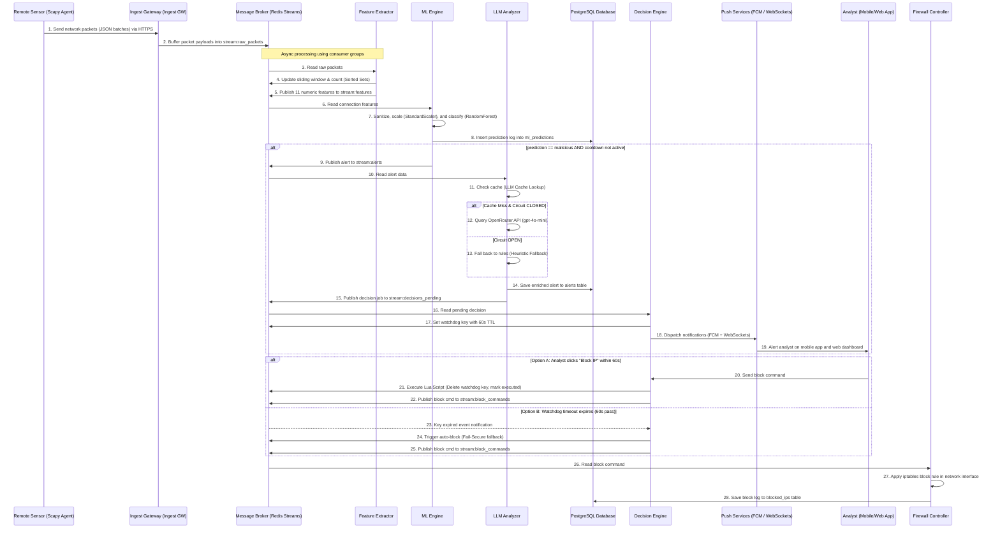

# Graduation Project Study Guide - CypherGuard

Welcome **CypherGuard** graduation project team! This guide is prepared specifically as a condensed and structured resource for you to study and understand the system's architectural, logical, and security details so you are 100% prepared for your graduation project defense/discussion.

This guide answers the core questions for each component: **What is it?**, **Where is it in the code?**, and **Why was it chosen?**, followed by **Defense Q&A** and **Role-Based Prep Cards** tailored to each team member's role.

---

## Table of Contents
1. [System Abstract](#1-system-abstract)
2. [End-to-End Data Flow](#2-end-to-end-data-flow)
3. [Tech Stack & Rationale](#3-tech-stack--rationale)
4. [Multi-Tenancy & Row-Level Security (RLS)](#4-multi-tenancy--row-level-security-rls)
5. [AI & ML Subsystem](#5-ai--ml-subsystem)
6. [Decision Engine & Watchdogs](#6-decision-engine--watchdogs)
7. [Security & STRIDE Threat Modeling](#7-security--stride-threat-modeling)
8. [Expected Defense Q&A](#8-expected-defense-qa)
9. [Role-Based Prep Cards](#9-role-based-prep-cards)

---

## 1. System Abstract

**CypherGuard** is an event-driven, multi-tenant Security Operations Center (SOC) and Intrusion Detection System (IDS) delivered as a SaaS platform. It secures enterprise environments by capturing raw network traffic in real time, converting it to flow features, applying high-speed Machine Learning (ML) classifiers to identify anomalies (such as DDoS floods or Port Scans), and enriching those alerts with Large Language Models (LLMs) to provide natural-language context and remediation recommendations. Operators can view and mitigate threats manually via a React web dashboard or a Flutter mobile app, or rely on a Redis-backed automated watchdog mechanism.

---

## 2. End-to-End Data Flow

When discussing the system's data lifecycle, trace the path of network data from the sensor all the way to a firewall block command:



---

## 3. Tech Stack & Rationale

CypherGuard uses a microservices architecture. Here is why each technology was chosen and where it resides:

### A. FastAPI (Backend APIs)
* **Where it is used:** The gateway services: [Dashboard Gateway](CypherGuard/gateway) (port 8000), [Mobile Gateway](CypherGuard/mobile_gateway) (port 8005), and [Ingest Gateway](CypherGuard/ingest_gateway) (port 8007).
* **Why it was chosen:**
  * High-performance asynchronous execution (`async def`) powered by `uvicorn` and `asyncio`, crucial for network telemetry ingestion.
  * Automatic interactive API documentation (OpenAPI / Swagger UI).
  * Strict typing and automatic schema validation using `Pydantic`.
  * Clean dependency injection system for managing database sessions and access tokens.

### B. PostgreSQL 16 (Primary Relational Storage)
* **Where it is used:** Relational tables configured in [shared/database.py](CypherGuard/shared/database.py), migrated via [alembic](CypherGuard/alembic).
* **Why it was chosen:**
  * Native support for **Row-Level Security (RLS)**, which is the cornerstone of tenant isolation.
  * Mature asynchronous database drivers (`asyncpg`) and ORMs (SQLAlchemy Async).
  * Powerful `JSONB` support, enabling storage and fast indexing of unstructured feature dictionaries alongside structured logs.
  * Strong ACID transaction guarantees.

### C. Redis 7 (In-Memory Datastore & Event Broker)
* **Where it is used:** 
  1. **Event Broker:** Inter-service message passing using **Redis Streams** with consumer groups in [shared/redis_client.py](CypherGuard/shared/redis_client.py).
  2. **Sliding Window:** Tracking packet arrivals and sizes via **Redis Sorted Sets (ZSET)**.
  3. **Caching:** Blocked IP cache, LLM result cache, and dashboard live metrics caching.
  4. **Watchdogs:** Key-space notifications (`EXPIRE` and `TTL`) to trigger timeout-based fallbacks.
* **Why it was chosen:**
  * Replaces multiple tools (RabbitMQ, Memcached, Chronos) with a single, highly performant, in-memory engine.
  * Sub-millisecond read/write latency.
  * Atomic operations using **Lua Scripts** to prevent race conditions during distributed decision-making.

### D. React 19 + Vite (Web Dashboard)
* **Where it is used:** The frontend folder: [soc-frontend](CypherGuard/soc-frontend).
* **Why it was chosen:**
  * Fast compilation and hot module replacement (HMR) using Vite instead of legacy Webpack.
  * Component-driven UI, ideal for building dynamic graphs, real-time alert logs, and system topology maps.
  * Seamless WebSocket integrations.

### E. Flutter SDK (Mobile Companion App)
* **Where it is used:** Mobile directory: [app/cypherguard](CypherGuard/app).
* **Why it was chosen:**
  * Compiled native applications for Android and iOS from a single Dart codebase.
  * Built-in support for persistent WebSockets and seamless integration with Firebase Cloud Messaging (FCM) for push notifications.

---

## 4. Multi-Tenancy & Row-Level Security (RLS)

CypherGuard implements a **Shared Database, Shared Process** SaaS multi-tenancy model to minimize infrastructure overhead while guaranteeing complete data isolation:

1. **JWT-Scoped Identity Extraction:**
   Upon login, users receive a signed JWT containing a `tenant_id` claim (`tid`). The application never relies on request parameters (like query parameters or body fields) to fetch or filter tenant data, preventing Parameter Tampering.
   
2. **PostgreSQL Row-Level Security (RLS) Enforcement:**
   * RLS is enabled on all tenant-specific tables (`alerts`, `blocked_ips`, `ml_predictions`, `audit_log`, etc.).
   * The `tenant_session()` database context manager executes:
     ```sql
     SET LOCAL app.tenant_id = 'user-tenant-uuid';
     ```
     as the very first statement of every database transaction.
   * Policies defined in the tables filter rows automatically:
     ```sql
     CREATE POLICY tenant_isolation_alerts ON alerts
     USING (tenant_id = current_setting('app.tenant_id', true)::uuid);
     ```
     PostgreSQL filters out any row that does not match this ID at the query engine level, preventing cross-tenant leakage even if the developer forgets to add filter clauses in Python.
   * **Defense-in-Depth Connection Pooling:** To prevent session leakage when connections are returned to the SQLAlchemy pool, the context manager always runs `RESET app.tenant_id` inside a `finally` block.

3. **In-Memory Redis Key Scoping:**
   Keys are prefixed with the tenant ID: `t:{tenant_id}:{key_name}`. WebSockets group client connections into rooms using the same token-derived tenant ID.

---

## 5. AI & ML Subsystem

The AI subsystem leverages a hybrid pipeline: a fast classical machine learning classifier for real-time binary filtering, and a generative LLM for contextual explainability.

```
Raw Packets ──> Extractor (11 sliding-window features) ──> ML Engine (Binary 0/1 prediction) ──> LLM Analyzer (Enrichment)
```

### A. Feature Extractor
Converts raw packet data `(src_ip, size, protocol)` into an **11-dimensional numeric feature vector** over a **30-second sliding window**:

| Feature Name | Runtime Name | Security Relevance & Purpose |
|---|---|---|
| **Flow Packets/s** | `packets_per_sec` | Frequency of packets. Spikes during port scans and SYN floods. |
| **Flow Bytes/s** | `bytes_per_sec` | Volume of bytes. Indicators of high-bandwidth volumetric DDoS floods. |
| **Avg Packet Size** | `avg_packet_size` | Average size of packets in bytes. Low values imply scanning probes; high values imply file extraction or packet payloads. |
| **Flow Duration** | `flow_duration` | The lifetime of the flow in seconds. Scans are bursty; normal connections are sustained. |
| **Total Fwd Packets** | `packet_count` | Raw forward packet counter. Indicates traffic intensity. |
| **Total Length of Fwd Packets** | `total_bytes` | Bandwidth footprint inside the active window. |
| **Fwd Packet Length Mean** | `fwd_pkt_len_mean` | Average length of forward packets. |
| **Fwd Packet Length Std** | `fwd_pkt_len_std` | Variation in packet sizes. Std near 0 points to uniform, automated script patterns; high std indicates human behavior. |
| **Flow IAT Mean** | `flow_iat_mean` | Average time between arrivals. Automated attacks have an IAT mean near zero. |
| **Flow IAT Std** | `flow_iat_std` | Inter-arrival consistency. Low std represents robotic periodicity (scanners); high std represents human irregularity. |
| **Small Packet Ratio** | `small_packet_ratio` | Ratio of packets under 100 bytes. High ratios (>0.8) indicate network scanning or SYN floods. |

* **Feature Extraction Code:** [shared/redis_client.py#L175-L248](CypherGuard/shared/redis_client.py#L175-L248)

### B. Machine Learning Engine (ML Engine)
* **Code Location:** [ml_engine/main.py](CypherGuard/ml_engine/main.py).
* **Training Dataset:** **CICIDS2017** (Canadian Institute for Cybersecurity benchmark).
* **Model Pipeline:** Built as a scikit-learn pipeline:
  1. `StandardScaler`: Normalizes features (Z-score scaling) to prevent features with wide ranges (e.g., flow bytes) from dominating features with small bounds (e.g., small packet ratio).
  2. `RandomForestClassifier`: Ensembled decision trees selected for high F1 scores and swift evaluation.
* **Metrics:** Achieves an **F1-Score of 98.6%** with an inference latency below **20ms**.
* **Imbalance Handling:** Imbalanced classes in training data are handled using `class_weight="balanced"`.
* **Zero-Downtime Hot-Reloading:** A background file watcher checks the timestamp of `model.joblib` every 5 seconds. If modified, the new pipeline is loaded into a temp variable and swapped atomically, avoiding server restart or downtime.

### C. Live Concept Drift Detection
* **Code Location:** [shared/drift_detector.py](CypherGuard/shared/drift_detector.py).
* **Algorithm:** **Kullback-Leibler (KL) Divergence**.
* **Process:** Compares incoming feature histograms (buffered in batches of 1,000 samples) against training baselines stored in `feature_baselines.json`.
* **Smoothing:** Applies **Laplace Smoothing** (adds `1e-10` to all bins) to prevent division by zero or log of zero. If KL divergence exceeds 0.1, the system alerts admins to trigger a model retraining loop.

### D. LLM Analyzer (Generative Explainer)
* **Code Location:** [llm_analyzer/main.py](CypherGuard/llm_analyzer/main.py).
* **Three-Tier Architecture:** For robustness and cost control:
  1. **Tier 1 (Redis Cache):** Buckets metrics (rounding pps/bps) and computes a hash. Similar network patterns fetch the cached explanation instantly, skipping API calls.
  2. **Tier 2 (OpenRouter API):** Queries `gpt-4o-mini` (falls back to `llama-3-8b-instruct`) using near-deterministic settings (`temperature=0.1`) and validates the JSON output via Pydantic.
  3. **Tier 3 (Heuristic Fallback):** If APIs are offline or timeouts occur, rule-based heuristics generate static, reliable security descriptions and mitigations.
* **Prompt Injection Prevention:** The system prompt is static, and the user prompt is compiled purely from formatted integers (pps, bps, confidence) and IP strings, leaving no vector for user-input string manipulation.
* **Circuit Breaker:** [shared/circuit_breaker.py](CypherGuard/shared/circuit_breaker.py) shifts traffic to Tier 3 for 60 seconds if 3 consecutive external API failures occur.
* **Alert Cooldown:** Dedupes alerts by setting a Redis lock (`SET cooldown:{ip} 1 NX EX 60`). Prevents an attacking IP from triggering thousands of LLM API requests under heavy packet floods.

---

## 6. Decision Engine & Watchdogs

CypherGuard bridges automation with human accountability using a **Human-In-The-Loop** architecture:

1. When a threat is detected, an alert is pushed to the analyst via WebSockets and Firebase Cloud Messaging (FCM).
2. A Redis key-space expiration watchdog is initialized with a **60-second TTL**.
3. **Manual Block (Option A):** If the analyst reviews the alert and clicks "Block IP", a **Lua script** is sent to Redis. It deletes the watchdog key and publishes a block command atomically, preventing double execution.
4. **Auto-Block Timeout (Option B - Fail-Secure):** If 60 seconds pass without user intervention, Redis fires a `keyexpired` event. The system catches this event and triggers an automated IP block command to protect the tenant network, logging the action as an automated timeout fallback.

---

## 7. Security & STRIDE Threat Modeling

The platform secures data across three main trust zones: the untrusted customer LAN (sensors), the DMZ (Gateways), and the private VPC (processing engine and databases).

### STRIDE Threat Matrix:

| Category | Threat | CypherGuard Mitigation |
|---|---|---|
| **Spoofing** | Rogue sensor attempts to feed false traffic metrics. | The Ingest Gateway validates API keys hashed via `bcrypt` in the DB. |
| **Tampering** | User alters JWT claims to view another company's logs. | JWTs are signed digitally with a secure HS256 server key. |
| **Repudiation** | Operator denies blocking a critical internal server. | Actions are written to an immutable `decision_logs` audit trail. |
| **Information Leak** | SQL injection exposes multi-tenant data. | Parameterized queries + PostgreSQL RLS policies applied to connections. |
| **Denial of Service** | Volumetric flood crashes the ingestion endpoints. | A Redis-backed sliding window rate limiter throttles incoming requests. |
| **Elevation of Priv.** | Read-only analyst sends IP unblock commands. | FastAPI endpoint dependencies verify roles (`require_role('admin', 'analyst')`). |

---

## 8. Expected Defense Q&A

### Q1: Why choose Redis Streams instead of RabbitMQ or Apache Kafka?
* **Answer:** "RabbitMQ and Kafka are excellent for large-scale enterprise logs, but for our scale, **Redis Streams** offers microsecond-level message broker latency without the overhead. Since we already use Redis for sliding window calculations (Sorted Sets), caching, and watchdogs, leveraging Redis Streams kept our infrastructure footprint small and highly optimized, reducing memory requirements and host cost while easily handling 10k+ events per second."

### Q2: How is data isolation between Tenant A and Tenant B guaranteed in a single shared database?
* **Answer:** "We enforce isolation at the database layer using **PostgreSQL Row-Level Security (RLS)**. On user login, the tenant ID is extracted from the JWT token. At the start of a database session, the gateway executes `SET LOCAL app.tenant_id = :tid`. PostgreSQL uses this session variable to automatically filter out rows on RLS-enabled tables. Developers do not need to write manual `.filter(tenant_id == ...)` queries in Python, avoiding accidental leaks due to developer errors."

### Q3: What happens if the external LLM API fails or is slow? Does threat detection stop?
* **Answer:** "No, the threat detection and blocking systems are decoupled from the LLM. If the OpenRouter API fails or times out, a **Circuit Breaker** triggers, and the **LLM Analyzer** falls back to deterministic rule-based heuristics to write explanation templates. Classification (ML Engine) and blocking (Firewall) are local services and continue to function seamlessly."

### Q4: Why did you run a StandardScaler before training the ML model?
* **Answer:** "Network flow metrics have widely different numeric scales. For instance, `Flow Bytes/s` can be in the millions, while `Small Packet Ratio` is strictly between 0 and 1. Without scaling, features with large values will dominate distance-based boundaries. The `StandardScaler` standardizes features to a mean of 0 and variance of 1, allowing the classifier to weigh all inputs equitably."

### Q5: What is the benefit of running Lua scripts in Redis?
* **Answer:** "Redis guarantees that Lua scripts run **atomically**. During script execution, no other operation can modify the database. We use this in the `LUA_EXECUTE_DECISION` script to prevent **Race Conditions**. For example, if a user clicks 'Block' at the exact millisecond the 60-second automatic timeout triggers, the Lua script ensures only one of these paths executes first, deletes the pending index, and logs the execution state cleanly."

---

## 9. Role-Based Prep Cards

### Abdelrahman Mohamed Farag Haroun (Lead Architect & Backend)
* **Study Scope:**
  * Microservices architecture boundaries and end-to-end data lifecycle.
  * PostgreSQL DB schemas, connection pools, and Alembic migrations.
  * Row-Level Security (RLS) implementation and local variable sessions.
  * Docker configurations and Traefik ingress proxy routing.
* **Code to Review:**
  * Context manager: [shared/database.py](CypherGuard/shared/database.py).
  * API Gateway routes and session managers.

### Ahmed Rizk Mohamed Gawish (AI & Machine Learning Engineer)
* **Study Scope:**
  * Definition and calculations of the 11 engineered features.
  * Scikit-learn Pipelines, `StandardScaler`, and `RandomForestClassifier`.
  * Evaluation metrics (F1-Score, Precision, Recall, Confusion Matrix).
  * KL Divergence, Laplace Smoothing, and drift event logging.
  * Automatic retraining and model registries.
* **Code to Review:**
  * Sliding window metrics: [shared/redis_client.py#L175-L248](CypherGuard/shared/redis_client.py#L175-L248).
  * Training scripts: [ml_engine/train_production.py](CypherGuard/ml_engine/train_production.py).
  * Drift detection helpers: [shared/drift_detector.py](CypherGuard/shared/drift_detector.py).

### Ahmed Reda Ahmed Hezema (Cyber Security Engineer)
* **Study Scope:**
  * Trust boundaries and private VPC network segregation.
  * STRIDE threat modeling analysis.
  * JWT HS256 signatures and token blacklisting.
  * Password hashing (`bcrypt`) and API key validations.
  * Firewall iptables commands executed via subprocess.
* **Code to Review:**
  * JWT verification logic: `shared/auth.py`.
  * Subprocess firewall shell: `firewall/main.py`.
  * Integration tests: [tests/test_mobile_gateway_isolation.py](CypherGuard/tests/test_mobile_gateway_isolation.py).

### Karas Medhat Zaki Abdelmalak (Mobile App Developer)
* **Study Scope:**
  * Flutter screen lifecycle and persistent WebSocket clients.
  * Firebase Cloud Messaging (FCM) push integration.
  * Block/Allow decision payloads.
* **Code to Review:**
  * Notification models and WebSockets handlers.

### Ziad Abdelatif Abdelatif Sorour (Frontend Developer & Data Analyst)
* **Study Scope:**
  * React SPA route definitions and `<ProtectedRoute>` controls.
  * Chart libraries and dynamic WebSockets subscription feeds.
  * Data analytics (Top blocked IPs, historical trend lines).
* **Code to Review:**
  * Dashboard grid components: `soc-frontend/src/components/` (LiveAlertsWidget, ThreatLog).
